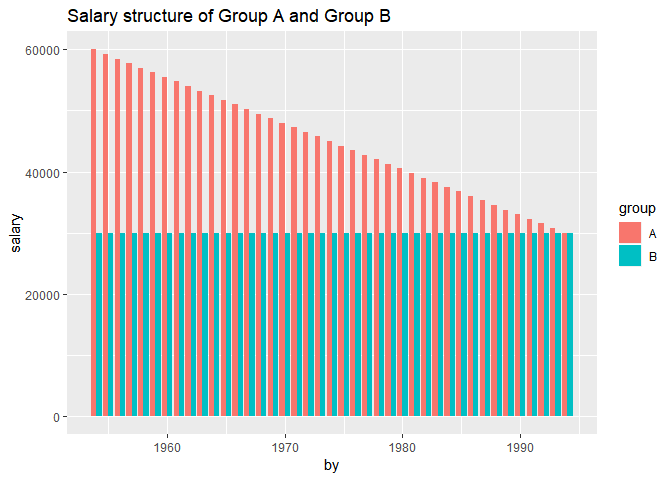
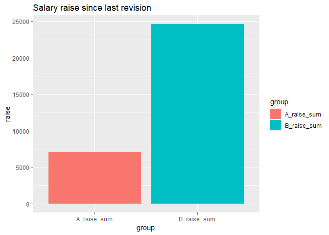
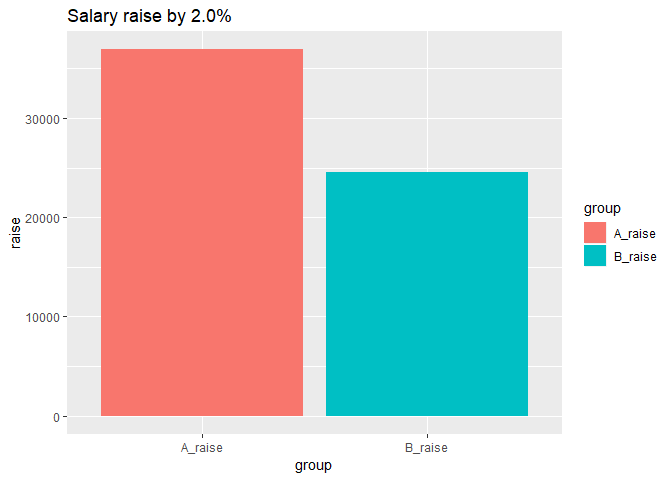
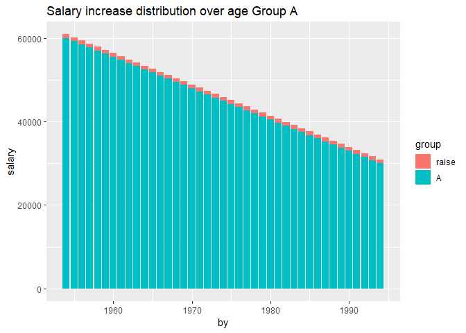
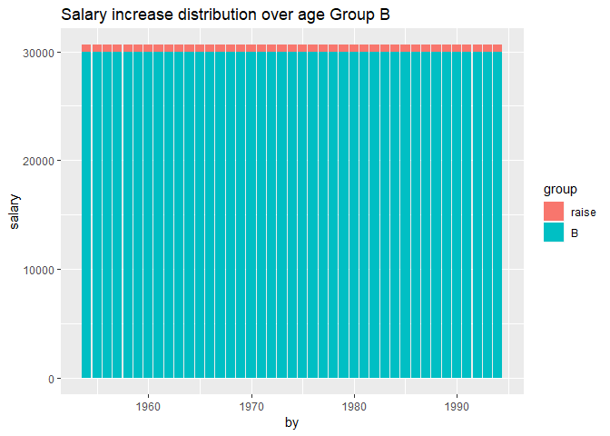
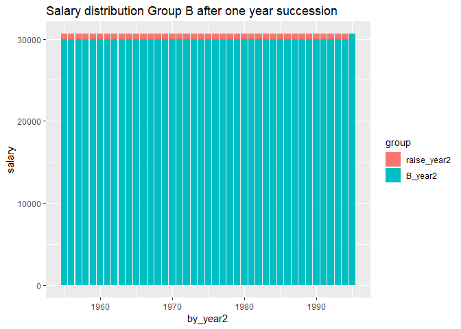
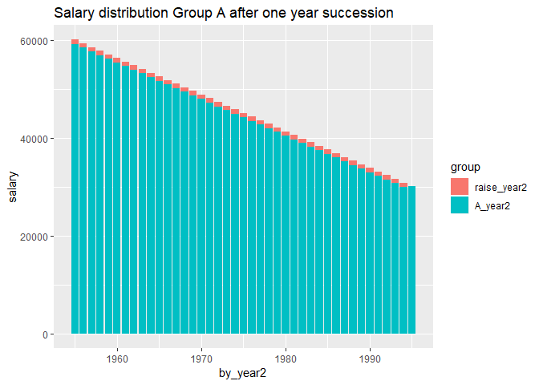

SCB Engineers Jönköping
================
Mikael Lundqvist
9 maj 2019

``` r
##rmarkdown::render("Engineer.r", encoding="UTF-8")  
```

Introduction
Personal development in R, Statisics, Scientific Report, Markdown, and GitHub
with data from Statistics Sweden. I will extract statistics from Statistics
Sweden regarding the labour market, salaries and other relevant data from
engineers, primarily in Jönköping county.
Help functions

``` r
library (tidyverse)  
library(gganimate)  
relative_dev <- function (x){  
  return (x / x[1])  
}  
tot_dev <- function (x){  
  scales::percent ((tail(x, 1) / x[1]) - 1)  
}  
perc_women <- function(x){  
  scales::percent (x[2] / x[1])  
}  
## Limited to statistics from 2000 or later  
readfile <- function (file1){  
  read_csv (file1, col_types = cols(), locale = readr::locale (encoding = "latin1"), na = c("..", "NA")) %>%  
    drop_na() %>%  
    gather (starts_with("20"), key = "year", value = salary) %>%  
    mutate (year2 = parse_number (year)) %>%  
    mutate (heading = file1) %>%  
    mutate (relsalary = relative_dev (salary))  
}     
```

Average monthly pay, pay dispersion etc., non-manual workers private sector (SLP) by educational orientation SUN 2000 and sex. Year 2001 - 2018
Average monthly pay (total pay), SEK
SUN2000, 4 natural sciences, mathematics and computing
sex, men and women

``` r
readfile ("AM0103I6.csv") %>%  
  ggplot () +  
    geom_line (mapping = aes(x = year2,y = salary, colour = `field of education SUN 2000`)) +  
    theme (legend.position = "bottom")   
```


``` r
readfile ("AM0103I6.csv") %>%   
  group_by (`field of education SUN 2000`) %>%   
  mutate (growth = c (NA, diff(salary)) / salary) %>%  
  ggplot () +    
    geom_line (mapping = aes(x = year2, y = growth, colour = `field of education SUN 2000`)) +  
    theme (legend.position = "bottom")    
```

    ## Warning: Removed 2 rows containing missing values (geom_path).


``` r
readfile ("AM0103I6_2.csv") %>%   
  group_by (`field of education SUN 2000`) %>%   
  summarise (tot = tot_dev (salary)) %>%  
  arrange (desc (tot))  
```

    ## # A tibble: 11 x 2
    ##    `field of education SUN 2000`                    tot  
    ##    <chr>                                            <chr>
    ##  1 0 general education                              73.0%
    ##  2 7 health care and nursing, social care           72.4%
    ##  3 8 services                                       69.3%
    ##  4 3 social sciences, law, commerce, administration 68.5%
    ##  5 000 All educational orientations                 68.2%
    ##  6 6 agriculture and forestry, veterinary medicine  68.1%
    ##  7 9 unknown                                        67.9%
    ##  8 5 engineering and manufacturing                  63.5%
    ##  9 2 humanities and arts                            61.6%
    ## 10 1 teaching methods and teacher education         59.5%
    ## 11 4 natural sciences, mathematics and computing    49.7%

Employees 16-64 years by region of work, occupation (3-digit SSYK 2012) and sex. Year 2001 - 2017
Jönköping county, occupation=311 Physical and engineering science technicians, men and women
In 2014 SCB changed from SSYK96 to SSYK2012

``` r
readfile ("AM0208B6.csv") %>%   
  group_by (year2) %>%   
  summarise (total = sum (salary)) %>%  
  ggplot ()+  
    geom_line (mapping = aes (x = year2, y = total)) +  
    theme (legend.position = "bottom")  
```


``` r
readfile ("000000NL.csv") %>%   
  group_by (year2) %>%   
  summarise (total = sum (salary)) %>%  
  ggplot () +  
    geom_line (mapping = aes (x = year2, y = total)) +  
    theme (legend.position = "bottom")    
```


Percent women in the countys
214 Engineering professionals

``` r
options(tibble.print_max = Inf)       
readfile ("000000NL_3.csv") %>%   
  group_by (`region`, year) %>%   
  summarise (perc_women = perc_women (salary)) %>%    
  arrange (desc (perc_women))  
```

    ## # A tibble: 22 x 3
    ## # Groups:   region [22]
    ##    region                    year  perc_women
    ##    <chr>                     <chr> <chr>     
    ##  1 03 Uppsala county         2017  43.2%     
    ##  2 09 Gotland county         2017  39.7%     
    ##  3 01 Stockholm county       2017  38.8%     
    ##  4 14 Västra Götaland county 2017  30.9%     
    ##  5 13 Halland county         2017  30.4%     
    ##  6 12 Skåne county           2017  30.3%     
    ##  7 24 Västerbotten county    2017  26.6%     
    ##  8 04 Södermanland county    2017  26.3%     
    ##  9 25 Norrbotten county      2017  26.2%     
    ## 10 05 Östergötland county    2017  25.9%     
    ## 11 18 Örebro county          2017  25.5%     
    ## 12 19 Västmanland county     2017  25.4%     
    ## 13 20 Dalarna county         2017  24.4%     
    ## 14 22 Västernorrland county  2017  24.4%     
    ## 15 17 Värmland county        2017  23.8%     
    ## 16 07 Kronoberg county       2017  22.0%     
    ## 17 06 Jönköping county       2017  21.6%     
    ## 18 10 Blekinge county        2017  19.0%     
    ## 19 08 Kalmar county          2017  18.8%     
    ## 20 21 Gävleborg county       2017  18.7%     
    ## 21 23 Jämtland county        2017  17.0%     
    ## 22 99 County unknown         2017  12.5%

Percent women in the countys
214 Engineering professionals
Joint-stock corporations not controlled by the government sector

``` r
readfile ("000000RM.csv") %>%   
  group_by (`region`, year) %>%   
  summarise (perc_women = perc_women (salary)) %>%    
  arrange (desc (perc_women))  
```

    ## # A tibble: 22 x 3
    ## # Groups:   region [22]
    ##    region                    year  perc_women
    ##    <chr>                     <chr> <chr>     
    ##  1 03 Uppsala county         2017  45.3%     
    ##  2 01 Stockholm county       2017  38.7%     
    ##  3 14 Västra Götaland county 2017  30.5%     
    ##  4 12 Skåne county           2017  30.4%     
    ##  5 13 Halland county         2017  28.9%     
    ##  6 24 Västerbotten county    2017  27.0%     
    ##  7 04 Södermanland county    2017  26.5%     
    ##  8 18 Örebro county          2017  25.4%     
    ##  9 19 Västmanland county     2017  25.1%     
    ## 10 20 Dalarna county         2017  24.7%     
    ## 11 05 Östergötland county    2017  24.0%     
    ## 12 17 Värmland county        2017  23.8%     
    ## 13 22 Västernorrland county  2017  23.5%     
    ## 14 25 Norrbotten county      2017  22.9%     
    ## 15 06 Jönköping county       2017  21.0%     
    ## 16 07 Kronoberg county       2017  20.8%     
    ## 17 23 Jämtland county        2017  19.9%     
    ## 18 10 Blekinge county        2017  18.4%     
    ## 19 21 Gävleborg county       2017  18.3%     
    ## 20 08 Kalmar county          2017  17.7%     
    ## 21 99 County unknown         2017  16.7%     
    ## 22 09 Gotland county         2017  12.5%

Average monthly pay, non-manual workers private sector (SLP) by region, occupational group (SSYK) and sex. Year 2000 - 2013
Average monthly pay (total pay), non-manual workers private sector (SLP), SEK
214 Engineering professionals
men and women

``` r
readfile ("AM0103H2.csv") %>%   
  ggplot () +  
    geom_line (mapping = aes (x = year2, y = salary, colour = region)) +  
    theme (legend.position = "bottom")  
```


``` r
readfile ("AM0103H2.csv") %>%   
  group_by (region) %>%
  mutate (growth = c (NA, diff(salary)) / salary) %>%  
  ggplot () +    
    geom_line (mapping = aes(x = year2, y = growth, colour = region)) +  
    theme (legend.position = "bottom")      
```

    ## Warning: Removed 2 rows containing missing values (geom_path).


Average monthly pay, non-manual workers private sector (SLP) by region, occupational group (SSYK 2012) and sex. Year 2014 - 2018
Average monthly pay (total pay), non-manual workers private sector (SLP), SEK
214 Engineering professionals
men and women

``` r
readfile ("0000002T.csv") %>%   
  ggplot () +  
    geom_line (mapping = aes (x = year2, y = salary, colour = region)) +  
    theme (legend.position = "bottom")  
```


``` r
readfile ("0000002T.csv") %>%   
  group_by (region) %>%
  mutate (growth = c (NA, diff(salary)) / salary) %>%  
  ggplot () +    
    geom_line (mapping = aes(x = year2, y = growth, colour = region)) +  
    theme (legend.position = "bottom")      
```

    ## Warning: Removed 2 rows containing missing values (geom_path).


Genomsnittlig grund- och månadslön samt kvinnors lön i procent av mäns lön
efter utbildningsgrupp SUN 2000 och kön. År 2004 - 2017
Månadslön
Kön=Totalt
Only available at the Swedish SCB site

``` r
readfile ("AM0110D2.csv") %>%   
  ggplot () +  
    geom_line (mapping = aes (x = year2, y = salary, colour = `utbildningsgrupp SUN 2000`)) +  
    theme (legend.position = "bottom") +      
    guides(col = guide_legend(title.position = "top", nrow = 5))  
```


Befolkningen 2006-2018 fördelad efter utbildningsgrupp (SUN 2000) och kön. 25-64 år Only available at the Swedish SCB site

``` r
readfile("tab8_tidsserie_2018.csv") %>%
  filter(`Utbildningsgrupp (SUN 2000)` == "Teknik och tillverkning") %>%
  filter(grepl("Civilingenjörsutbildning", `SUN 2000`)) %>%
  filter(grepl("Samtliga", year)) %>%
  ggplot () +  
    geom_line (mapping = aes (x = year2, y = salary, colour = `SUN 2000`)) +  
    theme (legend.position = "bottom") +      
    guides(col = guide_legend(title.position = "top", nrow = 5)) +
    scale_y_continuous(name = "Antal")    
```


Average monthly pay (total pay), non-manual workers private sector (SLP), SEK by occuptional (SSYK 2012), age, sex and year, Year 2000 - 2013
age=total
sex=total

``` r
readfile ("AM0103E6.csv") %>%   
  group_by (`occupational group (SSYK)`) %>%   
  summarise (tot = tot_dev (salary)) %>%  
  arrange (desc (tot))    
```

    ## # A tibble: 72 x 2
    ##    `occupational group (SSYK)`                                        tot  
    ##    <chr>                                                              <chr>
    ##  1 249 Psychologists, social work and related professionals           71.1%
    ##  2 723 Machinery mechanics and fitters                                70.4%
    ##  3 822 Chemical-products machine operators                            66.8%
    ##  4 829 Other machine operators and assemblers                         66.7%
    ##  5 722 Blacksmiths, tool-makers and related trades workers            62.0%
    ##  6 121 Directors and chief executives                                 61.5%
    ##  7 419 Other office clerks                                            61.4%
    ##  8 828 Assemblers                                                     61.1%
    ##  9 731 Precision workers in metal and related materials               60.8%
    ## 10 815 Chemical-processing-plant operators                            60.7%
    ## 11 522 Shop and stall salespersons and demonstrators                  60.5%
    ## 12 131 Managers of small enterprises                                  59.7%
    ## 13 321 Agronomy and forestry technicians                              58.0%
    ## 14 212 Mathematicians and statisticians                               57.6%
    ## 15 221 Life science professionals                                     57.3%
    ## 16 919 Other sales and services elementary occupations                56.9%
    ## 17 324 Life science technicians                                       56.7%
    ## 18 413 Stores and transport clerks                                    56.4%
    ## 19 331 Pre-primary education teaching associate professionals         55.4%
    ## 20 323 Nursing associate professionals                                54.9%
    ## 21 246 Religious professionals                                        54.4%
    ## 22 341 Finance and sales associate professionals                      54.3%
    ## 23 311 Physical and engineering science technicians                   54.2%
    ## 24 512 Housekeeping and restaurant services workers                   54.2%
    ## 25 347 Artistic, entertainment and sports associate professionals     54.1%
    ## 26 122 Production and operations managers                             52.9%
    ## 27 348 Religious associate professionals                              52.4%
    ## 28 713 Building finishers and related trades workers                  51.3%
    ## 29 0000 All                                                           51.2%
    ## 30 123 Other specialist managers                                      51.2%
    ## 31 914 Doorkeepers, newspaper and package deliverers and related wor~ 50.9%
    ## 32 315 Safety and quality inspectors                                  50.8%
    ## 33 412 Numerical clerks                                               50.8%
    ## 34 724 Electrical and electronic equipment mechanics and fitters      50.7%
    ## 35 346 Social work associate professionals                            50.3%
    ## 36 342 Business services agents and trade brokers                     50.2%
    ## 37 343 Administrative associate professionals                         50.2%
    ## 38 825 Printing-, binding- and paper-products machine operators       50.0%
    ## 39 312 Computer associate professionals                               48.5%
    ## 40 243 Archivists, librarians and related information professionals   48.2%
    ## 41 912 Helpers and cleaners                                           47.7%
    ## 42 422 Client information clerks                                      47.6%
    ## 43 513 Personal care and related workers                              47.3%
    ## 44 913 Helpers in restaurants                                         47.0%
    ## 45 831 Locomotive-engine drivers and related worker                   46.9%
    ## 46 712 Building frame and related trades workers                      46.8%
    ## 47 816 Power-production and related plant operators                   45.2%
    ## 48 411 Office secretaries and data entry operators                    44.4%
    ## 49 241 Business professionals                                         43.0%
    ## 50 514 Other personal services workers                                42.7%
    ## 51 211 Physicists, chemists and related professionals                 41.6%
    ## 52 245 Writers and creative or performing artists                     40.7%
    ## 53 832 Motor-vehicle drivers                                          40.6%
    ## 54 214 Architects, engineers and related professionals                40.3%
    ## 55 322 Health associate professionals (except nursing)                39.3%
    ## 56 223 Nursing and midwifery professionals                            39.2%
    ## 57 313 Optical and electronic equipment operators                     38.9%
    ## 58 515 Protective services workers                                    38.7%
    ## 59 821 Metal- and mineral-products machine operators                  38.6%
    ## 60 332 Other teaching associate professionals                         37.1%
    ## 61 233 Primary education teaching professionals                       36.2%
    ## 62 242 Legal professionals                                            35.7%
    ## 63 421 Cashiers, tellers and related clerks                           35.7%
    ## 64 213 Computing professionals                                        35.4%
    ## 65 234 Special education teaching professionals                       34.6%
    ## 66 235 Other teaching professionals                                   34.5%
    ## 67 511 Travel attendants and related workers                          34.3%
    ## 68 248 Administrative professionals of special-interest organisations 33.7%
    ## 69 244 Social science and linguistics professionals (except social w~ 33.0%
    ## 70 232 Secondary education teaching professionals                     32.1%
    ## 71 414 Library and filing clerks                                      31.2%
    ## 72 734 Craft printing and related trades workers                      22.5%

Average monthly pay (total pay), non-manual workers private sector (SLP), SEK by occuptional (SSYK 2012), age, sex and year, Year 2014 - 2018
age=total
sex=total
Approximaton with B-spline

``` r
readfile ("00000031.csv") %>%   
  group_by (`occuptional  (SSYK 2012)`) %>%   
  summarise (tot = parse_number (tot_dev (salary))) %>%  
  arrange (desc (tot))  
```

    ## # A tibble: 81 x 2
    ##    `occuptional  (SSYK 2012)`                                           tot
    ##    <chr>                                                              <dbl>
    ##  1 222 Nursing professionals                                         27.6  
    ##  2 343 Photographers, interior decorators and entertainers           24.8  
    ##  3 334 Administrative and specialized secretaries                    19.2  
    ##  4 266 Social work and counselling professionals                     18.4  
    ##  5 171 Hotel and conference managers                                 18.3  
    ##  6 161 Financial and insurance managers                              18.1  
    ##  7 173 Retail and wholesale trade managers                           17.8  
    ##  8 121 Finance managers                                              17.7  
    ##  9 223 Nursing professionals (cont.)                                 17.7  
    ## 10 122 Human resource managers                                       17.6  
    ## 11 132 Supply, logistics and transport managers                      17.2  
    ## 12 141 Primary and secondary schools and adult education managers    16.7  
    ## 13 142 Preschool managers                                            16    
    ## 14 234 Primary- and pre-school teachers                              15.2  
    ## 15 136 Production managers in construction and mining                15    
    ## 16 344 Driving instructors and other instructors                     14.8  
    ## 17 123 Administration and planning managers                          14.4  
    ## 18 153 Elderly care managers                                         14.1  
    ## 19 174 Sports, leisure and wellness managers                         14.1  
    ## 20 267 Religious professionals and deacons                           14.1  
    ## 21 265 Creative and performing artists                               13.6  
    ## 22 179 Other services managers not elsewhere classified              13.4  
    ## 23 228 Specialists in health care not elsewhere classified           13.4  
    ## 24 312 Construction and manufacturing supervisors                    13.4  
    ## 25 131 Information and communications technology service managers    13.2  
    ## 26 321 Medical and pharmaceutical technicians                        12.3  
    ## 27 335 Tax and related government associate professionals            12.3  
    ## 28 134 Architectural and engineering managers                        12.2  
    ## 29 217 Designers                                                     12.2  
    ## 30 151 Health care managers                                          11.8  
    ## 31 311 Physical and engineering science technicians                  11.7  
    ## 32 224 Psychologists and psychotherapists                            10.9  
    ## 33 262 Museum curators and librarians and related professionals      10.6  
    ## 34 125 Sales and marketing managers                                  10.4  
    ## 35 233 Secondary education teachers                                  10.3  
    ## 36 159 Other social services managers                                10.2  
    ## 37 332 Insurance advisers, sales and purchasing agents                9.87 
    ## 38 218 Specialists within environmental and health protection         9.8  
    ## 39 212 Mathematicians, actuaries and statisticians                    9.74 
    ## 40 324 Veterinary assistants                                          9.49 
    ## 41 0000 All                                                           9.44 
    ## 42 524 Event seller and telemarketers                                 9.44 
    ## 43 241 Accountants, financial analysts and fund managers              9.43 
    ## 44 411 Office assistants and other secretaries                        9.19 
    ## 45 341 Social work and religious associate professionals              9.03 
    ## 46 226 Dentists                                                       8.98 
    ## 47 231 University and higher education teachers                       8.92 
    ## 48 345 Culinary associate professionals                               8.7  
    ## 49 331 Financial and accounting associate professionals               8.61 
    ## 50 251 ICT architects, systems analysts and test managers             8.31 
    ## 51 124 Information, communication and public relations managers       8.28 
    ## 52 261 Legal professionals                                            8.19 
    ## 53 325 Dental hygienists                                              8.16 
    ## 54 213 Biologists, pharmacologists and specialists in agriculture ~   8.14 
    ## 55 232 Vocational education teachers                                  7.74 
    ## 56 242 Organisation analysts, policy administrators and human reso~   7.59 
    ## 57 137 Production managers in manufacturing                           7.54 
    ## 58 214 Engineering professionals                                      7.24 
    ## 59 211 Physicists and chemists                                        6.82 
    ## 60 422 Client information clerks                                      6.43 
    ## 61 421 Croupiers, debt collectors and related workers                 6.01 
    ## 62 112 Managing directors and chief executives                        5.84 
    ## 63 133 Research and development managers                              5.32 
    ## 64 135 Real estate and head of administration manager                 5.17 
    ## 65 333 Business services agents                                       5.1  
    ## 66 352 Broadcasting and audio-visual technicians                      4.79 
    ## 67 129 Administration and service managers not elsewhere classified   4.1  
    ## 68 243 Marketing and public relations professionals                   4.07 
    ## 69 351 ICT operations and user support technicians                    3.63 
    ## 70 227 Naprapaths, physiotherapists, occupational therapists          3.23 
    ## 71 315 Ship and aircraft controllers and technicians                  3.19 
    ## 72 264 Authors, journalists and linguists                             2.25 
    ## 73 342 Athletes, fitness instructors and recreational workers         2.11 
    ## 74 216 Architects and surveyors                                       2.08 
    ## 75 172 Restaurant managers                                            0.917
    ## 76 441 Library and filing clerks                                     -0.402
    ## 77 225 Veterinarians                                                 -0.467
    ## 78 235 Teaching professionals not elsewhere classified               -2.72 
    ## 79 0002 occupations unidentifiable                                   -4.51 
    ## 80 511 Cabin crew, guides and related workers                        -7.61 
    ## 81 221 Medical doctors                                               -8.99

Average monthly pay (total pay), non-manual workers private sector (SLP),
SEK by occuptional (SSYK), age, sex and year 2000-2013
214 Engineering professionals
sex=total

``` r
##readfile("AM0103A9.csv") %>% rowwise() %>% mutate(age2 = unlist(lapply(strsplit(substr(age, 1, 5), "-"), strtoi))[1]) %>%  
##rowwise() %>% mutate(age3 = unlist(lapply(strsplit(substr(age, 1, 5), "-"), strtoi))[2]) %>%   
## ggplot(mapping = aes(x = year2 - (age2 + age3) / 2, y = salary)) +  
##   geom_point() +   
##   geom_smooth(method = lm, formula = y ~ splines::bs(x, 8), se = FALSE) +  
##   transition_time(year2) +  
##   labs(title = "Year: {frame_time}") +  
##  scale_x_continuous(name = "Year of birth") +  
##   scale_y_continuous(name = "Salary")  
##anim_save("2000-2013.gif", width = 1000, height = 1000)     
```


Average monthly pay (total pay), non-manual workers private sector (SLP),
SEK by occuptional (SSYK 2012), age, sex and year 2014-2018
214 Engineering professionals
sex=total

``` r
##readfile("00000031_2.csv") %>% rowwise() %>% mutate(age2 = unlist(lapply(strsplit(substr(age, 1, 5), "-"), strtoi))[1]) %>%  
##rowwise() %>% mutate(age3 = unlist(lapply(strsplit(substr(age, 1, 5), "-"), strtoi))[2]) %>%   
## ggplot(mapping = aes(x = year2 - (age2 + age3) / 2, y = salary)) +  
##   geom_point() +   
##   geom_smooth(method = lm, formula = y ~ splines::bs(x, 8), se = FALSE) +  
##   transition_time(year2) +  
##   labs(title = "Year: {frame_time}") +  
##  scale_x_continuous(name = "Year of birth") +  
##   scale_y_continuous(name = "Salary")      
##anim_save("2014-2018.gif", width = 1000, height = 1000)    
```


Average monthly pay (total pay), non-manual workers private sector (SLP),
SEK by occuptional (SSYK 2012), age, sex and year 2000-2013
214 Engineering professionals
sex=total
Growth of salaries by age group

``` r
##csvfile <- readfile("AM0103A9.csv") %>%   
##  rowwise() %>%   
##  mutate(age2 = unlist(lapply(strsplit(substr(age, 1, 5), "-"), strtoi))[1]) %>%  
##  rowwise() %>% mutate(age3 = unlist(lapply(strsplit(substr(age, 1, 5), "-"), strtoi))[2])      
##yearwise <- group_split(csvfile %>% group_by(year2))    
##ageGroupGrowth = data.frame()   
##for (i in 1:13){  
##  temp <- cbind(year = 1999 + i, age = (yearwise[[i]]$age2 + yearwise[[i]]$age3) / 2, growth = yearwise[[i+1]]$relsalary / yearwise[[i]]$relsalary) - 1  
##  ageGroupGrowth <- rbind(myvar2, temp)  
##}   
##ageGroupGrowth[, 'age'] <- factor(ageGroupGrowth[, 'age'])          
##ageGroupGrowth %>%      
##  ggplot(mapping = aes(x = age, y = growth)) +  
##  geom_bar(stat = "identity") +  
##  transition_time(as.numeric(year)) +  
##  labs(title = "Year: {frame_time}") +  
##  scale_x_discrete(name = "Age group") +  
##  scale_y_continuous(name = "Salary increase (%)")      
##anim_save("AgeGroupGrowth2000-2013.gif", width = 1000, height = 1000)    
```


Average monthly pay (total pay), non-manual workers private sector (SLP),
SEK by occuptional (SSYK 2012), age, sex and year 2000-2013
214 Engineering professionals
sex=total
Individual salary increase by birthyear, estimated from B-spline approximation

``` r
##csvfile <- readfile("AM0103A9.csv") %>%   
##  rowwise() %>%   
##  mutate(age2 = unlist(lapply(strsplit(substr(age, 1, 5), "-"), strtoi))[1]) %>%  
##  rowwise() %>% mutate(age3 = unlist(lapply(strsplit(substr(age, 1, 5), "-"), strtoi))[2])  
##indGrowth = data.frame()  
##for (i in 2000:2012){  
##  yearfile <- filter(csvfile, year2 == i)  
##  x = yearfile$year2 - (yearfile$age2 + yearfile$age3) / 2  
##  model = lm(yearfile$salary ~ splines::bs(x, 8))  
##  X1 = data.frame(x = unlist(map2( i - 62, i - 22, seq)))  
##  Y1 = predict(model, X1)   
##  yearfile <- filter(csvfile, year2 == i + 1)  
##  x = yearfile$year2 - (yearfile$age2 + yearfile$age3) / 2  
##  model = lm(yearfile$salary ~ splines::bs(x, 8))  
##  X2 = data.frame(x = unlist(map2( i + 1 - 62, i + 1 - 22, seq)))      
##  Y2 = predict(model, X2)  
##  growth = Y2[1:40] / Y1[2:41]    
##  temp <- as_tibble(cbind(year = i+1, by=X2[1:40,1], growth=growth))  
##  indGrowth <- rbind(indGrowth, temp)  
##}   
##indGrowth %>%   
##  ggplot(mapping = aes(x = by, y = growth)) +  
##  geom_line() +  
## transition_time(year) +  
##  labs(title = "Year: {frame_time}") +  
##  scale_x_continuous(name = "Year of birth") +  
##  scale_y_continuous(name = "Salary increase (%)")   
##anim_save("indGrowth2000-2013.gif", width = 1000, height = 1000)  
```


Average monthly pay (total pay), non-manual workers private sector (SLP),
SEK by occuptional (SSYK 2012), age, sex and year 2000-2013
214 Engineering professionals
sex=total
Changes in the salary structure part by birthyear, salary structure part is
defined as the derivative of the age / salary function, salary structure
part defines how much the salaries needs to increase each year so that the
structure remains unchanged.

``` r
##csvfile <- readfile("AM0103A9.csv") %>%   
##  rowwise() %>%   
##  mutate(age2 = unlist(lapply(strsplit(substr(age, 1, 5), "-"), strtoi))[1]) %>%  
##  rowwise() %>% mutate(age3 = unlist(lapply(strsplit(substr(age, 1, 5), "-"), strtoi))[2])    
##salaryStructure = data.frame()  
##for (i in min(csvfile$year2):max(csvfile$year2)){  
##  yearfile <- filter(csvfile, year2 == i)  
##  x = yearfile$year2 - (yearfile$age2 + yearfile$age3) / 2  
##  model = lm(yearfile$salary ~ splines::bs(x, 8))  
##  X = data.frame(x = unlist(map2( i - 62, i - 22, seq, length = 100)))  
##  Y = predict(model, X)   
##  dX = rowMeans(embed(X$x, 2))  
##  dY = -diff(Y) / diff(X$x) / Y  
##  temp <- as_tibble(cbind(year = i, dX = dX, dY = dY))  
##  salaryStructure <- rbind(salaryStructure, temp)  
##}   
##salaryStructure %>%     
##  ggplot(mapping = aes(x = dX, y = dY)) +  
##  geom_line() +  
##  transition_time(year) +  
##  labs(title = "Year: {frame_time}") +  
##  scale_x_continuous(name = "Year of birth") +  
##  scale_y_continuous(name = "Structural increase (%)")   
##anim_save("salaryStructure2000-2013.gif", width = 1000, height = 1000)  
```


Theoretical study of salaries in groups with different age / salary structures.
Suppose there is two groups A and B that both have flat age distributions.
Group B have a flat salary distribution in general, in group A the oldest
employees earns twice as much as the youngest in general.

``` r
A <- seq(30000, 60000, by=750)  
B <- seq(30000, 30000, length=41)  
year <- 2019  
by <- (year - 25):(year - 65)    
tibble(by, A, B) %>%   
  gather(A, B, key = "group", value = "salary") %>%  
  ggplot() +  
  geom_bar(mapping = aes(x = by, y = salary, fill = group), stat = "identity", position = "dodge") +  
  labs(  
    title = "Salary structure of Group A and Group B"  
  )  
```



During the year both group A and B increase the sum of all salaries for
respective group by two percent.

``` r
tibble(A_raise = sum(A) * 0.02, B_raise = sum(B) * 0.02) %>%   
  gather(A_raise, B_raise, key="group", value="raise") %>%  
  ggplot() +  
    geom_bar(mapping = aes(x=group, y=raise, fill = group), stat = "identity") +  
    labs(  
      title = "Salary raise by 2.0%"  
    )    
```



Suppose that each groups increase is divided equally to the employees within
respective group.

``` r
raise <- (A + sum(A) * 0.02 / length (A)) - A     
g <- tibble(by, A, raise) %>%   
  gather(A, raise, key = "group", value = "salary")  
g$group <-  factor(g$group, levels = c("raise", "A"))  
g %>%  
  ggplot() +  
  geom_bar(mapping = aes(x = by, y = salary, fill = group), stat = "identity") +  
  labs(  
    title = "Salary increase distribution over age Group A"  
  )       
```



Suppose that each groups increase is divided equally to the employees within
respective group.

``` r
raise <- (B + sum(B) * 0.02 / length (B)) - B     
g <- as_tibble(cbind(by, B, raise)) %>%   
  gather(B, raise, key = "group", value = "salary")  
g$group <-  factor(g$group, levels = c("raise", "B"))  
g %>%  
  ggplot() +  
  geom_bar(mapping = aes(x = by, y = salary, fill = group), stat = "identity") +  
  labs(  
    title = "Salary increase distribution over age Group B"  
  )  
```



The oldest employees retire and new adolescents enter the job market. Suppose
that the starting salary for respective group is determined by the
age / salary structure.

``` r
by_year2 <- by + 1  
B_year2 <- lag(B)  
B_year2[1] <- B[1] * 1.02  
raise_year2 <- lag(B + sum(B) * 0.02 / length (B) - B)  
raise_year2[1] <- 0  
t <- tibble(by_year2, B_year2, raise_year2) %>%  
  gather(B_year2, raise_year2, key = "group", value = "salary")  
t$group <- factor(t$group, levels=c("raise_year2", "B_year2"))  
t %>%  
  ggplot() +  
  geom_bar(mapping = aes(x = by_year2, y = salary, fill = group), stat = "identity") +  
  labs(  
    title = "Salary distribution Group B after one year succession"  
  )     
```



The oldest employees retire and new adolescents enter the job market. Suppose
that the starting salary for respective group is determined by the
age / salary structure.

``` r
by_year2 <- by + 1  
raise_year2 <- lag(A + sum(A) * 0.02 / length (A) - A)  
raise_year2[1] <- 0  
A_year2 <- lag(A)  
A_year2[1] <- A[1] + raise_year2[2] - (A[2] - A[1])  
t <- tibble(by_year2, A_year2, raise_year2) %>%  
  gather(A_year2, raise_year2, key = "group", value = "salary")  
t$group <- factor(t$group, levels = c("raise_year2", "A_year2"))  
t %>%  
  ggplot() +  
  geom_bar(mapping = aes(x = by_year2, y = salary, fill = group), stat = "identity") +  
  labs(  
    title = "Salary distribution Group A after one year succession"  
  )    
```



Before next years’ salary revision the sum of the salaries have increased by
2.0 % for group B and only 0.31% for group A

``` r
tibble(A_raise_sum = sum(A) * 0.02 - A[length(A)] + A_year2[1], B_raise_sum = sum(B) * 0.02) %>%   
  gather(A_raise_sum, B_raise_sum, key = "group", value = "raise") %>%  
  ggplot() +  
    geom_bar(mapping = aes(x=group, y=raise, fill = group), stat = "identity") +  
    labs(  
      title = "Salary raise since last revision"  
    )     
```



This animation shows how the salary development progresses for a longer
period of time according to the prerequicites stated above.

``` r
##A <- seq(30000, 60000, by = 750)  
##B <- seq(30000, 30000, length = 41)  
##for (year in 2019:2059){  
## by <- (year - 25):(year - 65)    
## tibble(by, A, B) %>%   
##   gather(A, B, key = "group", value = "salary") %>%  
##   ggplot() +  
##     geom_point(mapping = aes(x = by, y = salary, colour = group)) +  
##     labs(  
##       title = "Salary development different groups.",  
##      subtitle = paste ("Year of revision", year)  
##     ) +  
##    scale_x_continuous(name = "Year of birth", limits = c(1954, 2034)) +  
##     scale_y_continuous(name = "Salary", limits = c(30000, 80000))            
## ggsave(paste (year, sep="", ".png"))  
## A <- A + sum (A) * 0.020 / length (A)  
## A <- c(A[1] - 750, A[1:40])  
## B <- B * 1.02  
##}   
```

The animation was made with ImageMagick

``` r
##"c:\Program Files\ImageMagick-7.0.8-Q16\magick.exe" -delay 50 -loop 0 *.png animation.gif   
```


TBC
Appendix
All tables avaliable at Statistics Sweden, Labour market
Labour market
Aggregate gross pay, payroll taxes and prel. tax statistics from employers monthly tax returns
Aggregate gross pay, payroll taxes and prel. tax statistics
Gross pay, payroll taxes and preliminary tax from employers monthly tax returns, by sector. Quarter 2001K1 - 2019K1 \[2019-05-23\]
Gross pay, payroll taxes and preliminary tax withheld by employers, by industry NACE Rev. 2 (aggr. level), for the business sector. Quarter 2008K1 - 2019K1 \[2019-05-23\]
Gross pay, payroll taxes and preliminary tax withheld by employers, by industry NACE Rev. 2, for the business sector. Quarter 2008K1 - 2019K1 \[2019-05-23\]
Old tables – not updated
Gross pay, payroll taxes and preliminary tax from employers monthly tax returns, by industry for the private sector. Quarter 2000K1 - 2008K4 \[2009-03-02\]
Gross pay, payroll taxes and preliminary tax from employers monthly tax returns, by sector (not updated). Quarter 2005K1 - 2015K1 \[2015-05-22\]
Gross pay, payroll taxes and preliminary tax withheld by employers, by industry Nace Rev. 2 (aggr. level), for the private sector (not updated). Quarter 2009K1 - 2015K1 \[2015-05-22\]
Gross pay, payroll taxes and preliminary tax withheld by employers, by industry NACE Rev. 2, for the private sector (not updated). Quarter 2013K1 - 2015K1 \[2015-05-21\]
Gross pay based on income of statements
Aggregate wages, prel. tax reported by employers and the amount of social benefit payments
Gross pay (SEK) and number of statements of income distributed by region of residence. Year 2010 - 2017 \[2018-09-20\]
Gross pay (SEK) and number of statements of income distrubuted by region of work and residence. Year 2005 - 2017 \[2018-11-29\]
Gross pay (SEK), preliminary tax and number of statements of income distributed by region. Year 1998 - 2017 \[2018-11-29\]
Aggregate wages, prel. tax reported by employers and the amount of social benefit payments by sex
Gross pay (SEK) and number of statements of income distributed by region of work and residence and sex. Year 2005 - 2017 \[2018-11-29\]
Job openings and unmet labour demand
Job openings and vacancies
Job openings and vacancies, Business by industry Nace Rev 2, Quarter 2015K2 - 2019K1 \[2019-05-23\]
Job openings and vacancies, Business by number of employees, Quarter 2015K2 - 2019K1 \[2019-05-23\]
Job openings and vacancies, Business by region and industry Nace Rev 2, Quarter 2015K2 - 2019K1 \[2019-05-23\]
Job openings and vacancies, Business by region NUTS2, Quarter 2015K2 - 2019K1 \[2019-05-23\]
Recruitment and vacancy rate
Recruitment and vacancy rate, Business by industry Nace rev 2, Quarter 2015K2 - 2019K1 \[2019-05-23\]
Recruitment and vacancy rate, Business by number of employees, Quarter 2015K2 - 2019K1 \[2019-05-23\]
Recruitment and vacancy rate, Business by region and industry Nace rev 2, Quarter 2015K2 - 2019K1 \[2019-05-23\]
Recruitment and vacancy rate, Business by region NUTS2, Quarter 2015K2 - 2019K1 \[2019-05-23\]
Recruitment time
Average recruitment time, in months, Business by Nace rev 2, Quarter 2015K2 - 2019K1 \[2019-05-23\]
Average recruitment time, in months, Business by region NUTS 2, Quarter 2015K2 - 2019K1 \[2019-05-23\]
Old tables, not updated
Average recruitment time, in months, private sector by Nace rev 1.1, Quarter 2003K3 - 2008K4 \[2009-02-17\]
Average recruitment time, in months, private sector by Nace rev 2, Quarter 2009K1 - 2015K1 \[2015-05-21\]
Average recruitment time, in months, private sector by region NUTS 2. Quarter 2003K3 - 2015K1 \[2015-05-21\]
Job openings and vacancies, private sector by industry Nace Rev 1.1, Quarter 2001K2 - 2008K4 \[2009-02-17\]
Job openings and vacancies, private sector by industry Nace Rev 2, Quarter 2009K1 - 2015K1 \[2015-05-21\]
Job openings and vacancies, private sector by number of employees, Quarter 2001K1 - 2015K1 \[2015-05-21\]
Job openings and vacancies, private sector by region and industry Nace Rev 2, Quarter 2009K1 - 2015K1 \[2015-05-21\]
Job openings and vacancies, private sector by region NUTS2 and industry Nace Rev 1.1, Quarter 2001K1 - 2008K4 \[2009-02-17\]
Job openings and vacancies, private sector by region NUTS2, Quarter 2001K1 - 2015K1 \[2015-05-21\]
Recruitment and vacancy rate, private sector by industry Nace rev 1.1, Quarter 2001K2 - 2008K4 \[2009-02-17\]
Recruitment and vacancy rate, private sector by industry Nace rev 2, Quarter 2009K1 - 2015K1 \[2015-05-21\]
Recruitment and vacancy rate, private sector by number of employees, Quarter 2002K2 - 2015K1 \[2015-05-21\]
Recruitment and vacancy rate, private sector by region and industry Nace rev 1.1, Quarter 2003K1 - 2008K4 \[2009-02-17\]
Recruitment and vacancy rate, private sector by region and industry Nace rev 2, Quarter 2009K1 - 2015K1 \[2015-05-21\]
Recruitment and vacancy rate, private sector by region NUTS2, Quarter 2002K2 - 2015K1 \[2015-05-21\]
Labour cost index
Labour Cost Index, manual workers, private sector (LCI man), NACE Rev. 2. Quarterly 2008K1 - 2018K4 \[2019-03-13\]
Labour Cost Index , non-manual workers, private sector (LCI non-man), NACE Rev. 2. Quarterly 2008K1 - 2018K4 \[2019-03-13\]
Labour Cost Index, manual workers, private sector (WAG man), NACE Rev. 2. Quarterly 2008k1 - 2018K4 \[2019-03-13\]
Labour Cost Index , non-manual workers, private sector (WAG non-man), NACE Rev. 2. Quarterly 2008K1 - 2018K4 \[2019-03-13\]
Labour cost index for wage-earners and salaried employees in the private sector (AKI)
Labour cost index for wage-earners and salaried employees in the private sector (AKI)
Labour cost index for salaried employees in private sector (AKI), NACE rev. 2. Month 2008M01 - 2019M03 \[2019-05-29\]
Labour cost index for wage-earners in private sector (AKI), NACE rev. 2. Month 2008M01 - 2019M03 \[2019-05-29\]
Index for direct wages and salaries
Index for direct salaries for salaried employees in private sector (LÖI), NACE rev. 2. Month 2008M01 - 2019M03 \[2019-05-29\]
Index for direct wages for wage-earners in private sector (LÖI), NACE rev. 2. Month 2008M01 - 2019M03 \[2019-05-29\]
Old tables, not updated
Index for direct salaries for salaried employees in private sector, NACE rev. 1.1 \[2009-03-02\]
Index for direct wages for wage-earners in mining, quarrying and manufacturing, NACE rev. 1.1 \[2009-03-02\]
Index for direct wages for wage-earners in private sector, NACE rev. 1.1 \[2009-03-02\]
Labour cost index for salaried employees in private sector, NACE rev. 1.1 \[2009-03-02\]
Labour cost index for wage-earners in mining, quarrying and manufacturing, NACE rev. 1.1 \[2009-03-02\]
Labour cost index for wage-earners in private sector, NACE rev. 1.1 \[2009-03-02\]
Economic indicators
Labour cost index (AKI), percentage change from corresponding month last year. Month 2009M01 - 2019M03 \[2019-05-29\]
Labour Force Surveys (LFS)
Population by labour status from 1970
Population aged 15-74 (LFS) by sex, age and labour status. Month 1970M01 - 2019M04 \[2019-05-23\]
Population aged 15-74 (LFS) by sex, age and labour status. Quarter 1970K1 - 2019K1 \[2019-04-18\]
Population aged 15-74 (LFS) by sex, age and labour status. Year 1970 - 2018 \[2019-01-24\]
Employed persons from 1970
Employed aged 15-74 (LFS), of which at work and of which absent from work the whole week by sex and age. Month 1970M01 - 2019M04 \[2019-05-23\]
Employed aged 15-74 (LFS), of which at work and of which absent from work the whole week by sex and age. Quarter 1970K1 - 2019K1 \[2019-04-18\]
Employed aged 15-74 (LFS), of which at work and of which absent from work the whole week by sex and age. Year 1970 - 2018 \[2019-01-24\]
Employed persons aged 15-74 (LFS) by degree of attachment to the labour market, sex and age. Month 1970M01 - 2019M04 \[2019-05-23\]
Employed persons aged 15-74 (LFS) by degree of attachment to the labour market, sex and age. Quarter 1970K1 - 2019K1 \[2019-04-18\]
Employed persons aged 15-74 (LFS) by degree of attachment to the labour market, sex and age. Year 1970 - 2018 \[2019-01-24\]
Employed persons aged 15-74 (LFS) by degree of attachment to the labour market, industrial classification NACE Rev. 2.0 and sex. Month 2009M01 - 2019M04 \[2019-05-23\]
Employed persons aged 15-74 (LFS) by degree of attachment to the labour market, industrial classification NACE Rev. 2.0 and sex. Quarter 2009K1 - 2019K1 \[2019-04-18\]
Employed persons aged 15-74 (LFS) by degree of attachment to the labour market, industrial classification NACE Rev. 2.0 and sex. Year 2009 - 2018 \[2019-01-24\]
Employed persons aged 15-74 (LFS) by attachment to the labour market, occupation SSYK 2012 and sex. Month 2015M01 - 2019M04 \[2019-05-23\]
Employed persons aged 15-74 (LFS) by attachment to the labour market, occupation SSYK 2012 and sex. Quarter 2015K1 - 2019K1 \[2019-04-18\]
Employed persons aged 15-74 (LFS) by attachment to the labour market, occupation SSYK 2012 and sex. Year 2015 - 2018 \[2019-01-24\]
Employed who study aged 15-74 (LFS) by full-time/part-time studies, sex and age. Month 2005M04 - 2019M04 \[2019-05-23\]
Employed who study aged 15-74 (LFS) by full-time/part-time studies, sex and age. Quarter 2005K2 - 2019K1 \[2019-04-18\]
Employed who study aged 15-74 (LFS) by full-time/part-time studies, sex and age. Year 2005 - 2018 \[2019-01-24\]
Employed who study aged 15-74 (LFS) - average number of hours worked/study hours per week and number of employed by sex and age. Month 2005M04 - 2019M04 \[2019-05-23\]
Employed who study aged 15-74 (LFS) - average number of hours worked/study hours per week and number of employed by sex and age. Quarter 2005K2 - 2019K1 \[2019-04-18\]
Employed who study aged 15-74 (LFS) - average number of hours worked/study hours per week and number of employed by sex and age. Year 2005 - 2018 \[2019-01-24\]
Employed aged 15-74 (LFS) by degree of attachment to the labour market, occupation SSYK 96 and sex. Month 2005M04 - 2015M12 \[2016-01-28\]
Employed aged 15-74 (LFS) by degree of attachment to the labour market, occupation SSYK 96 and sex. Quarter 2005K2 - 2015K4 \[2016-01-28\]
Employed aged 15-74 (LFS) by degree of attachment to the labour market, occupation SSYK 96 and sex. Year 2005 - 2015 \[2016-01-28\]
Employed persons aged 15-74 (LFS) by degree of attachment to the labour market, industrial classification NACE Rev. 1.1 and sex. Month 2005M04 - 2008M12 \[2009-01-22\]
Employed persons aged 15-74 (LFS) by degree of attachment to the labour market, industrial classification NACE Rev. 1.1 and sex. Quarter 2005K2 - 2008K4 \[2009-01-22\]
Employed persons aged 15-74 (LFS) by degree of attachment to the labour market, industrial classification NACE Rev. 1.1 and sex. Year 2005 - 2008 \[2009-01-29\]
Employees from 2005
Employees, total/permanent employees aged 15-74 (LFS) by sector, sex and age. Month 2005M04 - 2019M04 \[2019-05-23\]
Employees, total/permanent employees aged 15-74 (LFS) by sector, sex and age. Quarter 2005K2 - 2019K1 \[2019-04-18\]
Employees, total/permanent employees aged 15-74 (LFS) by sector, sex and age. Year 2005 - 2018 \[2019-01-24\]
Employees aged 15-74 (LFS) by type of employment, trade union membership and sex. Month 2005M04 - 2019M04 \[2019-05-23\]
Employees aged 15-74 (LFS) by type of employment, trade union membership and sex. Quarter 2005K2 - 2019K1 \[2019-04-18\]
Employees aged 15-74 (LFS) by type of employment, trade union membership and sex. Year 2005 - 2018 \[2019-01-24\]
Overtime in main occupation for employees aged 15-74 (persons and hours) during the reference week (LFS) by type of overtime, sex and age. Month 2005M04 - 2019M04 \[2019-05-23\]
Overtime in main occupation for employees aged 15-74 (persons and hours) during the reference week (LFS) by type of overtime, sex and age. Quarter 2005K2 - 2019K1 \[2019-04-18\]
Overtime in main occupation for employees aged 15-74 (persons and hours) during the reference week (LFS) by type of overtime, sex and age. Year 2005 - 2018 \[2019-01-24\]
Hours worked from 2005
Number of hours actually worked per week for persons aged 15-74 (LFS) by degree of attachment to the labour market, sector and sex. Month 2005M04 - 2019M04 \[2019-05-23\]
Number of hours actually worked per week for persons aged 15-74 (LFS) by degree of attachment to the labour market, by sector and sex. Quarter 2005K2 - 2019K1 \[2019-04-18\]
Number of hours actually worked per week for persons aged 15-74 (LFS) by degree of attachment to the labour market, by sector and sex. Year 2005 - 2018 \[2019-01-24\]
Average number of hours (actually) worked per week for employed persons aged 15-74 (LFS) by degree of attachment to the labour market, sex and age. Month 2005M04 - 2019M04 \[2019-05-23\]
Average number of hours (actually) worked per week for employed persons aged 15-74 (LFS) by degree of attachment to the labour market, sex and age. Quarter 2005K2 - 2019K1 \[2019-04-18\]
Average number of hours (actually) worked per week for employed persons aged 15-74 (LFS) by degree of attachment to the labour market, sex and age. Year 2005 - 2018 \[2019-01-24\]
Employed persons aged 15-74 (LFS) by working hours (by agreement) per week, sex and age. Month 2005M04 - 2019M04 \[2019-05-23\]
Employed persons aged 15-74 (LFS) by working hours (by agreement) per week, sex and age. Quarter 2005K2 - 2019K1 \[2019-04-18\]
Employed persons aged 15-74 (LFS) by working hours (by agreement) per week, sex and age. Year 2005 - 2018 \[2019-01-24\]
Average working hours (by agreement) per week for employed persons aged 15-74 (LFS) by sex and age. Month 2005M04 - 2019M04 \[2019-05-23\]
Average working hours (by agreement) per week for employed persons aged 15-74 (LFS) by sex and age. Quarter 2005K2 - 2019K1 \[2019-04-18\]
Average working hours (by agreement) per week for employed persons aged 15-74 (LFS) by sex and age. Year 2005 - 2018 \[2019-01-24\]
Hours worked by industrial classification (NACE Rev. 2) from 2009
Number of hours actually worked per week for persons aged 15-74 (LFS) by degree of attachment to the labour market, industrial classification NACE Rev. 2.0 and sex. Month 2009M01 - 2019M04 \[2019-05-23\]
Number of hours actually worked per week for persons aged 15-74 (LFS) by degree of attachment to the labour market, industrial classification NACE Rev. 2.0 and sex. Quarter 2009K1 - 2019K1 \[2019-04-18\]
Number of hours actually worked per week for persons aged 15-74 (LFS) by degree of attachment to the labour market, industrial classification NACE Rev. 2.0 and sex. Year 2009 - 2018 \[2019-01-24\]
Employed persons aged 15-74 (LFS) by number of working hours (by agreement) per week, industrial classification NACE Rev. 2.0 and sex. Month 2009M01 - 2019M04 \[2019-05-23\]
Employed persons aged 15-74 (LFS) by number of working hours (by agreement) per week, industrial classification NACE Rev. 2.0 and sex. Quarter 2009K1 - 2019K1 \[2019-04-18\]
Employed persons aged 15-74 (LFS) by number of working hours (by agreement) per week, industrial classification NACE Rev. 2.0 and sex. Year 2009 - 2018 \[2019-01-24\]
Average number of working hours (by agreement) per week for employed persons aged 15-74 (LFS) by industrial classification NACE Rev. 2.0 and sex. Month 2009M01 - 2019M04 \[2019-05-23\]
Average number of working hours (by agreement) per week for employed persons aged 15-74 (LFS) by industrial classification NACE Rev. 2.0 and sex. Quarter 2009K1 - 2019K1 \[2019-04-18\]
Average number of working hours (by agreement) per week for employed persons aged 15-74 (LFS) by industrial classification NACE Rev. 2.0 and sex. Year 2009 - 2018 \[2019-01-24\]
Hours worked by industrial classification (NACE Rev. 1.1) 2005-2008
Number of work hours (hours actually worked) per week for persons aged 15-74 (LFS) by degree of attachment to the labour market, industrial classification NACE Rev. 1.1 and sex. Month 2005M04 - 2008M12 \[2009-01-22\]
Number of work hours (hours actually worked) per week for persons aged 15-74 (LFS) by degree of attachment to the labour market, industrial classification NACE Rev. 1.1 and sex. Quarter 2005K2 - 2008K4 \[2009-01-22\]
Number of work hours (hours actually worked) per week for persons aged 15-74 (LFS) by degree of attachment to the labour market, industrial classification NACE Rev. 1.1 and sex. Year 2005 - 2008 \[2009-01-29\]
Employed persons aged 15-74 (LFS) by number of working hours (by agreement) per week, industrial classification NACE Rev. 1.1 and sex. Month 2005M04 - 2008M12 \[2009-01-22\]
Employed persons aged 15-74 (LFS) by number of working hours (by agreement) per week, industrial classification NACE Rev. 1.1 and sex.Quarter 2005K2 - 2008K4 \[2010-06-08\]
Employed persons aged 15-74 (LFS) by number of working hours (by agreement) per week, industrial classification NACE Rev. 1.1 and sex. Year 2005 - 2008 \[2009-01-29\]
Average number of working hours (by agreement) per week for employed persons aged 15-74 (LFS) by industrial classification NACE Rev. 1.1 and sex. Month 2005M04 - 2008M12 \[2009-01-22\]
Average number of working hours (by agreement) per week for employed persons aged 15-74 (LFS) by industrial classification NACE Rev. 1.1 and sex. Quarter 2005K2 - 2008K4 \[2009-01-22\]
Average number of working hours (by agreement) per week for employed persons aged 15-74 (LFS) by industrial classification NACE Rev. 1.1 and sex. Year 2005 - 2008 \[2009-01-29\]
Persons absent from work from 2005
Persons absent from work aged 15-74 (LFS)/hours of absence during the reference week by reason for absence, sex and age. Month 2005M04 - 2019M04 \[2019-05-23\]
Persons absent from work aged 15-74 (LFS)/hours of absence during the reference week by reason for absence, sex and age. Quarter 2005K2 - 2019K1 \[2019-04-18\]
Persons absent from work aged 15-74 (LFS)/hours of absence during the reference week by reason for absence, sex and age. Year 2005 - 2018 \[2019-01-24\]
Absent employed persons and employees aged 15-74 (number and portion) during the reference week (the whole week and part of the week) in main job (LFS) by sex and age. Month 2005M04 - 2019M04 \[2019-05-23\]
Absent employed persons and employees aged 15-74 (number and portion) during the reference week (the whole week and part of the week) in main job (LFS) by sex and age. Quarter 2005K2 - 2019K1 \[2019-04-18\]
Absent employed persons and employees aged 15-74 (number and portion) during the reference week (the whole week and part of the week) in main job (LFS) by sex and age. Year 2005 - 2018 \[2019-01-24\]
Absence from main job in the reference week (LFS) among employees aged 15-74 (persons and hours) by sex and age. Month 2005M04 - 2019M04 \[2019-05-23\]
Absence from main job in the reference week (LFS) among employees aged 15-74 (persons and hours) by sex and age. Quarter 2005K2 - 2019K1 \[2019-04-18\]
Absence from main job in the reference week (LFS) among employees aged 15-74 (persons and hours) by sex and age. Year 2005 - 2018 \[2019-01-24\]
Unemployed persons from 2005
Unemployed persons aged 15-74 (LFS) by duration of unemployment, sex and age. Month 2005M04 - 2019M04 \[2019-05-23\]
Unemployed persons aged 15-74 (LFS) by duration of unemployment, sex and age. Quarter 2005K2 - 2019K1 \[2019-04-18\]
Unemployed persons aged 15-74 (LFS) by duration of unemployment, sex and age. Year 2005 - 2018 \[2019-01-24\]
Unemployed persons and of which full-time students aged 15-74 (LFS) by sex and age. Month 2005M04 - 2019M04 \[2019-05-23\]
Unemployed persons and of which full-time students aged 15-74 (LFS) by sex and age. Quarter 2005K2 - 2019K1 \[2019-04-18\]
Unemployed persons and of which full-time students aged 15-74 (LFS) by sex and age. Year 2005 - 2018 \[2019-01-24\]
Average duration of unemployment and number of unemployed persons aged 15-74 (LFS) by sex and age. Month 2005M04 - 2019M04 \[2019-05-23\]
Average duration of unemployment and number of unemployed persons aged 15-74 (LFS) by sex and age. Quarter 2005K2 - 2019K1 \[2019-04-18\]
Average duration of unemployment and number of unemployed persons aged 15-74 (LFS) by sex and age. Year 2005 - 2018 \[2019-01-24\]
Persons not in the labour force from 2005
Not in the labour force, number of persons aged 15-74 (LFS) by reason, sex and age. Month 2005M04 - 2019M04 \[2019-05-23\]
Not in the labour force, number of persons aged 15-74 (LFS) by reason, sex and age. Quarter 2005K2 - 2019K1 \[2019-04-18\]
Not in the labour force, number of persons aged 15-74 (LFS) by reason, sex and age. Year 2005 - 2018 \[2019-01-24\]
Persons not in the labour force aged 15-74 (LFS) by wanting to work/being available for work, sex and age. Month 2005M04 - 2019M04 \[2019-05-23\]
Persons not in the labour force aged 15-74 (LFS) by wanting to work/being available for work, sex and age. Quarter 2005K2 - 2019K1 \[2019-04-18\]
Persons not in the labour force aged 15-74 (LFS) by wanting to work/being available for work, sex and age. Year 2005 - 2018 \[2019-01-24\]
Labour supply not utilized as from 2005
Underutilized labour supply, number of persons aged 15-74 and hours (LFS) for unemployed, not fully employed and persons potentially looking for a job by sex and age. Month 2005M04 - 2019M04 \[2019-05-23\]
Underutilized labour supply, number of persons aged 15-74 and hours (LFS) for unemployed, not fully employed and persons potentially looking for a job by sex and age. Quarter 2005K2 - 2019K1 \[2019-04-18\]
Underutilized labour supply, number of persons aged 15-74 and hours (LFS) for unemployed, not fully employed and persons potentially looking for a job by sex and age. Year 2005 - 2018 \[2019-01-24\]
Regional data from 2005
Population aged 15-74 (LFS) by region, labour status and sex. Quarter 2005K2 - 2019K1 \[2019-04-18\]
Population aged 15-74 (LFS) by region, labour status and sex. year 2005 - 2018 \[2019-01-24\]
Average working hours (by agreement) per week for employed persons aged 15-74 (LFS) by region and sex. Quarter 2005K2 - 2019K1 \[2019-04-18\]
Average working hours (by agreement) per week for employed persons aged 15-74 (LFS) by region and sex. Year 2005 - 2018 \[2019-01-24\]
Employed persons aged 15-74 (LFS) by region, degree of attachment to the labour market and sex. Quarter 2005K2 - 2019K1 \[2019-04-18\]
Employed persons aged 15-74 (LFS) by region, degree of attachment to the labour market and sex. Year 2005 - 2018 \[2019-01-24\]
Level and field of Education as from 2005
Unemployed persons aged 15-74 (LFS) by duration of unemployment, level of education and sex. Year 2005 - 2018 \[2019-01-24\]
Population aged 15-74 (LFS) by labour status, field of education (SUN 2000) and sex. Year 2005 - 2018 \[2019-01-24\]
Population aged 15-74 (LFS) by labour status, level of education and sex. Year 2005 - 2018 \[2019-01-24\]
Average number of working hours (by agreement) per week for employed persons aged 15-74 (LFS) by level of education and sex. Year 2005 - 2018 \[2019-01-24\]
Average duration of unemployment and number of unemployed persons aged 15-74 (LFS) by level of education and sex. Year 2005 - 2018 \[2019-01-24\]
Employed persons aged 15-74 (LFS) by degree of attachment to the labour market, level of education and sex. Year 2005 - 2018 \[2019-01-24\]
Civil status and children as from 2005
Population aged 15-74 (LFS) by labour force status, sex, marital status and whether there are children living at home or not. Month 2005M04 - 2019M04 \[2019-05-23\]
Population aged 15-74 (LFS) by labour force status, sex, marital status and whether there are children living at home or not. Quarter 2005K2 - 2019K1 \[2019-04-18\]
Population aged 15-74 (LFS) by labour force status, sex, marital status and whether there are children living at home or not. Year 2005 - 2018 \[2019-01-24\]
Average of actual hours worked for persons aged 15-74 (LFS) with children living at home by marital status, sex and age of the youngest child. Month 2005M04 - 2019M04 \[2019-05-23\]
Average of actual hours worked for persons aged 15-74 (LFS) with children living at home by marital status, sex and age of the youngest child. Quarter 2005K2 - 2019K1 \[2019-04-18\]
Average of actual hours worked for persons aged 15-74 (LFS) with children living at home by marital status, sex and age of the youngest child. Year 2005 - 2018 \[2019-01-24\]
Employed perons aged 15-74 (LFS) by average of actual hours worked, hours of absence and overtime hours per week and share of full-time workers (main job) and also by sex, marital status and whether there are children living at home or not. Month 2005M04 - 2019M04 \[2019-05-23\]
Employed perons aged 15-74 (LFS) by average of actual hours worked, hours of absence and overtime hours per week and share of full-time workers (main job) and also by sex, marital status and whether there are children living at home or not. Quarter 2005K2 - 2019K1 \[2019-04-18\]
Employed perons aged 15-74 (LFS) by average of actual hours worked, hours of absence and overtime hours per week and share of full-time workers (main job) and also by sex, marital status and whether there are children living at home or not. Year 2005 - 2018 \[2019-01-24\]
Employment rate for persons aged 15-74 (LFS) with children living at home by marital status, sex and age of the youngest child. Month 2005M04 - 2019M04 \[2019-05-23\]
Employment rate for persons aged 15-74 (LFS) with children living at home by marital status, sex and age of the youngest child. Quarter 2005K2 - 2019K1 \[2019-04-18\]
Employment rate for persons aged 15-74 (LFS) with children living at home by marital status, sex and age of the youngest child. Year 2005 - 2018 \[2019-01-24\]
Born in Sweden and Foreign-born persons as from 2005
Unemployed aged 15-74 (LFS) by duration of unemployment (27+ weeks) and by born in Sweden/foreign born, sex and age. Month 2005M04 - 2019M04 \[2019-05-23\]
Unemployed aged 15-74 (LFS) by duration of unemployment (27+ weeks) and by born in Sweden/foreign born, sex and age. Quarter 2005K2 - 2019K1 \[2019-04-18\]
Unemployed aged 15-74 (LFS) by duration of unemployment (27+ weeks) and by born in Sweden/foreign born, sex and age. Year 2005 - 2018 \[2019-01-24\]
Population aged 15-74 (LFS) by labour status, born in Sweden/foreign born, sex and age. Month 2005M04 - 2019M04 \[2019-05-23\]
Population aged 15-74 (LFS) by labour status, born in Sweden/foreign born, sex and age. Quarter 2005K2 - 2019K1 \[2019-04-18\]
Population aged 15-74 (LFS) by labour status, born in Sweden/foreign born, sex and age. Year 2005 - 2018 \[2019-01-24\]
Population aged 15-74 (LFS) by labour status, born in Sweden/foreign born, level of education and sex. Year 2005 - 2018 \[2019-01-24\]
Employed persons aged 15-74 (number and share) absent from main job (LFS) in the reference week (part of and the whole week) by born in Sweden/foreign born, sex and age. Month 2005M04 - 2019M04 \[2019-05-23\]
Employed persons aged 15-74 (number and share) absent from main job (LFS) in the reference week (part of and the whole week) by born in Sweden/foreign born, sex and age. Quarter 2005K2 - 2019K1 \[2019-04-18\]
Employed persons aged 15-74 (number and share) absent from main job (LFS) in the reference week (part of and the whole week) by born in Sweden/foreign born, sex and age. Year 2005 - 2018 \[2019-01-24\]
Average number of working hours (by agreement) per week for employed persons and number of employed persons aged 15-74 (LFS) by born in Sweden/foreign born, sex and age. Month 2005M04 - 2019M04 \[2019-05-23\]
Average number of working hours (by agreement) per week for employed persons and number of employed persons aged 15-74 (LFS) by born in Sweden/foreign born, sex and age. Quarter 2005K2 - 2019K1 \[2019-04-18\]
Average number of working hours (by agreement) per week for employed persons and number of employed persons aged 15-74 (LFS) by born in Sweden/foreign born, sex and age. Year 2005 - 2018 \[2019-01-24\]
Average duration of unemployment and number of unemployed persons aged 15-74 (LFS) and by born in Sweden/foreign born, sex and age. Month 2005M04 - 2019M04 \[2019-05-23\]
Average duration of unemployment and number of unemployed persons aged 15-74 (LFS) and by born in Sweden/foreign born, sex and age. Quarter 2005K2 - 2019K1 \[2019-04-18\]
Average duration of unemployment and number of unemployed persons aged 15-74 (LFS) and by born in Sweden/foreign born, sex and age. Year 2005 - 2018 \[2019-01-24\]
Labour supply not utilised, number of persons aged 15-74 and hours (LFS) for unemployed, underemployed and persons available to work but not seeking by born in Sweden/foreign born, sex and age. Month 2005M04 - 2019M04 \[2019-05-23\]
Labour supply not utilised, number of persons aged 15-74 and hours (LFS) for unemployed, underemployed and persons available to work but not seeking by born in Sweden/foreign born, sex and age. Quarter 2005K2 - 2019K1 \[2019-04-18\]
Labour supply not utilised, number of persons aged 15-74 and hours (LFS) for unemployed, underemployed and persons available to work but not seeking by born in Sweden/foreign born, sex and age. Year 2005 - 2018 \[2019-01-24\]
Employed perons aged 15-74 (LFS) by average of actual hours worked, hours of absence and overtime hours per week and share of full-time workers (main job) and also by born in Sweden/foreign born, sex and age. Month 2005M04 - 2019M04 \[2019-05-23\]
Employed perons aged 15-74 (LFS) by average of actual hours worked, hours of absence and overtime hours per week and share of full-time workers (main job) and also by born in Sweden/foreign born, sex and age. Quarter 2005K2 - 2019K1 \[2019-04-18\]
Employed perons aged 15-74 (LFS) by average of actual hours worked, hours of absence and overtime hours per week and share of full-time workers (main job) and also by born in Sweden/foreign born, sex and age. Year 2005 - 2018 \[2019-01-24\]
Employed persons aged 15-74 (LFS) by status in employment and by born in Sweden/foreign born, sex and age. Month 2005M04 - 2019M04 \[2019-05-23\]
Employed persons aged 15-74 (LFS) by status in employment and by born in Sweden/foreign born, sex and age. Quarter 2005K2 - 2019K1 \[2019-04-18\]
Employed persons aged 15-74 (LFS) by status in employment and by born in Sweden/foreign born, sex and age. Year 2005 - 2018 \[2019-01-24\]
Young people not in employment and not in any education and training (NEET) from 2007
Young people aged 15-34 (LFS) not in employment and not in any education and training (NEET) by sex and age. Quarter 2007K1 - 2019K1 \[2019-04-18\]
Young people aged 15-34 (LFS) not in employment and not in any education and training (NEET) by sex and age. Year 2007 - 2018 \[2019-01-24\]
Young people aged 15-24 (LFS) not in employment and not in any education and training (NEET) by sex and Swedish/foreign born. Quarter 2007K1 - 2019K1 \[2019-04-18\]
Young people aged 15-24 (LFS) not in employment and not in any education and training (NEET) by sex and Swedish/foreign born. Year 2007 - 2018 \[2019-01-24\]
Young people aged 15-24 (LFS) not in employment and not in any education and training (NEET) by sex and previous experience of work, Quarter 2007K1 - 2019K1 \[2019-04-18\]
Young people aged 15-24 (LFS) not in employment and not in any education and training (NEET) by sex and previous experience of work, Year 2007 - 2018 \[2019-01-24\]
Young people aged 15-24 (LFS) not in employment and not in any education and training (NEET) by sex and labour status. Quarter 2007K1 - 2019K1 \[2019-04-18\]
Young people aged 15-24 (LFS) not in employment and not in any education and training (NEET) by sex and labour status. Year 2007 - 2018 \[2019-01-24\]
Economic indicators
Labour Force Surveys (LFS), population aged 15-74, by economic indicator. Non seasonally adjusted estimates. Month 2013M01 - 2019M04 \[2019-05-23\]
Labour Force Surveys (LFS), population aged 15-74, by economic indicator. Smoothed and seasonally adjusted estimates. Month 2013M01 - 2019M04 \[2019-05-23\]
Labour Force Surveys (LFS), population aged 15-74, by economic indicator. Seasonally adjusted estimates. Month 2013M01 - 2019M04 \[2019-05-23\]
Labour statistics based on administrative sources
Population 16+ years, 2004-
Population 16+ years (RAMS) by region, employment, age and sex. Year 2004 - 2017 \[2018-11-29\]
Population 16+ yeras (RAMS) at national level, employment, country of citizenship, age and sex. Year 2004 - 2017 \[2018-11-29\]
Population 16+ years (RAMS) at national level, employment, country of birth, latest year of immigration, age and sex. Year 2004 - 2017 \[2018-11-29\]
Population 16+ years, 1993-2003
Population 16+ years (RAMS) by region, employment, age and sex. 1993-2003 \[2005-03-21\]
Population 16+ years (RAMS) at national level, employment, country of citizenship, age and sex. 1993-2003 \[2005-03-21\]
Population 16+ years (RAMS) at national level, employment, country of birth, latest year of immigration, age and sex. 1993-2003 \[2011-03-30\]
Gainfully employed commuters 16- years of age, 1993-2003 / 2004-
Gainfully employed commuters 16+ years , leaving or coming into the municipality, by municipality and sex 2004 - 2017 \[2018-11-29\]
Gainfully employed commuters, 16+ years , leaving or coming into the municipality, by municipality and sex. Year 1993-2003 \[2007-03-26\]
Gainfully employed commuters 16+ years , leaving or coming into the county, by county and sex 2004 - 2017 \[2018-11-29\]
Gainfully employed commuters, 16+ years , leaving or coming into the county, by county and sex. Year 1993-2003 1993 - 2003 \[2007-03-26\]
Gainfully employed commuters by municipality 16+ years by municipality of residence, municipality of work and sex. Year 2004 - 2017 \[2018-11-29\]
Gainfully employed commuters by municipality 16+ years by municipality of residence, municipality of work and sex. Year 1993-2003 \[2012-02-06\]
Gainfully employed commuters by county 16+ years by county of residence, county of work and sex. Year 2004 - 2017 \[2018-11-29\]
Gainfully employed commuters by county 16+ years by county of residence, county of work and sex. Year 1993-2003 \[2012-02-06\]
Gainfully employed 16+ years by region of residence, 2004-
Gainfully employed 16+ years by region of residence (RAMS), by region, industry SNI2007 and sex. Year 2008 - 2017 \[2018-11-30\]
Gainfully employed 16+ years by region of residence (RAMS), by region, industry SNI2002 and sex. Year 2004 - 2007 \[2008-12-16\]
Gainfully employed 16+ years by region of residence (RAMS), by region, sector, age and sex. Year 2004 - 2017 \[2018-11-29\]
Gainfully employed 16+ years by region of residence (RAMS), at national level, industry SNI2007, country of birth and sex. Year 2008 - 2017 \[2018-11-29\]
Gainfully employed 16+ years by region of residence (RAMS), at national level, industry SNI2002, country of birth and sex. Year 2004 - 2007 \[2013-03-04\]
Gainfully employed 16+ years by region of residence (RAMS), at national level, industry SNI2007, country of citizenship and sex. Year 2008 - 2017 \[2018-11-29\]
Gainfully employed 16+ years by region of residence (RAMS), at national level, industry SNI2002, country of citizenship and sex. Year 2004 - 2007 \[2013-03-04\]
Gainfully employed 16+ years by region of residence (RAMS), at national level, industry SNI2007, status in employment, age and sex. Year 2008 - 2017 \[2018-11-30\]
Gainfully employed 16+ years by region of residence (RAMS), at national level, industry SNI2002, status in employment, age and sex. Year 2004 - 2007 \[2013-03-04\]
Gainful employment rate 20-64 years by region, born in Sweden and foreign born and sex. Year 2004 - 2017 \[2018-11-29\]
Gainfully employed 16+ years by region of residence, 1993-2003
Gainfully employed 16+ years by region of residence (RAMS), by region, industry SNI92 and sex. 1993-2003 \[2005-03-21\]
Gainfully employed 16+ years by region of residence (RAMS), by region, sector, age and sex. 1993-2003 \[2005-03-21\]
Gainfully employed 16+ years by region of residence (RAMS), at national level, industry SNI92, country of birth and sex. 1993-2003 \[2005-03-21\]
Gainfully employed 16+ years by region of residence (RAMS), at national level, industry SNI92, country of citizenship and sex. 1993-2003 \[2005-03-21\]
Gainfully employed 16+ years by region of residence (RAMS), at national level, industry SNI92, status in employment and sex. 1993-2003 \[2006-02-08\]
Gainful employment rate 20-64 years by region, born in Sweden and foreign born and sex. Year 1993 - 2003 \[2016-02-10\]
Gainfully employed 16+ years by region of work, 2004-
Gainfully employed 16+ years by region of work (RAMS), by region, industry SNI 2007 and sex. Year 2008 - 2017 \[2018-11-29\]
Gainfully employed 16+ years by region of work (RAMS), by region, industry SNI 2002 and sex. Year 2004 - 2007 \[2008-12-16\]
Gainfully employed 16+ years by region of work (RAMS), by region, sector, age and sex. Year 2004 - 2017 \[2018-11-29\]
Gainfully employed 16+ years by region of work (RAMS), at national level, industry SNI 2007, level of education, size class of the local unit and sex. Year 2008 - 2017 \[2018-11-29\]
Gainfully employed 16+ years by region of work (RAMS), at national level, industry SNI 2002, level of education, size class of the local unit and sex. Year 2004 - 2007 \[2013-03-04\]
Gainfully employed 16+ years by region of work (RAMS), at national level, industry SNI 2007, status in employment, age and sex. Year 2008 - 2017 \[2018-11-29\]
Gainfully employed 16+ years by region of work (RAMS), at national level, industry SNI 2002, status in employment, age and sex. Year 2004 - 2007 \[2013-03-04\]
Gainfully employed 16+ years by region of work (RAMS), at national level, industry SNI 2007, status in employment, level of education and sex. Year 2008 - 2017 \[2018-11-29\]
Gainfully employed 16+ years by region of work (RAMS), at national level, industry SNI 2002 , status in employment, level of education and sex. Year 2004 - 2007 \[2013-03-04\]
Gainfully employed 16+ years by region of work, 1993-2003
Gainfully employed 16+ years by region of work (RAMS), by region, industry SNI92 and sex. 1993-2003 \[2005-03-21\]
Gainfully employed 16+ years by region of work (RAMS), by region, sector, age and sex. 1993-2003 \[2005-03-21\]
Gainfully employed 16+ years by region of work (RAMS), at national level, industry SNI92, level of education, size class of the local unit and sex. 1993-2003 \[2017-02-10\]
Gainfully employed 16+ years by region of work (RAMS), at national level, industry SNI92 (43 study domains), status in employment, age and sex. Year 1993 - 2003 \[2005-03-21\]
Gainfully employed 16+ years by region of work (RAMS), at national level, industry SNI92 ,status in employment, level of education and sex. 1993-2003 \[2005-03-21\]
Labour Statistics Based on Administrative Sources 1985-1993
Population 16+ years (ÅRSYS) by region, employment, age and sex. Year 1985 - 1993 \[1997-01-01\]
Salary structures, whole economy
Salaries by occupation (SSYK, 4-digit level)
Average basic salary, monthly salary and women´s salary as a percentage of men´s salary by sector, occupation (SSYK 2012), sex and educational level (SUN) . Year 2014 - 2017 \[2018-06-19\]
Average basic salary, monthly salary and women´s salary as a percentage of men´s salary by sector, occupation (SSYK), sex and educational level (SUN). Year 2005 - 2013 \[2014-06-17\]
Average basic salary, monthly salary and women´s salary as a percentage of men´s salary by region, sector, occupation (SSYK 2012) and sex . Year 2014 - 2017 \[2018-06-19\]
Average basic salary, monthly salary and women´s salary as a percentage of men´s salary by region, sector, occupation (SSYK) and sex. Year 2005 - 2013 \[2014-06-17\]
Average basic salary, monthly salary and women´s salary as a percentage of men´s salary by sector, occupation (SSYK 2012) , sex and age . Year 2014 - 2017 \[2018-06-19\]
Average basic salary, monthly salary and women´s salary as a percentage of men´s salary by sector, occupation (SSYK) , sex and age. Year 2005 - 2013 \[2014-06-17\]
Average salary and salary dispersion by sector, occupation (SSYK 2012) and sex . Year 2014 - 2017 \[2018-06-19\]
Average salary and salary dispersion by sector, occupation (SSYK) and sex. Year 2005 - 2013 \[2014-06-17\]
Women´s salary as a percentage of men´s salary, standard weighted and unweighted, by occupation (SSYK 2012) . Year 2014 - 2017 \[2018-06-19\]
Women´s salary as a percentage of men´s salary, standard weighted and unweighted, by occupation (SSYK). Year 2005 - 2013 \[2014-06-17\]
Salaries by occupational group (SSYK, 3-digit level)
Average basic salary, monthly salary and women´s salary as a percentage of men´s salary by sector, occupational group (SSYK 2012), sex and educational level (SUN). Year 2014 - 2017 \[2018-06-19\]
Average basic salary, monthly salary and women´s salary as a percentage of men´s salary by sector, occupational group (SSYK), sex and educational level (SUN). Year 2003 - 2013 \[2014-06-17\]
Average basic salary, monthly salary and women´s salary as a percentage of men´s salary by region, sector, occupational group (SSYK 2012) and sex . Year 2014 - 2017 \[2018-06-19\]
Average basic salary, monthly salary and women´s salary as a percentage of men´s salary by region, sector, occupational group (SSYK) and sex. Year 2003 - 2013 \[2014-06-17\]
Average basic salary, monthly salary and women´s salary as a percentage of men´s salary by sector, occupational group (SSYK 2012) , sex and age. Year 2014 - 2017 \[2018-06-19\]
Average basic salary, monthly salary and women´s salary as a percentage of men´s salary by sector, occupational group (SSYK) , sex and age. Year 2004 - 2013 \[2014-06-17\]
Average salary and salary dispersion by sector, occupational group (SSYK 2012) and sex. Year 2014 - 2017 \[2018-06-19\]
Average salary and salary dispersion by sector, occupational group (SSYK) and sex. Year 2004 - 2013 \[2014-06-17\]
Women´s salary as a percentage of men´s salary, standard weighted and unweighted, by occupational group (SSYK 2012). Year 2014 - 2017 \[2018-06-19\]
Women´s salary as a percentage of men´s salary, standard weighted and unweighted, by occupational group (SSYK). Year 2004 - 2013 \[2014-06-17\]
Salaries by educational group and industry
Average basic salary, monthly salary and women´s salary as a percentage of men´s salary by SNI 2007 and sex . Year 2014 - 2017 \[2018-06-21\]
Short term business statistics on sick pay
Number of sickdays and sickperiods
Number of sick days and sick periods distributed by sex and industrial classification SNI2007 (production-and service industry). Quarter 2009K1 - 2018K4 \[2019-03-08\]
Number of sickperiods and sickdays per employee distributed by sex and sector. Quaterly 2015K2 - 2018K4 \[2019-03-08\]
Older tables, not updated
Number of sickperiods and sickdays per employee distributed by sex and sector (old Institutional Sectors). Quaterly 2006K1 - 2015K1 \[2015-06-02\]
Number of sickdays and sickperiods distributed by sex and industrial classification SNI2002 (production-and service industry). Quaterly 2006K1 - 2009K1 \[2009-06-02\]
Short-term employment
Employed population
Number of employees by region and sector. Quarter 2015K2 - 2019K1 \[2019-05-23\]
Number of employees, business sector, by industry SNI2007. Quarter 2015K2 - 2019K1 \[2019-05-23\]
Sick Leave
Proportion of absent employees due to sick leave by branch of industry in business sector. Quarter 2015K2 - 2019K1 \[2019-05-23\]
Proportion of absent employees due to sick leave by sector and sex. Quarter 2015K2 - 2019K1 \[2019-05-23\]
Old tables, not updated
Number of employees, private sector, index 2000Q1=100, by industry SNI2007. Quarter 2000K1 - 2015K1 \[2015-05-21\]
Number of employees, private sector by industry. Quarter 1993K1 - 2008K4 \[2009-02-17\]
Short-term statistics, salaries in the county councils
Average monthly salary in the county councils (KLL). Month 1999M01 - 2019M03 \[2019-05-29\]
Short-term statistics, salaries in the municipalities
Average monthly salary in the municipalities (KLK). Month 1999M01 - 2019M03 \[2019-05-29\]
Short-term statistics, wages and salaries in the private sector
Manual workers: Hourly earnings by industry
Average hourly earnings of manual workers in the private sector (KLP) by industrial classification SNI2007 and overtime pay. Month 2008M01 - 2019M03 \[2019-05-29\]
Non-manual workers: Monthly salary by industry
Average monthly salary of non-manual workers in the private sector (KLP) by industrial classification SNI2007 and variable supplements. Month 2008M01 - 2019M03 \[2019-05-29\]
Older tables, not updated
Average hourly earnings of manual workers in the private sector (KLP) by industrial classification SNI2002 and overtime pay (no update). Month 1996M01 - 2008M12 \[2010-03-01\]
Average monthly salary of non-manual workers in the private sector (KLP) by industrial classification SNI2002 and variable supplements (no update). Month 1996M01 - 2008M12 \[2010-03-01\]
Short-term statistics; salaries in the governmental sector
Salaries and employees
Average monthly salary for monthly paid and number of employees in the governmental sector (KLS) by authority, sex and full-/ part-time. Month 2010M01 - 2019M03 \[2019-05-29\]
Average monthly salary for monthly paid and number of employees in the governmental sector (KLS) by industry sector (SNI2007), sex and full-/part-time. Month 2010M01 - 2019M03 \[2019-05-29\]
Older tables, not updated
Average monthly salary and number of employees in the governmental sector (KLS) by authority, sex and full-/part-time. Month 2000M01 - 2011M12 \[2013-03-01\]
Average monthly salary and number of employees in the governmental sector (KLS) by industry sector (SNI2007), sex and full-/part-time. Month 2009M01 - 2011M12 \[2013-03-01\]
Average monthly salary and number of employees in the governmental sector (KLS) by industry sector (SNI92), sex and full-/part-time. Month 2000M01 - 2008M12 \[2010-03-01\]
The Swedish Occupational Register
The population 16+ years
The population 16+ years by region, employment status, age and sex. Year 2001 - 2017 \[2019-03-07\]
Employed population 16-64 years at national level (SSYK3)
Employees 16-64 years at national level by occupation (3-digit SSYK 2012), industry SNI2007 (aggr. level), age and sex. Year 2014 - 2017 \[2019-03-07\]
Employees 16-64 years at national level by occupation (3-digit SSYK 2012, sector, age and sex. Year 2014 - 2017 \[2019-03-07\]
Employees 16-64 years at national level by occupation (3-digit SSYK 2012), level of education SUN 2000, age and sex. Year 2014 - 2017 \[2019-03-07\]
Employees 16-64 years at national level by occupation (3-digit SSYK 2012), orientation of education (SUN 2000), age and sex. Year 2014 - 2017 \[2019-03-07\]
Employees 16-64 years at national level by occupation (3-digit SSYK 2012), region of birth and sex. Year 2014 - 2017 \[2019-03-07\]
Employees 16-64 years at national level by occupation (3-digit SSYK 2012), size class of the local unit, industry SNI2007 (aggr. level), and sex. Year 2014 - 2017 \[2019-03-07\]
Employees 16-64 years at national level by occupation (3-digit SSYK 96), industry SNI 2002 (aggr. level), age and sex. Year 2001 - 2010 \[2012-03-07\]
Employees 16-64 years at national level by occupation (3-digit SSYK 96), industry SNI2007 (aggr. level), age and sex. Year 2008 - 2013 \[2015-02-12\]
Employees 16-64 years at national level by occupation (3-digit SSYK 96), sector, age and sex. Year 2001 - 2013 \[2015-02-12\]
Employees 16-64 years at national level by occupation (3-digit SSYK 96), level of education SUN 2000, age and sex. Year 2001 - 2013 \[2015-02-12\]
Employees 16-64 years at national level by occupation (3-digit SSYK 96), orientation of education (SUN 2000), age and sex. Year 2001 - 2013 \[2015-02-12\]
Employees 16-64 years at national level by occupation (3-digit SSYK 96), size class of the local unit, industry SNI 2002 (aggr. level), and sex. Year 2007 - 2010 \[2012-03-07\]
Employees 16-64 years at national level by occupation (3-digit SSYK 96), size class of the local unit, industry SNI2007 (aggr. level), and sex. Year 2008 - 2013 \[2015-02-12\]
Employed population 16-64 years at national level (SSYK4)
Employees 16-64 years at national level by occupation (4-digit SSYK 2012), sector and sex. Year 2014 - 2017 \[2019-03-07\]
Employees 16-64 years at national level by occupation (4-digit SSYK 2012), level of education SUN 2000, age and sex. Year 2014 - 2017 \[2019-03-07\]
Employees 16-64 years at national level by occupation (4-digit SSYK 2012), orientation of education (SUN 2000), age and sex. Year 2014 - 2017 \[2019-03-07\]
Employees 16-64 years at national level by occupation (4-digit SSYK 2012), region of birth and sex. Year 2014 - 2017 \[2019-03-07\]
Employees 16-64 years at national level by occupation (4-digit SSYK 2012), industry SNI2007 (aggr. level), age and sex. Year 2014 - 2017 \[2019-03-07\]
Employees 16-64 years at national level by occupation (4-digit SSYK 96), sector and sex. Year 2005 - 2013 \[2015-02-12\]
Employees 16-64 years at national level by occupation (4-digit SSYK 96), level of education SUN 2000, age and sex. Year 2005 - 2013 \[2015-02-12\]
Employees 16-64 years at national level by occupation (4-digit SSYK 96), orientation of education (SUN 2000), age and sex. Year 2005 - 2013 \[2015-02-12\]
Employees 16-64 years at national level by occupation (4-digit SSYK 96), industry SNI 2002 (aggr. level), age and sex. Year 2005 - 2010 \[2012-03-07\]
Employees 16-64 years at national level by occupation (4-digit SSYK 96), industry SNI2007 (aggr. level), age and sex. Year 2008 - 2013 \[2015-02-12\]
Employed population 16-64 years by region of residence (SSYK3)
Employees 16-64 years by region of residence, occupation (3-digit SSYK 2012), age and sex. Year 2014 - 2017 \[2019-03-07\]
Employees 16-64 years by region of residence, occupation (3-digit SSYK 96), age and sex. Year 2001 - 2013 \[2015-02-12\]
Employed population 16-64 years by region of work (SSYK3)
Employees 16-64 years by region of work, occupation (3-digit SSYK 2012), industry SNI2007 (aggr. level) and sex. Year 2014 - 2017 \[2019-03-07\]
Employees 16-64 years by region of work, occupation (3-digit SSYK 2012), age and sex. Year 2014 - 2017 \[2019-03-07\]
Employees 16-64 years by region of work, occupation (3-digit SSYK 2012) and sex. Year 2014 - 2017 \[2019-03-07\]
Employees 16-64 years by region of work, occupation (3-digit SSYK 2012), sector and sex. Year 2014 - 2017 \[2019-03-07\]
Employees 16-64 years by region of work, occupation (3-digit SSYK 96), industry SNI 2002 (aggr. level) and sex. Year 2001 - 2010 \[2012-03-07\]
Employees 16-64 years by region of work, occupation (3-digit SSYK 96), industry SNI2007 (aggr. level) and sex. Year 2008 - 2013 \[2015-02-12\]
Employees 16-64 years by region of work, occupation (3-digit SSYK 96), age and sex. Year 2001 - 2013 \[2015-02-12\]
Employees 16-64 years by region of work, occupation (3-digit SSYK 96) and sex. Year 2001 - 2013 \[2015-02-12\]
Employees 16-64 years by region of work, occupation (3-digit SSYK 96), sector and sex. Year 2001 - 2013 \[2015-02-12\]
Employed population 16-64 years by region of work (SSYK4)
Employees 16-64 years by region of work, occupation (4-digit SSYK 2012) and sex. Year 2014 - 2017 \[2019-03-07\]
Self employed 16+ years
Self employed by region of work (NUTS2), occupation (3-digit SSYK 2012), age and sex. Year 2014 - 2017 \[2019-03-07\]
Self employed by national level, occupation (4-digit SSYK 2012), region of birth and sex. Year 2014 - 2017 \[2019-03-07\]
Wage and salary structures and employment in county councils
Salaries
Average monthly salary in the county councils by activity, agreed rate of employment and sex. Year 2000 - 2018 \[2019-05-17\]
Average monthly salary in th county councils by activity, extent of employment and sex. Year 2000 - 2018 \[2019-05-17\]
Average monthly salary and salary dispersion in SEK in the county councils by occupation and sex. Year 2014 - 2018 \[2019-05-17\]
Average monthly salary and basic salary in the county councils by occupation, age and sex. Year 2014 - 2018 \[2019-05-17\]
Average monthly salary and basic salary in the county councils by region (NUTS1, 2008), occupation and sex . Year 2014 - 2018 \[2019-05-17\]
Time serie: Number of employees in the public sector
Employees in the governmental-, municipal-, county council sector and the Church of Sweden by sector and sex. Year 1995 - 2018 \[2019-05-17\]
Old tables, not updated
Average monthly salary in the county councils by county council, occupation and sex. Year 2000 - 2008 \[2009-05-26\]
Average monthly salary and salary dispersion in SEK in the county councils by occupation and sex. Year 2000 - 2013 \[2014-05-21\]
Average monthly salary and basic salary in the county councils by region (NUTS1, 2008), occupation and sex. Year 2009 - 2013 \[2014-05-21\]
Average monthly salary and basic salary in the county councils by occupation, age and sex. Year 2000 - 2013 \[2014-05-21\]
Average monthly salary and basic salary in the county councils by region (NUTS2), occupation and sex. Year 2000 - 2008 \[2009-05-26\]
Average monthly salary in the county councils by occupation and sex. Year 1999 \[2000-10-20\]
Employees in the county councils by monthly salary interval in SEK, sex and age. Year 2000 - 2010 \[2011-05-24\]
Employees in the county councils by montly salar interval, occupation and sex. Year 2000 - 2010 \[2011-05-24\]
Average basic salary in the county councils by occupation, sex and age. Year 1999 \[2009-05-26\]
Employees in the county council-, municipal- , governmental, - other public sectors and the Church of Sweden by sector and sex. Year 1992 - 2013 \[2014-05-21\]
Employees, new appointments and resignations/retirements in the county councils by agreed rate of employment, age and sex. Year 2000 - 2013 \[2014-05-21\]
Employees in the county councils by activity, agreed rate of employment and sex. Year 2000 - 2013 \[2014-05-21\]
Employees in the county councils by activity, extent of employment and sex. Year 2000 - 2013 \[2014-05-21\]
Employees in the county councils by county council, activity and sex. Year 2000 - 2013 \[2014-05-21\]
Employees in the county councils by county council, extent of employment and sex. Year 2000 - 2013 \[2014-05-21\]
Wage and salary structures and employment in the central government sector
Salaries
Average monthly salary, salary dispersion etc. in the central government sector by field of education, level of education and sex. Year 2001 - 2018 \[2019-05-17\]
Average monthly salary in the central government sector by county, occupation and sex. Year 2014 - 2018 \[2019-05-17\]
Average monthly salary, salary dispersion etc. in the central government sector by occupation and sex. Year 2014 - 2018 \[2019-05-17\]
Average monthly salary and basic salary in the central government sector by occupation, age and sex. Year 2014 - 2018 \[2019-05-17\]
Average monthly salary and basic salary in the central government sector by region (NUTS2), occupation and sex. Year 2014 - 2018 \[2019-05-17\]
Time serie: Number of employees in the public sector
Employees in the governmental-, municipal-, county council sector and the Church of Sweden by sector and sex. Year 1995 - 2018 \[2019-05-17\]
Old tables, not updated
Number of employees, new appointments and resignations/retirements in the central government sector by extent of employment, age and sex. Year 2000 - 2013 \[2014-05-21\]
Average monthly salary in the central government sector by county, occupation and sex. Old table, not updated. Year 2000 - 2003 \[2004-05-13\]
Average monthly salary, salary dispersion etc. in the central government sector by occupation and sex. Old table, not updated. Year 2000 - 2003 \[2004-05-13\]
Average monthly salary and basic salary in the central government sector by occupation, age and sex. Old table, not updated. Year 2000 - 2003 \[2004-05-13\]
Average monthly salary and basic salary in the central government sector by region (NUTS2), occupation and sex. Old table, not updated. Year 2000 - 2003 \[2004-05-13\]
Employees in the central government sector by region, extent of employment and sex. Year 2000 - 2013 \[2014-05-21\]
Employees in the central government sector by monthly salary interval in SEK, sex and age. Year 2000 - 2011 \[2012-05-22\]
Average monthly salary in the central government sector by county, occupation and sex. Year 2004 - 2013 \[2014-05-21\]
Employees in the public sector (governmental, county council-, municipal-, other public sectors and the Church of Sweden) by sector and sex. Year 1992 - 2013 \[2014-05-21\]
Average monthly salary, salary dispersion etc. in the central government sector by occupation and sex. Year 2004 - 2013 \[2014-05-21\]
Average monthly salary and basic salary in the central government sector by occupation, age and sex. Year 2004 - 2013 \[2014-05-21\]
Average monthly salary and basic salary in the central government sector by region (NUTS2), occupation and sex. Year 2004 - 2013 \[2014-05-21\]
Wage and salary structures and employment in the primary municipalities
Salaries
Average monthly salary in the primary municipalities by municipality and sex. Year 2007 - 2018 \[2019-05-17\]
Average monthly salary, salary dispersion etc. in the primary municipalities by field of education, level of education and sex. Year 2001 - 2018 \[2019-05-17\]
Average monthly salary in the primary municipalities by activity, extent of employment and sex. Year 2000 - 2018 \[2019-05-17\]
Average monthly salary in the primary municipalities by activity, agreed rate of employment and sex. Year 2012 - 2018 \[2019-05-17\]
Average monthly salary in the primary municipalities by county, occupation and sex. Year 2014 - 2018 \[2019-05-17\]
Average monthly salary, salary dispersion etc. in the primary municipalities by occupation and sex. Year 2014 - 2018 \[2019-05-17\]
Average monthly salary and basic salary in the primary municipalities by occupation, age and sex. Year 2014 - 2018 \[2019-05-17\]
Average monthly salary and basic salary in the primary municipalities by region (NUTS2), occupation and sex. Year 2014 - 2018 \[2019-05-17\]
Time serie: Number of employees in the public sector
Employees in the governmental-, municipal-, county council sector and the Church of Sweden by sector and sex. Year 1995 - 2018 \[2019-05-17\]
Old tables, not updated
Average monthly salary in the primary municipalities by county, occupation and sex. Year 2000 - 2013 \[2014-05-21\]
Average monthly salary and basic salary in the primary municipalities by region (NUTS2), occupation and sex. Year 2000 - 2013 \[2014-05-21\]
Average monthly salary and basic salary in the primary municipalities by occupation, age and sex. Year 2000 - 2013 \[2014-05-21\]
Average monthly salary, salary dispersion etc. in the primary municipalities by occupation and sex. Year 2000 - 2013 \[2014-05-21\]
Average monthly salary in the primary municipalities by occupation and sex. Year 1999 \[2000-10-20\]
Average monthly salary in the primary municipalities by activity, type of appointment and sex. Year 2000 - 2011 \[2012-05-22\]
Employees in the governmental-, municipal-, county council-, other public sector and the Church of Sweden by sector and sex. Year 1992 - 2013 \[2014-05-21\]
Employees in the primary municipalities by activity, agreed rate of employment and sex. Year 2012 - 2013 \[2014-05-21\]
Employees in the primary municipalities by activity, extent of employment and sex. Year 2000 - 2013 \[2014-05-21\]
Employees in the primary municipalities by activity, type of appointment and sex. Year 2000 - 2011 \[2012-05-22\]
Employees in the primary municipalities by monthly salary interval, occupation (major group) and sex. Year 2000 - 2010 \[2011-05-24\]
Employees in the primary municipalities by monthly salary interval, sex and age. Year 2000 - 2010 \[2011-05-24\]
Employees in the primary municipalities by region, activity and sex. Year 2000 - 2013 \[2014-05-21\]
Employees in the primary municipalities by region, extent of employment and sex. Year 2000 - 2003 \[2004-05-14\]
Number of employees, new appointments and resignations/retirements in the primary municipalities by extent of employment, age and sex. Year 2000 - 2013 \[2014-05-21\]
Wage and salary structures in the private sector
Manual workers: Hourly wages
Average hourly pay, manual workers private sector (SLP) by region, occupational group (SSYK) and sex. Year 2014 - 2018 \[2019-05-17\]
Average hourly pay, manual workers private sector (SLP) by, occupational group (SSYK) age and sex. Year 2014 - 2018 \[2019-05-17\]
Average hourly pay, manual workers private sector (SLP) by region, occupation (4-digit SSYK) and sex. Year 2014 - 2018 \[2019-05-17\]
Average hourly pay, manual workers private sector (SLP) by occupation (4-digit SSYK) and sex. Year 2014 - 2018 \[2019-05-17\]
Average hourly pay, manual workers private sector (SLP) by pay element by industry SNI 2007, type of working time and sex. Year 2008 - 2018 \[2019-05-17\]
Average hourly pay and confidence interval, manual workers private sector (SLP) by region, occupational group (SSYK) and sex. Year 2008 - 2018 \[2019-05-17\]
Manual workers: Wages dispersion
Average hourly pay, pay dispersion etc., manual workers private sector (SLP) by educational orientation SUN 2000 and sex. Year 2001 - 2018 \[2019-05-17\]
Average hourly pay, pay dispersion etc., manual workers private sector (SLP) by industry SNI 2007, educational level (SUN96) and sex. Year 2008 - 2018 \[2019-05-17\]
Average hourly pay, pay dispersion etc., manual workers private sector (SLP) by region, occupational group (SSYK2012) and sex. Year 2014 - 2018 \[2019-05-17\]
Average hourly pay, pay dispersion etc., Average hourly pay, manual workers private sector (SLP) by, occupational group (SSYK 201 ) and sex. Year 2014 - 2018 \[2019-05-17\]
Manual workers: Other time series
Average hourly pay and real pay development in the mining and manufacturing industries, manual workers private sector (SLP) by sex. Year 1952 - 2013 \[2014-05-21\]
Manual workers: Old tables, not updated
Average hourly pay, manual workers private sector (SLP) by region, occupational group (SSYK) and sex. Year 2000 - 2013 \[2014-05-21\]
Average hourly pay, pay dispersion etc., Average hourly pay, manual workers private sector (SLP) by, occupational group (SSYK) and sex. Year 2000 - 2013 \[2014-05-21\]
Average hourly pay, manual workers private sector (SLP) by, occupational group (SSYK) age and sex. Year 2000 - 2013 \[2014-05-21\]
Average hourly pay, pay dispersion etc., manual workers private sector (SLP) by region, occupational group (SSYK) and sex. Year 2007 - 2013 \[2014-05-21\]
Average hourly pay, manual workers private sector (SLP) by region, occupation (4-digit SSYK) and sex. Year 2007 - 2013 \[2014-05-21\]
Average hourly pay, manual workers private sector (SLP) by occupation (4-digit SSYK) and sex. Year 2007 - 2013 \[2014-05-21\]
Non-manual workers: Monthly salary
Average monthly pay, non-manual workers private sector (SLP) by industry SNI 2007, type of employment form, occupational area (SSYK 2012) and sex. Year 2014 - 2018 \[2019-05-17\]
Average monthly pay, non-manual workers private sector (SLP) by region, occupation (4-digit SSYK 2012 ) and sex. Year 2014 - 2018 \[2019-05-17\]
Average monthly pay, non-manual workers private sector (SLP) by region, occupational group (SSYK 2012) and sex. Year 2014 - 2018 \[2019-05-17\]
Average monthly pay, non-manual workers private sector (SLP) by occupation (4-digit SSYK 2012), age and sex. Year 2014 - 2018 \[2019-05-17\]
Average monthly pay, non-manual workers private sector (SLP) by occupational group (SSYK 2012) age and sex. Year 2014 - 2018 \[2019-05-17\]
Non-manual workers: Salary dispersion
Average monthly pay, pay dispersion etc., non-manual workers private sector (SLP) by educational orientation SUN 2000 and sex. Year 2001 - 2018 \[2019-05-17\]
Average monthly pay, pay dispersion etc., non-manual workers private sector (SLP) by industry SNI 2007, educational level (SUN96) and sex. Year 2008 - 2018 \[2019-05-17\]
Average monthly pay, pay dispersion etc., non-manual workers private sector (SLP) by occupation (4-digit SSYK 2012) and sex. Year 2014 - 2018 \[2019-05-17\]
Average monthly pay, pay dispersion etc., non-manual workers private sector (SLP) by occupational group (SSYK 2012) and sex. Year 2014 - 2018 \[2019-05-17\]
Non-manual workers: Other time series
Average monthly pay, (total pay) and real pay development in the mining and manufacturing industries, full-time employees, non-manual workers private sector (SLP) by sex. Year 1947 - 2013 \[2014-05-21\]
Non-manual workers: Old tables, not updated
Average monthly pay, non-manual workers private sector (SLP) by region, occupational group (SSYK) and sex. Year 2000 - 2013 \[2014-05-21\]
Average monthly pay, pay dispersion etc., non-manual workers private sector (SLP) by occupational group (SSYK) and sex. Year 2000 - 2013 \[2014-05-21\]
Average monthly pay, non-manual workers private sector (SLP) by occupational group (SSYK) age and sex. Year 2000 - 2013 \[2014-05-21\]
Average monthly pay, pay dispersion etc., non-manual workers private sector (SLP) by occupation (4-digit SSYK) and sex. Year 2007 - 2013 \[2014-05-21\]
Average monthly pay, non-manual workers private sector (SLP) by region, occupation (4-digit SSYK) and sex. Year 2007 - 2013 \[2014-05-21\]
Average monthly pay, non-manual workers private sector (SLP) by occupation (4-digit SSYK), age and sex. Year 2007 - 2013 \[2014-05-21\]
Average monthly pay, non-manual workers private sector (SLP) by industry SNI 2007, type of employment form, occupational area (SSYK) and sex. Year 2008 - 2013 \[2014-05-21\]
References
<http://www.statistikdatabasen.scb.se/pxweb/en>
<http://www.statistikdatabasen.scb.se/pxweb/sv>
<https://imagemagick.org/>
