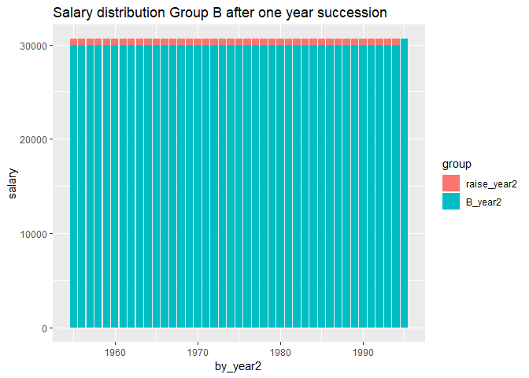

SCB Engineers Jönköping
================
Mikael Lundqvist
9 maj 2019

``` r
##rmarkdown::render("Engineer.r", encoding="UTF-8")
```

Introduction Personal development in R, Statisics, Scientific Report, Markdown, and GitHub with data from Statistics Sweden. I will extract statistics from Statistics Sweden regarding the labour market, salaries and other relevant data from engineers, primarily in Jönköping county. Help functions

``` r
library (tidyverse)
relative_dev <- function (x){
  return (x / x[1])
}
tot_dev <- function (x){
  scales::percent ((tail(x, 1) / x[1]) - 1)
}
perc_women <- function(x){
  scales::percent (x[2] / x[1])
}
## Limited to statistics from 2000 or later
readfile <- function (file1){
  read_csv (file1, col_types = cols(), locale = readr::locale (encoding = "latin1"), na = c("..", "NA")) %>%
    drop_na() %>%
    gather (starts_with("20"), key = "year", value = salary) %>%
    mutate (year2 = parse_number (year)) %>%
    mutate (heading = file1) %>%
    mutate (relsalary = relative_dev (salary))
}   
```

Average monthly pay, pay dispersion etc., non-manual workers private sector (SLP) by educational orientation SUN 2000 and sex. Year 2001 - 2018 Average monthly pay (total pay), SEK SUN2000, 4 natural sciences, mathematics and computing sex, men and women

``` r
readfile ("AM0103I6.csv") %>%
  ggplot () +
    geom_line (mapping = aes(x = year2,y = salary, colour = `field of education SUN 2000`)) +
    theme (legend.position = "bottom") 
```


``` r
readfile ("AM0103I6.csv") %>% 
  group_by (`field of education SUN 2000`) %>% 
  mutate (growth = c (NA, diff(salary)) / salary) %>%
  ggplot () +  
    geom_line (mapping = aes(x = year2, y = growth, colour = `field of education SUN 2000`)) +
    theme (legend.position = "bottom")  
```

    ## Warning: Removed 2 rows containing missing values (geom_path).


``` r
readfile ("AM0103I6_2.csv") %>% 
  group_by (`field of education SUN 2000`) %>% 
  summarise (tot = tot_dev (salary)) %>%
  arrange (desc (tot))
```

    ## # A tibble: 11 x 2
    ##    `field of education SUN 2000`                    tot  
    ##    <chr>                                            <chr>
    ##  1 0 general education                              73.0%
    ##  2 7 health care and nursing, social care           72.4%
    ##  3 8 services                                       69.3%
    ##  4 3 social sciences, law, commerce, administration 68.5%
    ##  5 000 All educational orientations                 68.2%
    ##  6 6 agriculture and forestry, veterinary medicine  68.1%
    ##  7 9 unknown                                        67.9%
    ##  8 5 engineering and manufacturing                  63.5%
    ##  9 2 humanities and arts                            61.6%
    ## 10 1 teaching methods and teacher education         59.5%
    ## 11 4 natural sciences, mathematics and computing    49.7%

Employees 16-64 years by region of work, occupation (3-digit SSYK 2012) and sex. Year 2001 - 2017 Jönköping county, occupation=311 Physical and engineering science technicians, men and women
In 2014 SCB changed from SSYK96 to SSYK2012

``` r
readfile ("AM0208B6.csv") %>% 
  group_by (year2) %>% 
  summarise (total = sum (salary)) %>%
  ggplot ()+
    geom_line (mapping = aes (x = year2, y = total)) +
    theme (legend.position = "bottom")
```


``` r
readfile ("000000NL.csv") %>% 
  group_by (year2) %>% 
  summarise (total = sum (salary)) %>%
  ggplot ()+
    geom_line (mapping = aes (x = year2, y = total)) +
    theme (legend.position = "bottom")  
```


Percent women in the countys 214 Engineering professionals

``` r
options(tibble.print_max = Inf)     
readfile ("000000NL_3.csv") %>% 
  group_by (`region`, year) %>% 
  summarise (perc_women = perc_women (salary)) %>%  
  arrange (desc (perc_women))
```

    ## # A tibble: 22 x 3
    ## # Groups:   region [22]
    ##    region                    year  perc_women
    ##    <chr>                     <chr> <chr>     
    ##  1 03 Uppsala county         2017  43.2%     
    ##  2 09 Gotland county         2017  39.7%     
    ##  3 01 Stockholm county       2017  38.8%     
    ##  4 14 Västra Götaland county 2017  30.9%     
    ##  5 13 Halland county         2017  30.4%     
    ##  6 12 Skåne county           2017  30.3%     
    ##  7 24 Västerbotten county    2017  26.6%     
    ##  8 04 Södermanland county    2017  26.3%     
    ##  9 25 Norrbotten county      2017  26.2%     
    ## 10 05 Östergötland county    2017  25.9%     
    ## 11 18 Örebro county          2017  25.5%     
    ## 12 19 Västmanland county     2017  25.4%     
    ## 13 20 Dalarna county         2017  24.4%     
    ## 14 22 Västernorrland county  2017  24.4%     
    ## 15 17 Värmland county        2017  23.8%     
    ## 16 07 Kronoberg county       2017  22.0%     
    ## 17 06 Jönköping county       2017  21.6%     
    ## 18 10 Blekinge county        2017  19.0%     
    ## 19 08 Kalmar county          2017  18.8%     
    ## 20 21 Gävleborg county       2017  18.7%     
    ## 21 23 Jämtland county        2017  17.0%     
    ## 22 99 County unknown         2017  12.5%

Percent women in the countys 214 Engineering professionals Joint-stock corporations not controlled by the government sector

``` r
readfile ("000000RM.csv") %>% 
  group_by (`region`, year) %>% 
  summarise (perc_women = perc_women (salary)) %>%  
  arrange (desc (perc_women))
```

    ## # A tibble: 22 x 3
    ## # Groups:   region [22]
    ##    region                    year  perc_women
    ##    <chr>                     <chr> <chr>     
    ##  1 03 Uppsala county         2017  45.3%     
    ##  2 01 Stockholm county       2017  38.7%     
    ##  3 14 Västra Götaland county 2017  30.5%     
    ##  4 12 Skåne county           2017  30.4%     
    ##  5 13 Halland county         2017  28.9%     
    ##  6 24 Västerbotten county    2017  27.0%     
    ##  7 04 Södermanland county    2017  26.5%     
    ##  8 18 Örebro county          2017  25.4%     
    ##  9 19 Västmanland county     2017  25.1%     
    ## 10 20 Dalarna county         2017  24.7%     
    ## 11 05 Östergötland county    2017  24.0%     
    ## 12 17 Värmland county        2017  23.8%     
    ## 13 22 Västernorrland county  2017  23.5%     
    ## 14 25 Norrbotten county      2017  22.9%     
    ## 15 06 Jönköping county       2017  21.0%     
    ## 16 07 Kronoberg county       2017  20.8%     
    ## 17 23 Jämtland county        2017  19.9%     
    ## 18 10 Blekinge county        2017  18.4%     
    ## 19 21 Gävleborg county       2017  18.3%     
    ## 20 08 Kalmar county          2017  17.7%     
    ## 21 99 County unknown         2017  16.7%     
    ## 22 09 Gotland county         2017  12.5%

Average monthly pay, non-manual workers private sector (SLP) by region, occupational group (SSYK) and sex. Year 2000 - 2013 Average monthly pay (total pay), non-manual workers private sector (SLP), SEK 214 Engineering professionals
men and women

``` r
readfile ("AM0103H2.csv") %>% 
  ggplot ()+
    geom_line (mapping = aes (x = year2, y = salary, colour = region)) +
    theme (legend.position = "bottom")
```


Average monthly pay, non-manual workers private sector (SLP) by region, occupational group (SSYK 2012) and sex. Year 2014 - 2018 Average monthly pay (total pay), non-manual workers private sector (SLP), SEK 214 Engineering professionals
men and women

``` r
readfile ("0000002T.csv") %>% 
  ggplot ()+
    geom_line (mapping = aes (x = year2, y = salary, colour = region)) +
    theme (legend.position = "bottom")
```


Average monthly pay (total pay), non-manual workers private sector (SLP), SEK by occuptional (SSYK 2012), age, sex and year, Year 2000 - 2013
age=total sex=total

``` r
readfile ("AM0103E6.csv") %>% 
  group_by (`occupational group (SSYK)`) %>% 
  summarise (tot = tot_dev (salary)) %>%
  arrange (desc (tot))  
```

    ## # A tibble: 72 x 2
    ##    `occupational group (SSYK)`                                        tot  
    ##    <chr>                                                              <chr>
    ##  1 249 Psychologists, social work and related professionals           71.1%
    ##  2 723 Machinery mechanics and fitters                                70.4%
    ##  3 822 Chemical-products machine operators                            66.8%
    ##  4 829 Other machine operators and assemblers                         66.7%
    ##  5 722 Blacksmiths, tool-makers and related trades workers            62.0%
    ##  6 121 Directors and chief executives                                 61.5%
    ##  7 419 Other office clerks                                            61.4%
    ##  8 828 Assemblers                                                     61.1%
    ##  9 731 Precision workers in metal and related materials               60.8%
    ## 10 815 Chemical-processing-plant operators                            60.7%
    ## 11 522 Shop and stall salespersons and demonstrators                  60.5%
    ## 12 131 Managers of small enterprises                                  59.7%
    ## 13 321 Agronomy and forestry technicians                              58.0%
    ## 14 212 Mathematicians and statisticians                               57.6%
    ## 15 221 Life science professionals                                     57.3%
    ## 16 919 Other sales and services elementary occupations                56.9%
    ## 17 324 Life science technicians                                       56.7%
    ## 18 413 Stores and transport clerks                                    56.4%
    ## 19 331 Pre-primary education teaching associate professionals         55.4%
    ## 20 323 Nursing associate professionals                                54.9%
    ## 21 246 Religious professionals                                        54.4%
    ## 22 341 Finance and sales associate professionals                      54.3%
    ## 23 311 Physical and engineering science technicians                   54.2%
    ## 24 512 Housekeeping and restaurant services workers                   54.2%
    ## 25 347 Artistic, entertainment and sports associate professionals     54.1%
    ## 26 122 Production and operations managers                             52.9%
    ## 27 348 Religious associate professionals                              52.4%
    ## 28 713 Building finishers and related trades workers                  51.3%
    ## 29 0000 All                                                           51.2%
    ## 30 123 Other specialist managers                                      51.2%
    ## 31 914 Doorkeepers, newspaper and package deliverers and related wor~ 50.9%
    ## 32 315 Safety and quality inspectors                                  50.8%
    ## 33 412 Numerical clerks                                               50.8%
    ## 34 724 Electrical and electronic equipment mechanics and fitters      50.7%
    ## 35 346 Social work associate professionals                            50.3%
    ## 36 342 Business services agents and trade brokers                     50.2%
    ## 37 343 Administrative associate professionals                         50.2%
    ## 38 825 Printing-, binding- and paper-products machine operators       50.0%
    ## 39 312 Computer associate professionals                               48.5%
    ## 40 243 Archivists, librarians and related information professionals   48.2%
    ## 41 912 Helpers and cleaners                                           47.7%
    ## 42 422 Client information clerks                                      47.6%
    ## 43 513 Personal care and related workers                              47.3%
    ## 44 913 Helpers in restaurants                                         47.0%
    ## 45 831 Locomotive-engine drivers and related worker                   46.9%
    ## 46 712 Building frame and related trades workers                      46.8%
    ## 47 816 Power-production and related plant operators                   45.2%
    ## 48 411 Office secretaries and data entry operators                    44.4%
    ## 49 241 Business professionals                                         43.0%
    ## 50 514 Other personal services workers                                42.7%
    ## 51 211 Physicists, chemists and related professionals                 41.6%
    ## 52 245 Writers and creative or performing artists                     40.7%
    ## 53 832 Motor-vehicle drivers                                          40.6%
    ## 54 214 Architects, engineers and related professionals                40.3%
    ## 55 322 Health associate professionals (except nursing)                39.3%
    ## 56 223 Nursing and midwifery professionals                            39.2%
    ## 57 313 Optical and electronic equipment operators                     38.9%
    ## 58 515 Protective services workers                                    38.7%
    ## 59 821 Metal- and mineral-products machine operators                  38.6%
    ## 60 332 Other teaching associate professionals                         37.1%
    ## 61 233 Primary education teaching professionals                       36.2%
    ## 62 242 Legal professionals                                            35.7%
    ## 63 421 Cashiers, tellers and related clerks                           35.7%
    ## 64 213 Computing professionals                                        35.4%
    ## 65 234 Special education teaching professionals                       34.6%
    ## 66 235 Other teaching professionals                                   34.5%
    ## 67 511 Travel attendants and related workers                          34.3%
    ## 68 248 Administrative professionals of special-interest organisations 33.7%
    ## 69 244 Social science and linguistics professionals (except social w~ 33.0%
    ## 70 232 Secondary education teaching professionals                     32.1%
    ## 71 414 Library and filing clerks                                      31.2%
    ## 72 734 Craft printing and related trades workers                      22.5%

Average monthly pay (total pay), non-manual workers private sector (SLP), SEK by occuptional (SSYK 2012), age, sex and year, Year 2014 - 2018 age=total sex=total

``` r
readfile ("00000031.csv") %>% 
  group_by (`occuptional  (SSYK 2012)`) %>% 
  summarise (tot = parse_number (tot_dev (salary))) %>%
  arrange (desc (tot))
```

    ## # A tibble: 81 x 2
    ##    `occuptional  (SSYK 2012)`                                           tot
    ##    <chr>                                                              <dbl>
    ##  1 222 Nursing professionals                                         27.6  
    ##  2 343 Photographers, interior decorators and entertainers           24.8  
    ##  3 334 Administrative and specialized secretaries                    19.2  
    ##  4 266 Social work and counselling professionals                     18.4  
    ##  5 171 Hotel and conference managers                                 18.3  
    ##  6 161 Financial and insurance managers                              18.1  
    ##  7 173 Retail and wholesale trade managers                           17.8  
    ##  8 121 Finance managers                                              17.7  
    ##  9 223 Nursing professionals (cont.)                                 17.7  
    ## 10 122 Human resource managers                                       17.6  
    ## 11 132 Supply, logistics and transport managers                      17.2  
    ## 12 141 Primary and secondary schools and adult education managers    16.7  
    ## 13 142 Preschool managers                                            16    
    ## 14 234 Primary- and pre-school teachers                              15.2  
    ## 15 136 Production managers in construction and mining                15    
    ## 16 344 Driving instructors and other instructors                     14.8  
    ## 17 123 Administration and planning managers                          14.4  
    ## 18 153 Elderly care managers                                         14.1  
    ## 19 174 Sports, leisure and wellness managers                         14.1  
    ## 20 267 Religious professionals and deacons                           14.1  
    ## 21 265 Creative and performing artists                               13.6  
    ## 22 179 Other services managers not elsewhere classified              13.4  
    ## 23 228 Specialists in health care not elsewhere classified           13.4  
    ## 24 312 Construction and manufacturing supervisors                    13.4  
    ## 25 131 Information and communications technology service managers    13.2  
    ## 26 321 Medical and pharmaceutical technicians                        12.3  
    ## 27 335 Tax and related government associate professionals            12.3  
    ## 28 134 Architectural and engineering managers                        12.2  
    ## 29 217 Designers                                                     12.2  
    ## 30 151 Health care managers                                          11.8  
    ## 31 311 Physical and engineering science technicians                  11.7  
    ## 32 224 Psychologists and psychotherapists                            10.9  
    ## 33 262 Museum curators and librarians and related professionals      10.6  
    ## 34 125 Sales and marketing managers                                  10.4  
    ## 35 233 Secondary education teachers                                  10.3  
    ## 36 159 Other social services managers                                10.2  
    ## 37 332 Insurance advisers, sales and purchasing agents                9.87 
    ## 38 218 Specialists within environmental and health protection         9.8  
    ## 39 212 Mathematicians, actuaries and statisticians                    9.74 
    ## 40 324 Veterinary assistants                                          9.49 
    ## 41 0000 All                                                           9.44 
    ## 42 524 Event seller and telemarketers                                 9.44 
    ## 43 241 Accountants, financial analysts and fund managers              9.43 
    ## 44 411 Office assistants and other secretaries                        9.19 
    ## 45 341 Social work and religious associate professionals              9.03 
    ## 46 226 Dentists                                                       8.98 
    ## 47 231 University and higher education teachers                       8.92 
    ## 48 345 Culinary associate professionals                               8.7  
    ## 49 331 Financial and accounting associate professionals               8.61 
    ## 50 251 ICT architects, systems analysts and test managers             8.31 
    ## 51 124 Information, communication and public relations managers       8.28 
    ## 52 261 Legal professionals                                            8.19 
    ## 53 325 Dental hygienists                                              8.16 
    ## 54 213 Biologists, pharmacologists and specialists in agriculture ~   8.14 
    ## 55 232 Vocational education teachers                                  7.74 
    ## 56 242 Organisation analysts, policy administrators and human reso~   7.59 
    ## 57 137 Production managers in manufacturing                           7.54 
    ## 58 214 Engineering professionals                                      7.24 
    ## 59 211 Physicists and chemists                                        6.82 
    ## 60 422 Client information clerks                                      6.43 
    ## 61 421 Croupiers, debt collectors and related workers                 6.01 
    ## 62 112 Managing directors and chief executives                        5.84 
    ## 63 133 Research and development managers                              5.32 
    ## 64 135 Real estate and head of administration manager                 5.17 
    ## 65 333 Business services agents                                       5.1  
    ## 66 352 Broadcasting and audio-visual technicians                      4.79 
    ## 67 129 Administration and service managers not elsewhere classified   4.1  
    ## 68 243 Marketing and public relations professionals                   4.07 
    ## 69 351 ICT operations and user support technicians                    3.63 
    ## 70 227 Naprapaths, physiotherapists, occupational therapists          3.23 
    ## 71 315 Ship and aircraft controllers and technicians                  3.19 
    ## 72 264 Authors, journalists and linguists                             2.25 
    ## 73 342 Athletes, fitness instructors and recreational workers         2.11 
    ## 74 216 Architects and surveyors                                       2.08 
    ## 75 172 Restaurant managers                                            0.917
    ## 76 441 Library and filing clerks                                     -0.402
    ## 77 225 Veterinarians                                                 -0.467
    ## 78 235 Teaching professionals not elsewhere classified               -2.72 
    ## 79 0002 occupations unidentifiable                                   -4.51 
    ## 80 511 Cabin crew, guides and related workers                        -7.61 
    ## 81 221 Medical doctors                                               -8.99

Average monthly pay (total pay), non-manual workers private sector (SLP), SEK by occuptional (SSYK), age, sex and year 2000-2013 214 Engineering professionals sex=total

``` r
##readfile("AM0103A9.csv") %>% rowwise() %>% mutate(age2 = unlist(lapply(strsplit(substr(age, 1, 5), "-"), strtoi))[1]) %>%
##rowwise() %>% mutate(age3 = unlist(lapply(strsplit(substr(age, 1, 5), "-"), strtoi))[2]) %>% 
##  ggplot(mapping = aes(x = year2 - (age2 + age3) / 2, y = salary)) +
##    geom_point() + 
##    geom_smooth(method = lm, formula = y ~ splines::bs(x, 8), se = FALSE) +
##    transition_time(year2) +
##    labs(title = "Year: {frame_time}") +
##  scale_x_continuous(name = "Year of birth") +
##    scale_y_continuous(name = "Salary")
##anim_save("2000-1013.gif", width = 1000, height = 1000)   
```


Average monthly pay (total pay), non-manual workers private sector (SLP), SEK by occuptional (SSYK 2012), age, sex and year 2014-2018 214 Engineering professionals sex=total

``` r
##readfile("00000031_2.csv") %>% rowwise() %>% mutate(age2 = unlist(lapply(strsplit(substr(age, 1, 5), "-"), strtoi))[1]) %>%
##rowwise() %>% mutate(age3 = unlist(lapply(strsplit(substr(age, 1, 5), "-"), strtoi))[2]) %>% 
##  ggplot(mapping = aes(x = year2 - (age2 + age3) / 2, y = salary)) +
##    geom_point() + 
##    geom_smooth(method = lm, formula = y ~ splines::bs(x, 8), se = FALSE) +
##    transition_time(year2) +
##    labs(title = "Year: {frame_time}") +
##  scale_x_continuous(name = "Year of birth") +
##    scale_y_continuous(name = "Salary")   
##anim_save("2014-2018.gif", width = 1000, height = 1000)  
```


Theoretical study of salaries in groups with different age / salary structures. Suppose there is two groups A and B that both have flat age distributions. Group B have a flat salary distribution in general, in group A the oldest employees earns twice as much as the youngest in general.

``` r
A <- seq(30000, 60000, by=750)
B <- seq(30000, 30000, length=41)
year <- 2019
by <- (year - 25):(year - 65)  
tibble(by, A, B) %>% 
  gather(A, B, key = "group", value = "salary") %>%
  ggplot() +
  geom_bar(mapping = aes(x = by, y = salary, fill = group), stat = "identity", position = "dodge") +
  labs(
    title = "Salary structure of Group A and Group B"
  )
```


During the year both group A and B increase the sum of all salaries for respective group by two percent.

``` r
tibble(A_raise = sum(A) * 0.02, B_raise = sum(B) * 0.02) %>% 
  gather(A_raise, B_raise, key="group", value="raise") %>%
  ggplot() +
    geom_bar(mapping = aes(x=group, y=raise, fill = group), stat = "identity") +
    labs(
      title = "Salary raise by 2.0%"
    )  
```


Suppose that each groups increase is divided equally to the employees within respective group.

``` r
raise <- (A + sum(A) * 0.02 / length (A)) - A   
g <- tibble(by, A, raise) %>% 
  gather(A, raise, key = "group", value = "salary")
g$group <-  factor(g$group, levels = c("raise", "A"))
g %>%
  ggplot() +
  geom_bar(mapping = aes(x = by, y = salary, fill = group), stat = "identity") +
  labs(
    title = "Salary increase distribution over age Group A"
  )     
```


Suppose that each groups increase is divided equally to the employees within respective group.

``` r
raise <- (B + sum(B) * 0.02 / length (B)) - B   
g <- as_tibble(cbind(by, B, raise)) %>% 
  gather(B, raise, key = "group", value = "salary")
g$group <-  factor(g$group, levels = c("raise", "B"))
g %>%
  ggplot() +
  geom_bar(mapping = aes(x = by, y = salary, fill = group), stat = "identity") +
  labs(
    title = "Salary increase distribution over age Group B"
  )
```


The oldest employees retire and new adolescents enter the job market. Suppose that the starting salary for respective group is determined by the age / salary structure.

``` r
by_year2 <- by + 1
B_year2 <- lag(B)
B_year2[1] <- B[1] * 1.02
raise_year2 <- lag(B + sum(B) * 0.02 / length (B) - B)
raise_year2[1] <- 0
t <- tibble(by_year2, B_year2, raise_year2) %>%
  gather(B_year2, raise_year2, key = "group", value = "salary")
t$group <- factor(t$group, levels=c("raise_year2", "B_year2"))
t %>%
  ggplot() +
  geom_bar(mapping = aes(x = by_year2, y = salary, fill = group), stat = "identity") +
  labs(
    title = "Salary distribution Group B after one year succession"
  )   
```



The oldest employees retire and new adolescents enter the job market. Suppose that the starting salary for respective group is determined by the age / salary structure.

``` r
by_year2 <- by + 1
raise_year2 <- lag(A + sum(A) * 0.02 / length (A) - A)
raise_year2[1] <- 0
A_year2 <- lag(A)
A_year2[1] <- A[1] + raise_year2[2] - (A[2] - A[1])
t <- tibble(by_year2, A_year2, raise_year2) %>%
  gather(A_year2, raise_year2, key = "group", value = "salary")
t$group <- factor(t$group, levels = c("raise_year2", "A_year2"))
t %>%
  ggplot() +
  geom_bar(mapping = aes(x = by_year2, y = salary, fill = group), stat = "identity") +
  labs(
    title = "Salary distribution Group A after one year succession"
  )  
```


Before next years’ salary revision the sum of the salaries have increased by 2.0 % for group B and only 0.31% for group A

``` r
tibble(A_raise_sum = sum(A) * 0.02 - A[length(A)] + A_year2[1], B_raise_sum = sum(B) * 0.02) %>% 
  gather(A_raise_sum, B_raise_sum, key = "group", value = "raise") %>%
  ggplot() +
    geom_bar(mapping = aes(x=group, y=raise, fill = group), stat = "identity") +
    labs(
      title = "Salary raise since last revision"
    )   
```


This animation shows how the salary development progresses for a longer period of time according to the prerequicites stated above.

``` r
##A <- seq(30000, 60000, by = 750)
##B <- seq(30000, 30000, length = 41)
##for (year in 2019:2059){
##  by <- (year - 25):(year - 65)  
##  tibble(by, A, B) %>% 
##    gather(A, B, key = "group", value = "salary") %>%
##    ggplot() +
##      geom_point(mapping = aes(x = by, y = salary, colour = group)) +
##      labs(
##        title = "Salary development different groups.",
##      subtitle = paste ("Year of revision", year)
##      ) +
##    scale_x_continuous(name = "Year of birth", limits = c(1954, 2034)) +
##      scale_y_continuous(name = "Salary", limits = c(30000, 80000))         
##  ggsave(paste (year, sep="", ".png"))
##  A <- A + sum (A) * 0.020 / length (A)
##  A <- c(A[1] - 750, A[1:40])
##  B <- B * 1.02
##} 
```

The animation was made with ImageMagick

``` r
##"c:\Program Files\ImageMagick-7.0.8-Q16\magick.exe" -delay 50 -loop 0 *.png animation.gif 
```


TBC
References <http://www.statistikdatabasen.scb.se/pxweb/en/>
<https://imagemagick.org/>
