SCB Engineers Jönköping
================
Mikael Lundqvist
9 maj 2019

``` r
##rmarkdown::render("Engineer.r", encoding="UTF-8")  
```

Introduction
with data from Statistics Sweden. I will extract statistics from Statistics
Sweden regarding the labour market, salaries and other relevant data from
engineers, primarily in Jönköping county. Help functions

``` r
library (tidyverse)  
library(gganimate)  
library(car)
relative_dev <- function (x){  
  return (x / x[1])  
}  
tot_dev <- function (x){  
  scales::percent ((tail(x, 1) / x[1]) - 1)  
}  
perc_women <- function(x){  
  scales::percent (x[2] / x[1])  
}   
readfile <- function (file1){  
  read_csv (file1, col_types = cols(), locale = readr::locale (encoding = "latin1"), na = c("..", "NA")) %>%  
    gather (starts_with("19"), starts_with("20"), key = "year", value = salary) %>%  
    drop_na() %>%  
    mutate (year2 = parse_number (year)) %>%  
    mutate (heading = file1) %>%  
    mutate (relsalary = relative_dev (salary))  
}     
```

Average monthly pay, pay dispersion etc., non-manual workers private sector (SLP) by educational orientation SUN 2000 and sex. Year 2001 - 2018
Average monthly pay (total pay), SEK
SUN2000, 4 natural sciences, mathematics and computing
sex, men and women

``` r
readfile ("AM0103I6.csv") %>%  
  ggplot () +  
    geom_line (mapping = aes(x = year2,y = salary, colour = `field of education SUN 2000`)) +  
    theme (legend.position = "bottom")   
```

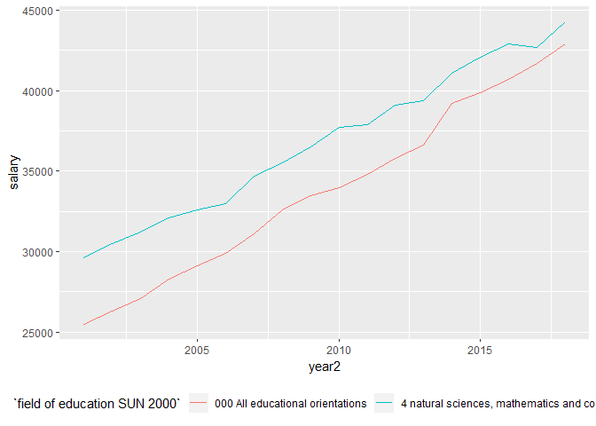

``` r
readfile ("AM0103I6.csv") %>%   
  group_by (`field of education SUN 2000`) %>%   
  mutate (growth = c (NA, diff(salary)) / salary) %>%  
  ggplot () +    
    geom_line (mapping = aes(x = year2, y = growth, colour = `field of education SUN 2000`)) +  
    theme (legend.position = "bottom")    
```

    ## Warning: Removed 2 rows containing missing values (geom_path).

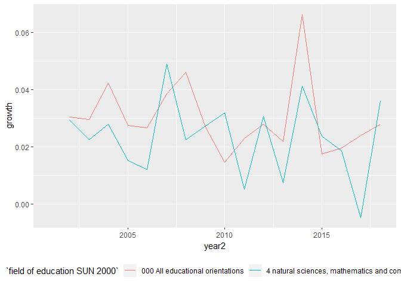

``` r
readfile ("AM0103I6_2.csv") %>%   
  group_by (`field of education SUN 2000`) %>%   
  summarise (tot = tot_dev (salary)) %>%  
  arrange (desc (tot))  
```

    ## # A tibble: 11 x 2
    ##    `field of education SUN 2000`                    tot  
    ##    <chr>                                            <chr>
    ##  1 0 general education                              73.0%
    ##  2 7 health care and nursing, social care           72.4%
    ##  3 8 services                                       69.3%
    ##  4 3 social sciences, law, commerce, administration 68.5%
    ##  5 000 All educational orientations                 68.2%
    ##  6 6 agriculture and forestry, veterinary medicine  68.1%
    ##  7 9 unknown                                        67.9%
    ##  8 5 engineering and manufacturing                  63.5%
    ##  9 2 humanities and arts                            61.6%
    ## 10 1 teaching methods and teacher education         59.5%
    ## 11 4 natural sciences, mathematics and computing    49.7%

Employees 16-64 years by region of work, occupation (3-digit SSYK 2012) and sex. Year 2001 - 2017
Jönköping county, occupation=311 Physical and engineering science technicians, men and women
In 2014 SCB changed from SSYK96 to SSYK2012

``` r
readfile ("AM0208B6.csv") %>%   
  group_by (year2) %>%   
  summarise (total = sum (salary)) %>%  
  ggplot ()+  
    geom_line (mapping = aes (x = year2, y = total)) +  
    theme (legend.position = "bottom")  
```

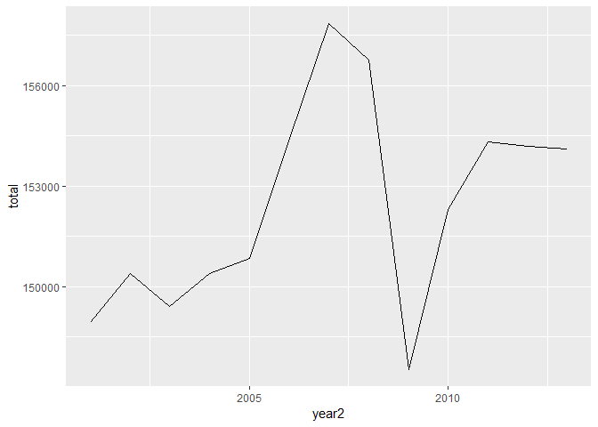

``` r
readfile ("000000NL.csv") %>%   
  group_by (year2) %>%   
  summarise (total = sum (salary)) %>%  
  ggplot () +  
    geom_line (mapping = aes (x = year2, y = total)) +  
    theme (legend.position = "bottom")    
```

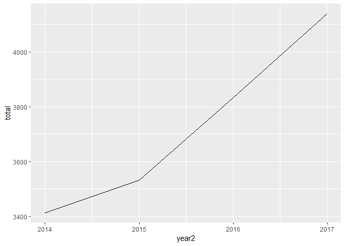

Percent women in the countys
214 Engineering professionals

``` r
options(tibble.print_max = Inf)       
readfile ("000000NL_3.csv") %>%   
  group_by (`region`, year) %>%   
  summarise (perc_women = perc_women (salary)) %>%    
  arrange (desc (perc_women))  
```

    ## # A tibble: 22 x 3
    ## # Groups:   region [22]
    ##    region                    year  perc_women
    ##    <chr>                     <chr> <chr>     
    ##  1 03 Uppsala county         2017  43.2%     
    ##  2 09 Gotland county         2017  39.7%     
    ##  3 01 Stockholm county       2017  38.8%     
    ##  4 14 Västra Götaland county 2017  30.9%     
    ##  5 13 Halland county         2017  30.4%     
    ##  6 12 Skåne county           2017  30.3%     
    ##  7 24 Västerbotten county    2017  26.6%     
    ##  8 04 Södermanland county    2017  26.3%     
    ##  9 25 Norrbotten county      2017  26.2%     
    ## 10 05 Östergötland county    2017  25.9%     
    ## 11 18 Örebro county          2017  25.5%     
    ## 12 19 Västmanland county     2017  25.4%     
    ## 13 20 Dalarna county         2017  24.4%     
    ## 14 22 Västernorrland county  2017  24.4%     
    ## 15 17 Värmland county        2017  23.8%     
    ## 16 07 Kronoberg county       2017  22.0%     
    ## 17 06 Jönköping county       2017  21.6%     
    ## 18 10 Blekinge county        2017  19.0%     
    ## 19 08 Kalmar county          2017  18.8%     
    ## 20 21 Gävleborg county       2017  18.7%     
    ## 21 23 Jämtland county        2017  17.0%     
    ## 22 99 County unknown         2017  12.5%

Percent women in the countys
214 Engineering professionals
Joint-stock corporations not controlled by the government sector

``` r
readfile ("000000RM.csv") %>%   
  group_by (`region`, year) %>%   
  summarise (perc_women = perc_women (salary)) %>%    
  arrange (desc (perc_women))  
```

    ## # A tibble: 22 x 3
    ## # Groups:   region [22]
    ##    region                    year  perc_women
    ##    <chr>                     <chr> <chr>     
    ##  1 03 Uppsala county         2017  45.3%     
    ##  2 01 Stockholm county       2017  38.7%     
    ##  3 14 Västra Götaland county 2017  30.5%     
    ##  4 12 Skåne county           2017  30.4%     
    ##  5 13 Halland county         2017  28.9%     
    ##  6 24 Västerbotten county    2017  27.0%     
    ##  7 04 Södermanland county    2017  26.5%     
    ##  8 18 Örebro county          2017  25.4%     
    ##  9 19 Västmanland county     2017  25.1%     
    ## 10 20 Dalarna county         2017  24.7%     
    ## 11 05 Östergötland county    2017  24.0%     
    ## 12 17 Värmland county        2017  23.8%     
    ## 13 22 Västernorrland county  2017  23.5%     
    ## 14 25 Norrbotten county      2017  22.9%     
    ## 15 06 Jönköping county       2017  21.0%     
    ## 16 07 Kronoberg county       2017  20.8%     
    ## 17 23 Jämtland county        2017  19.9%     
    ## 18 10 Blekinge county        2017  18.4%     
    ## 19 21 Gävleborg county       2017  18.3%     
    ## 20 08 Kalmar county          2017  17.7%     
    ## 21 99 County unknown         2017  16.7%     
    ## 22 09 Gotland county         2017  12.5%

Average monthly pay, non-manual workers private sector (SLP) by region, occupational group (SSYK) and sex. Year 2000 - 2013
Average monthly pay (total pay), non-manual workers private sector (SLP), SEK
214 Engineering professionals
men and women

``` r
readfile ("AM0103H2.csv") %>%   
  ggplot () +  
    geom_line (mapping = aes (x = year2, y = salary, colour = region)) +  
    theme (legend.position = "bottom")  
```

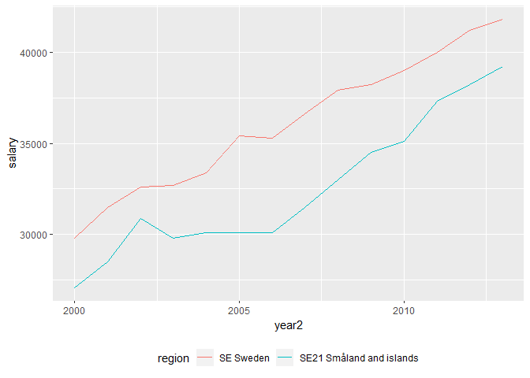

``` r
readfile ("AM0103H2.csv") %>%   
  group_by (region) %>%
  mutate (growth = c (NA, diff(salary)) / salary) %>%  
  ggplot () +    
    geom_line (mapping = aes(x = year2, y = growth, colour = region)) +  
    theme (legend.position = "bottom")      
```

    ## Warning: Removed 2 rows containing missing values (geom_path).

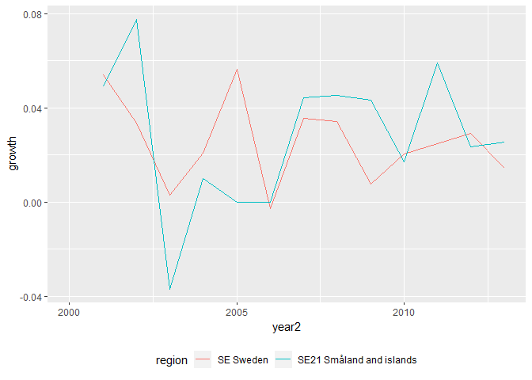

Average monthly pay, non-manual workers private sector (SLP) by region, occupational group (SSYK 2012) and sex. Year 2014 - 2018
Average monthly pay (total pay), non-manual workers private sector (SLP), SEK
214 Engineering professionals
men and women

``` r
readfile ("0000002T.csv") %>%   
  ggplot () +  
    geom_line (mapping = aes (x = year2, y = salary, colour = region)) +  
    theme (legend.position = "bottom")  
```

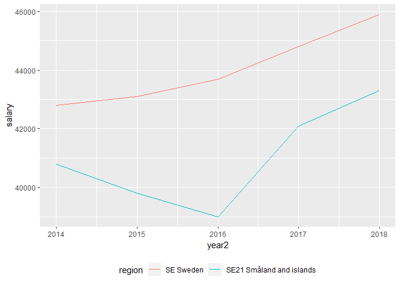

``` r
readfile ("0000002T.csv") %>%   
  group_by (region) %>%
  mutate (growth = c (NA, diff(salary)) / salary) %>%  
  ggplot () +    
    geom_line (mapping = aes(x = year2, y = growth, colour = region)) +  
    theme (legend.position = "bottom")      
```

    ## Warning: Removed 2 rows containing missing values (geom_path).

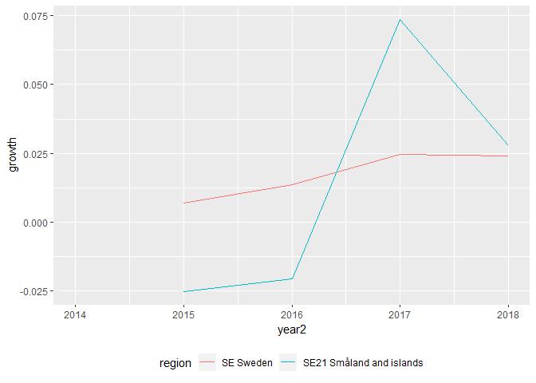

Genomsnittlig grund- och månadslön samt kvinnors lön i procent av mäns lön
efter utbildningsgrupp SUN 2000 och kön. År 2004 - 2017
Månadslön
Kön=Totalt
Only available at the Swedish SCB site

``` r
readfile ("AM0110D2.csv") %>%   
  ggplot () +  
    geom_line (mapping = aes (x = year2, y = salary, colour = `utbildningsgrupp SUN 2000`)) +  
    theme (legend.position = "bottom") +      
    guides(col = guide_legend(title.position = "top", nrow = 5))  
```

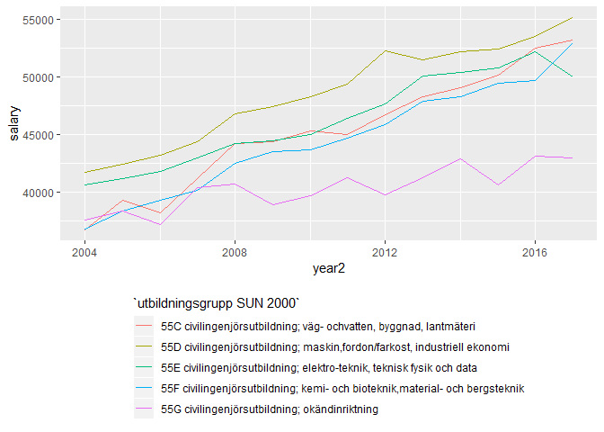

Befolkningen 2006-2018 fördelad efter utbildningsgrupp (SUN 2000) och kön. 25-64 år Only available at the Swedish SCB site

``` r
readfile("tab8_tidsserie_2018.csv") %>%
  filter(`Utbildningsgrupp (SUN 2000)` == "Teknik och tillverkning") %>%
  filter(grepl("Civilingenjörsutbildning", `SUN 2000`)) %>%
  filter(grepl("Samtliga", year)) %>%
  ggplot () +  
    geom_line (mapping = aes (x = year2, y = salary, colour = `SUN 2000`)) +  
    theme (legend.position = "bottom") +      
    guides(col = guide_legend(title.position = "top", nrow = 5)) +
    scale_y_continuous(name = "Antal")    
```

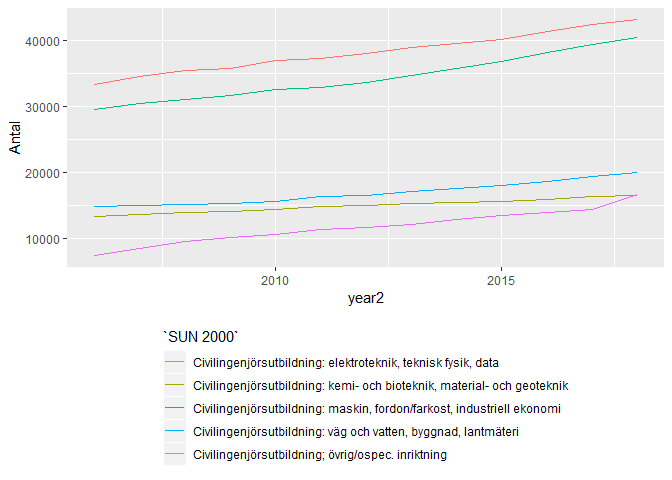

Average monthly pay (total pay), non-manual workers private sector (SLP), SEK by occuptional (SSYK 2012), age, sex and year, Year 2000 - 2013
age=total
sex=total

``` r
readfile ("AM0103E6.csv") %>%   
  group_by (`occupational group (SSYK)`) %>%   
  summarise (tot = tot_dev (salary)) %>%  
  arrange (desc (tot))    
```

    ## # A tibble: 98 x 2
    ##    `occupational group (SSYK)`                                        tot  
    ##    <chr>                                                              <chr>
    ##  1 249 Psychologists, social work and related professionals           71.1%
    ##  2 723 Machinery mechanics and fitters                                70.4%
    ##  3 822 Chemical-products machine operators                            66.8%
    ##  4 829 Other machine operators and assemblers                         66.7%
    ##  5 222 Health professionals (except nursing)                          66.6%
    ##  6 0002 occupations unidentifiable                                    63.1%
    ##  7 722 Blacksmiths, tool-makers and related trades workers            62.0%
    ##  8 121 Directors and chief executives                                 61.5%
    ##  9 419 Other office clerks                                            61.4%
    ## 10 828 Assemblers                                                     61.1%
    ## 11 731 Precision workers in metal and related materials               60.8%
    ## 12 815 Chemical-processing-plant operators                            60.7%
    ## 13 522 Shop and stall salespersons and demonstrators                  60.5%
    ## 14 131 Managers of small enterprises                                  59.7%
    ## 15 321 Agronomy and forestry technicians                              58.0%
    ## 16 212 Mathematicians and statisticians                               57.6%
    ## 17 221 Life science professionals                                     57.3%
    ## 18 919 Other sales and services elementary occupations                56.9%
    ## 19 324 Life science technicians                                       56.7%
    ## 20 413 Stores and transport clerks                                    56.4%
    ## 21 827 Food and related products machine operators                    55.7%
    ## 22 331 Pre-primary education teaching associate professionals         55.4%
    ## 23 323 Nursing associate professionals                                54.9%
    ## 24 246 Religious professionals                                        54.4%
    ## 25 341 Finance and sales associate professionals                      54.3%
    ## 26 311 Physical and engineering science technicians                   54.2%
    ## 27 512 Housekeeping and restaurant services workers                   54.2%
    ## 28 347 Artistic, entertainment and sports associate professionals     54.1%
    ## 29 122 Production and operations managers                             52.9%
    ## 30 348 Religious associate professionals                              52.4%
    ## 31 713 Building finishers and related trades workers                  51.3%
    ## 32 0000 All                                                           51.2%
    ## 33 123 Other specialist managers                                      51.2%
    ## 34 914 Doorkeepers, newspaper and package deliverers and related wor~ 50.9%
    ## 35 315 Safety and quality inspectors                                  50.8%
    ## 36 412 Numerical clerks                                               50.8%
    ## 37 724 Electrical and electronic equipment mechanics and fitters      50.7%
    ## 38 346 Social work associate professionals                            50.3%
    ## 39 342 Business services agents and trade brokers                     50.2%
    ## 40 343 Administrative associate professionals                         50.2%
    ## 41 825 Printing-, binding- and paper-products machine operators       50.0%
    ## 42 312 Computer associate professionals                               48.5%
    ## 43 243 Archivists, librarians and related information professionals   48.2%
    ## 44 912 Helpers and cleaners                                           47.7%
    ## 45 422 Client information clerks                                      47.6%
    ## 46 513 Personal care and related workers                              47.3%
    ## 47 913 Helpers in restaurants                                         47.0%
    ## 48 831 Locomotive-engine drivers and related worker                   46.9%
    ## 49 712 Building frame and related trades workers                      46.8%
    ## 50 816 Power-production and related plant operators                   45.2%
    ## 51 411 Office secretaries and data entry operators                    44.4%
    ## 52 112 Senior officials of special-interest organisations             43.9%
    ## 53 241 Business professionals                                         43.0%
    ## 54 514 Other personal services workers                                42.7%
    ## 55 344 Customs, tax and related government associate professionals    42.0%
    ## 56 231 College, university and higher education teaching professiona~ 41.8%
    ## 57 211 Physicists, chemists and related professionals                 41.6%
    ## 58 245 Writers and creative or performing artists                     40.7%
    ## 59 832 Motor-vehicle drivers                                          40.6%
    ## 60 214 Architects, engineers and related professionals                40.3%
    ## 61 721 Metal moulders, welders, sheet-metal workers, structural-meta~ 39.9%
    ## 62 322 Health associate professionals (except nursing)                39.3%
    ## 63 223 Nursing and midwifery professionals                            39.2%
    ## 64 313 Optical and electronic equipment operators                     38.9%
    ## 65 515 Protective services workers                                    38.7%
    ## 66 821 Metal- and mineral-products machine operators                  38.6%
    ## 67 332 Other teaching associate professionals                         37.1%
    ## 68 233 Primary education teaching professionals                       36.2%
    ## 69 743 Garment and related trades workers                             35.8%
    ## 70 242 Legal professionals                                            35.7%
    ## 71 421 Cashiers, tellers and related clerks                           35.7%
    ## 72 833 Agricultural and other mobile-plant operators                  35.5%
    ## 73 213 Computing professionals                                        35.4%
    ## 74 234 Special education teaching professionals                       34.6%
    ## 75 235 Other teaching professionals                                   34.5%
    ## 76 511 Travel attendants and related workers                          34.3%
    ## 77 933 Transport labourers and freight handlers                       34.0%
    ## 78 248 Administrative professionals of special-interest organisations 33.7%
    ## 79 244 Social science and linguistics professionals (except social w~ 33.0%
    ## 80 232 Secondary education teaching professionals                     32.1%
    ## 81 414 Library and filing clerks                                      31.2%
    ## 82 314 Ship and aircraft controllers and technicians                  29.5%
    ## 83 915 Garbage collectors and related labourers                       27.9%
    ## 84 611 Market gardeners and crop growers                              27.1%
    ## 85 814 Wood-processing- and papermaking-plant operators               26.6%
    ## 86 932 Manufacturing labourers                                        25.4%
    ## 87 824 Wood-products machine operators                                23.9%
    ## 88 714 Painters, building structure cleaners and related trades work~ 22.7%
    ## 89 734 Craft printing and related trades workers                      22.5%
    ## 90 612 Animal producers and related workers                           21.1%
    ## 91 823 Rubber- and plastic-products machine operators                 15.7%
    ## 92 247 Public service administrative professionals                    15.1%
    ## 93 415 Mail carriers and sorting clerks                               13.6%
    ## 94 124 Foreman                                                        13.1%
    ## 95 111 Legislators and senior government officials                    0%   
    ## 96 834 Ships´ deck crews and related workers                          0%   
    ## 97 931 Mining and construction labourers                              0%   
    ## 98 812 Metal-processing-plant operators                               -6.5~

Genomsnittlig månadslön, lön i fasta priser och lönespridning efter utbildningsnivå SUN 2000 och kön. År 1991 - 2015
Genomsnittlig lön, kr Only available at the Swedish SCB site

``` r
tb <- readfile("AM0112C1.csv") %>%
  filter(year2 > 1994) %>%
  group_by (`Utbildningsnivå SUN 2000`, kön) %>%   
  mutate (grouprelsal = relative_dev (salary))

tb %>%
  ggplot () +  
    geom_point (mapping = aes(x = year2,y = grouprelsal, colour = `Utbildningsnivå SUN 2000`, shape=kön))  
```

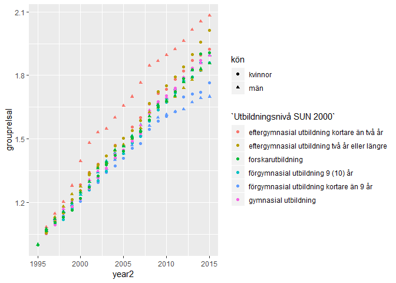

``` r
tb %>%
  ggplot () +  
    geom_point (mapping = aes(x = year2,y = log(grouprelsal), colour = `Utbildningsnivå SUN 2000`, shape=kön))
```

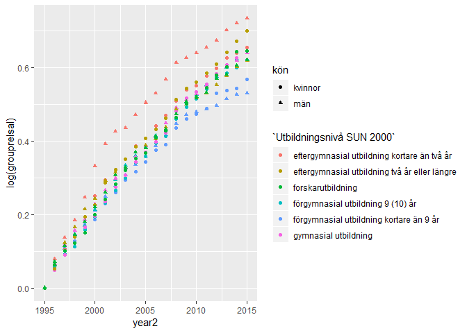

``` r
model <- lm (log(grouprelsal) ~ `Utbildningsnivå SUN 2000` + year2 + kön, data = tb)

tb <- bind_cols(tb, as_tibble(exp(predict(model, tb, interval = "confidence")))) 

tb %>%
  ggplot () +  
    geom_point (mapping = aes(x = year2,y = log(fit), colour = `Utbildningsnivå SUN 2000`, shape=kön))
```

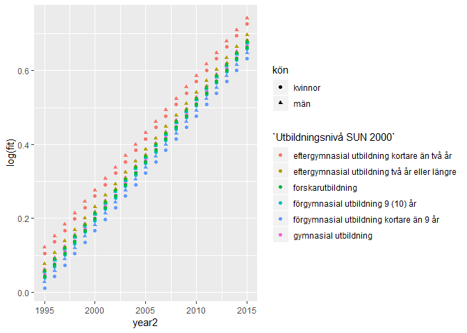

``` r
model1 <- lm (log(grouprelsal) ~ `Utbildningsnivå SUN 2000` * year2 * kön, data = tb)  

tb <- bind_cols(tb, as_tibble(exp(predict(model1, tb, interval = "confidence"))))

tb %>%
  ggplot () +  
    geom_point (mapping = aes(x = year2,y = log(fit1), colour = `Utbildningsnivå SUN 2000`, shape=kön))
```

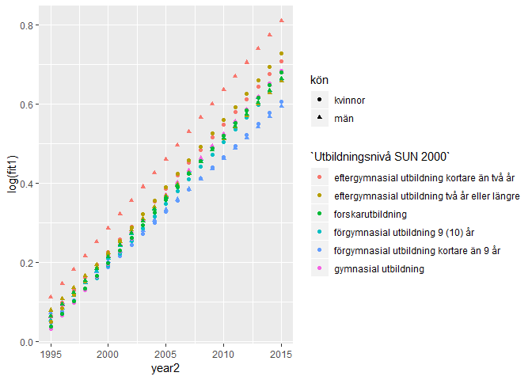

``` r
model2 <- lm (log(grouprelsal) ~ `Utbildningsnivå SUN 2000` * poly(year2, 2) * kön, data = tb)  

tb <- bind_cols(tb, as_tibble(exp(predict(model2, tb, interval = "confidence"))))

tb %>%
  ggplot () +  
    geom_point (mapping = aes(x = year2,y = log(fit2), colour = `Utbildningsnivå SUN 2000`, shape=kön))
```

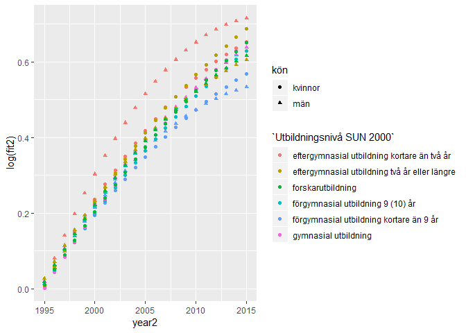

``` r
tb %>%
  ggplot () +  
    geom_point (mapping = aes(x = year2,y = fit2, colour = `Utbildningsnivå SUN 2000`, shape=kön))  
```

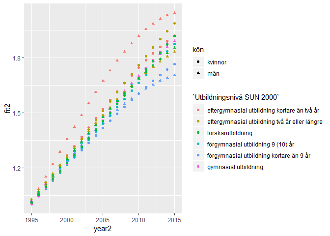

``` r
tb <- tb1 %>% mutate(diffpolylin = fit2 - fit1)

tb %>%
  ggplot () +  
    geom_point (mapping = aes(x = year2,y = diffpolylin, colour = `Utbildningsnivå SUN 2000`, shape=kön))
```

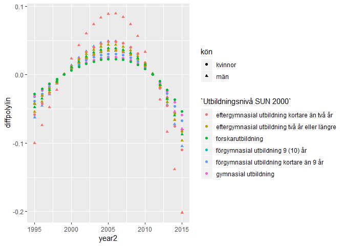

``` r
summary (model2)
```

    ## 
    ## Call:
    ## lm(formula = log(grouprelsal) ~ `Utbildningsnivå SUN 2000` * 
    ##     poly(year2, 2) * kön, data = tb)
    ## 
    ## Residuals:
    ##       Min        1Q    Median        3Q       Max 
    ## -0.027315 -0.006362 -0.000423  0.006024  0.041086 
    ## 
    ## Coefficients:
    ##                                                                                                 Estimate
    ## (Intercept)                                                                                     0.386488
    ## `Utbildningsnivå SUN 2000`eftergymnasial utbildning två år eller längre                         0.002760
    ## `Utbildningsnivå SUN 2000`forskarutbildning                                                    -0.027981
    ## `Utbildningsnivå SUN 2000`förgymnasial utbildning 9 (10) år                                    -0.038948
    ## `Utbildningsnivå SUN 2000`förgymnasial utbildning kortare än 9 år                              -0.059564
    ## `Utbildningsnivå SUN 2000`gymnasial utbildning                                                 -0.028406
    ## poly(year2, 2)1                                                                                 3.094220
    ## poly(year2, 2)2                                                                                -0.457040
    ## könmän                                                                                          0.073840
    ## `Utbildningsnivå SUN 2000`eftergymnasial utbildning två år eller längre:poly(year2, 2)1         0.161835
    ## `Utbildningsnivå SUN 2000`forskarutbildning:poly(year2, 2)1                                    -0.011156
    ## `Utbildningsnivå SUN 2000`förgymnasial utbildning 9 (10) år:poly(year2, 2)1                    -0.091140
    ## `Utbildningsnivå SUN 2000`förgymnasial utbildning kortare än 9 år:poly(year2, 2)1              -0.409677
    ## `Utbildningsnivå SUN 2000`gymnasial utbildning:poly(year2, 2)1                                  0.034874
    ## `Utbildningsnivå SUN 2000`eftergymnasial utbildning två år eller längre:poly(year2, 2)2         0.121677
    ## `Utbildningsnivå SUN 2000`forskarutbildning:poly(year2, 2)2                                     0.231465
    ## `Utbildningsnivå SUN 2000`förgymnasial utbildning 9 (10) år:poly(year2, 2)2                     0.202302
    ## `Utbildningsnivå SUN 2000`förgymnasial utbildning kortare än 9 år:poly(year2, 2)2               0.151023
    ## `Utbildningsnivå SUN 2000`gymnasial utbildning:poly(year2, 2)2                                  0.208284
    ## `Utbildningsnivå SUN 2000`eftergymnasial utbildning två år eller längre:könmän                 -0.095486
    ## `Utbildningsnivå SUN 2000`forskarutbildning:könmän                                             -0.069119
    ## `Utbildningsnivå SUN 2000`förgymnasial utbildning 9 (10) år:könmän                             -0.055252
    ## `Utbildningsnivå SUN 2000`förgymnasial utbildning kortare än 9 år:könmän                       -0.068237
    ## `Utbildningsnivå SUN 2000`gymnasial utbildning:könmän                                          -0.062012
    ## poly(year2, 2)1:könmän                                                                          0.257936
    ## poly(year2, 2)2:könmän                                                                         -0.313951
    ## `Utbildningsnivå SUN 2000`eftergymnasial utbildning två år eller längre:poly(year2, 2)1:könmän -0.735994
    ## `Utbildningsnivå SUN 2000`forskarutbildning:poly(year2, 2)1:könmän                             -0.460803
    ## `Utbildningsnivå SUN 2000`förgymnasial utbildning 9 (10) år:poly(year2, 2)1:könmän             -0.251851
    ## `Utbildningsnivå SUN 2000`förgymnasial utbildning kortare än 9 år:poly(year2, 2)1:könmän       -0.442240
    ## `Utbildningsnivå SUN 2000`gymnasial utbildning:poly(year2, 2)1:könmän                          -0.417802
    ## `Utbildningsnivå SUN 2000`eftergymnasial utbildning två år eller längre:poly(year2, 2)2:könmän  0.229157
    ## `Utbildningsnivå SUN 2000`forskarutbildning:poly(year2, 2)2:könmän                              0.163326
    ## `Utbildningsnivå SUN 2000`förgymnasial utbildning 9 (10) år:poly(year2, 2)2:könmän              0.228888
    ## `Utbildningsnivå SUN 2000`förgymnasial utbildning kortare än 9 år:poly(year2, 2)2:könmän        0.131139
    ## `Utbildningsnivå SUN 2000`gymnasial utbildning:poly(year2, 2)2:könmän                           0.227129
    ##                                                                                                Std. Error
    ## (Intercept)                                                                                      0.002177
    ## `Utbildningsnivå SUN 2000`eftergymnasial utbildning två år eller längre                          0.003079
    ## `Utbildningsnivå SUN 2000`forskarutbildning                                                      0.003079
    ## `Utbildningsnivå SUN 2000`förgymnasial utbildning 9 (10) år                                      0.003079
    ## `Utbildningsnivå SUN 2000`förgymnasial utbildning kortare än 9 år                                0.003079
    ## `Utbildningsnivå SUN 2000`gymnasial utbildning                                                   0.003079
    ## poly(year2, 2)1                                                                                  0.034557
    ## poly(year2, 2)2                                                                                  0.034557
    ## könmän                                                                                           0.003079
    ## `Utbildningsnivå SUN 2000`eftergymnasial utbildning två år eller längre:poly(year2, 2)1          0.048871
    ## `Utbildningsnivå SUN 2000`forskarutbildning:poly(year2, 2)1                                      0.048871
    ## `Utbildningsnivå SUN 2000`förgymnasial utbildning 9 (10) år:poly(year2, 2)1                      0.048871
    ## `Utbildningsnivå SUN 2000`förgymnasial utbildning kortare än 9 år:poly(year2, 2)1                0.048871
    ## `Utbildningsnivå SUN 2000`gymnasial utbildning:poly(year2, 2)1                                   0.048871
    ## `Utbildningsnivå SUN 2000`eftergymnasial utbildning två år eller längre:poly(year2, 2)2          0.048871
    ## `Utbildningsnivå SUN 2000`forskarutbildning:poly(year2, 2)2                                      0.048871
    ## `Utbildningsnivå SUN 2000`förgymnasial utbildning 9 (10) år:poly(year2, 2)2                      0.048871
    ## `Utbildningsnivå SUN 2000`förgymnasial utbildning kortare än 9 år:poly(year2, 2)2                0.048871
    ## `Utbildningsnivå SUN 2000`gymnasial utbildning:poly(year2, 2)2                                   0.048871
    ## `Utbildningsnivå SUN 2000`eftergymnasial utbildning två år eller längre:könmän                   0.004354
    ## `Utbildningsnivå SUN 2000`forskarutbildning:könmän                                               0.004354
    ## `Utbildningsnivå SUN 2000`förgymnasial utbildning 9 (10) år:könmän                               0.004354
    ## `Utbildningsnivå SUN 2000`förgymnasial utbildning kortare än 9 år:könmän                         0.004354
    ## `Utbildningsnivå SUN 2000`gymnasial utbildning:könmän                                            0.004354
    ## poly(year2, 2)1:könmän                                                                           0.048871
    ## poly(year2, 2)2:könmän                                                                           0.048871
    ## `Utbildningsnivå SUN 2000`eftergymnasial utbildning två år eller längre:poly(year2, 2)1:könmän   0.069114
    ## `Utbildningsnivå SUN 2000`forskarutbildning:poly(year2, 2)1:könmän                               0.069114
    ## `Utbildningsnivå SUN 2000`förgymnasial utbildning 9 (10) år:poly(year2, 2)1:könmän               0.069114
    ## `Utbildningsnivå SUN 2000`förgymnasial utbildning kortare än 9 år:poly(year2, 2)1:könmän         0.069114
    ## `Utbildningsnivå SUN 2000`gymnasial utbildning:poly(year2, 2)1:könmän                            0.069114
    ## `Utbildningsnivå SUN 2000`eftergymnasial utbildning två år eller längre:poly(year2, 2)2:könmän   0.069114
    ## `Utbildningsnivå SUN 2000`forskarutbildning:poly(year2, 2)2:könmän                               0.069114
    ## `Utbildningsnivå SUN 2000`förgymnasial utbildning 9 (10) år:poly(year2, 2)2:könmän               0.069114
    ## `Utbildningsnivå SUN 2000`förgymnasial utbildning kortare än 9 år:poly(year2, 2)2:könmän         0.069114
    ## `Utbildningsnivå SUN 2000`gymnasial utbildning:poly(year2, 2)2:könmän                            0.069114
    ##                                                                                                t value
    ## (Intercept)                                                                                    177.542
    ## `Utbildningsnivå SUN 2000`eftergymnasial utbildning två år eller längre                          0.896
    ## `Utbildningsnivå SUN 2000`forskarutbildning                                                     -9.089
    ## `Utbildningsnivå SUN 2000`förgymnasial utbildning 9 (10) år                                    -12.651
    ## `Utbildningsnivå SUN 2000`förgymnasial utbildning kortare än 9 år                              -19.348
    ## `Utbildningsnivå SUN 2000`gymnasial utbildning                                                  -9.227
    ## poly(year2, 2)1                                                                                 89.540
    ## poly(year2, 2)2                                                                                -13.226
    ## könmän                                                                                          23.985
    ## `Utbildningsnivå SUN 2000`eftergymnasial utbildning två år eller längre:poly(year2, 2)1          3.311
    ## `Utbildningsnivå SUN 2000`forskarutbildning:poly(year2, 2)1                                     -0.228
    ## `Utbildningsnivå SUN 2000`förgymnasial utbildning 9 (10) år:poly(year2, 2)1                     -1.865
    ## `Utbildningsnivå SUN 2000`förgymnasial utbildning kortare än 9 år:poly(year2, 2)1               -8.383
    ## `Utbildningsnivå SUN 2000`gymnasial utbildning:poly(year2, 2)1                                   0.714
    ## `Utbildningsnivå SUN 2000`eftergymnasial utbildning två år eller längre:poly(year2, 2)2          2.490
    ## `Utbildningsnivå SUN 2000`forskarutbildning:poly(year2, 2)2                                      4.736
    ## `Utbildningsnivå SUN 2000`förgymnasial utbildning 9 (10) år:poly(year2, 2)2                      4.140
    ## `Utbildningsnivå SUN 2000`förgymnasial utbildning kortare än 9 år:poly(year2, 2)2                3.090
    ## `Utbildningsnivå SUN 2000`gymnasial utbildning:poly(year2, 2)2                                   4.262
    ## `Utbildningsnivå SUN 2000`eftergymnasial utbildning två år eller längre:könmän                 -21.932
    ## `Utbildningsnivå SUN 2000`forskarutbildning:könmän                                             -15.876
    ## `Utbildningsnivå SUN 2000`förgymnasial utbildning 9 (10) år:könmän                             -12.691
    ## `Utbildningsnivå SUN 2000`förgymnasial utbildning kortare än 9 år:könmän                       -15.673
    ## `Utbildningsnivå SUN 2000`gymnasial utbildning:könmän                                          -14.243
    ## poly(year2, 2)1:könmän                                                                           5.278
    ## poly(year2, 2)2:könmän                                                                          -6.424
    ## `Utbildningsnivå SUN 2000`eftergymnasial utbildning två år eller längre:poly(year2, 2)1:könmän -10.649
    ## `Utbildningsnivå SUN 2000`forskarutbildning:poly(year2, 2)1:könmän                              -6.667
    ## `Utbildningsnivå SUN 2000`förgymnasial utbildning 9 (10) år:poly(year2, 2)1:könmän              -3.644
    ## `Utbildningsnivå SUN 2000`förgymnasial utbildning kortare än 9 år:poly(year2, 2)1:könmän        -6.399
    ## `Utbildningsnivå SUN 2000`gymnasial utbildning:poly(year2, 2)1:könmän                           -6.045
    ## `Utbildningsnivå SUN 2000`eftergymnasial utbildning två år eller längre:poly(year2, 2)2:könmän   3.316
    ## `Utbildningsnivå SUN 2000`forskarutbildning:poly(year2, 2)2:könmän                               2.363
    ## `Utbildningsnivå SUN 2000`förgymnasial utbildning 9 (10) år:poly(year2, 2)2:könmän               3.312
    ## `Utbildningsnivå SUN 2000`förgymnasial utbildning kortare än 9 år:poly(year2, 2)2:könmän         1.897
    ## `Utbildningsnivå SUN 2000`gymnasial utbildning:poly(year2, 2)2:könmän                            3.286
    ##                                                                                                Pr(>|t|)
    ## (Intercept)                                                                                     < 2e-16
    ## `Utbildningsnivå SUN 2000`eftergymnasial utbildning två år eller längre                        0.371028
    ## `Utbildningsnivå SUN 2000`forskarutbildning                                                     < 2e-16
    ## `Utbildningsnivå SUN 2000`förgymnasial utbildning 9 (10) år                                     < 2e-16
    ## `Utbildningsnivå SUN 2000`förgymnasial utbildning kortare än 9 år                               < 2e-16
    ## `Utbildningsnivå SUN 2000`gymnasial utbildning                                                  < 2e-16
    ## poly(year2, 2)1                                                                                 < 2e-16
    ## poly(year2, 2)2                                                                                 < 2e-16
    ## könmän                                                                                          < 2e-16
    ## `Utbildningsnivå SUN 2000`eftergymnasial utbildning två år eller längre:poly(year2, 2)1        0.001088
    ## `Utbildningsnivå SUN 2000`forskarutbildning:poly(year2, 2)1                                    0.819647
    ## `Utbildningsnivå SUN 2000`förgymnasial utbildning 9 (10) år:poly(year2, 2)1                    0.063550
    ## `Utbildningsnivå SUN 2000`förgymnasial utbildning kortare än 9 år:poly(year2, 2)1              6.64e-15
    ## `Utbildningsnivå SUN 2000`gymnasial utbildning:poly(year2, 2)1                                 0.476251
    ## `Utbildningsnivå SUN 2000`eftergymnasial utbildning två år eller längre:poly(year2, 2)2        0.013537
    ## `Utbildningsnivå SUN 2000`forskarutbildning:poly(year2, 2)2                                    3.94e-06
    ## `Utbildningsnivå SUN 2000`förgymnasial utbildning 9 (10) år:poly(year2, 2)2                    4.99e-05
    ## `Utbildningsnivå SUN 2000`förgymnasial utbildning kortare än 9 år:poly(year2, 2)2              0.002263
    ## `Utbildningsnivå SUN 2000`gymnasial utbildning:poly(year2, 2)2                                 3.03e-05
    ## `Utbildningsnivå SUN 2000`eftergymnasial utbildning två år eller längre:könmän                  < 2e-16
    ## `Utbildningsnivå SUN 2000`forskarutbildning:könmän                                              < 2e-16
    ## `Utbildningsnivå SUN 2000`förgymnasial utbildning 9 (10) år:könmän                              < 2e-16
    ## `Utbildningsnivå SUN 2000`förgymnasial utbildning kortare än 9 år:könmän                        < 2e-16
    ## `Utbildningsnivå SUN 2000`gymnasial utbildning:könmän                                           < 2e-16
    ## poly(year2, 2)1:könmän                                                                         3.17e-07
    ## poly(year2, 2)2:könmän                                                                         8.33e-10
    ## `Utbildningsnivå SUN 2000`eftergymnasial utbildning två år eller längre:poly(year2, 2)1:könmän  < 2e-16
    ## `Utbildningsnivå SUN 2000`forskarutbildning:poly(year2, 2)1:könmän                             2.14e-10
    ## `Utbildningsnivå SUN 2000`förgymnasial utbildning 9 (10) år:poly(year2, 2)1:könmän             0.000336
    ## `Utbildningsnivå SUN 2000`förgymnasial utbildning kortare än 9 år:poly(year2, 2)1:könmän       9.59e-10
    ## `Utbildningsnivå SUN 2000`gymnasial utbildning:poly(year2, 2)1:könmän                          6.48e-09
    ## `Utbildningsnivå SUN 2000`eftergymnasial utbildning två år eller längre:poly(year2, 2)2:könmän 0.001072
    ## `Utbildningsnivå SUN 2000`forskarutbildning:poly(year2, 2)2:könmän                             0.019009
    ## `Utbildningsnivå SUN 2000`förgymnasial utbildning 9 (10) år:poly(year2, 2)2:könmän             0.001087
    ## `Utbildningsnivå SUN 2000`förgymnasial utbildning kortare än 9 år:poly(year2, 2)2:könmän       0.059105
    ## `Utbildningsnivå SUN 2000`gymnasial utbildning:poly(year2, 2)2:könmän                          0.001185
    ##                                                                                                   
    ## (Intercept)                                                                                    ***
    ## `Utbildningsnivå SUN 2000`eftergymnasial utbildning två år eller längre                           
    ## `Utbildningsnivå SUN 2000`forskarutbildning                                                    ***
    ## `Utbildningsnivå SUN 2000`förgymnasial utbildning 9 (10) år                                    ***
    ## `Utbildningsnivå SUN 2000`förgymnasial utbildning kortare än 9 år                              ***
    ## `Utbildningsnivå SUN 2000`gymnasial utbildning                                                 ***
    ## poly(year2, 2)1                                                                                ***
    ## poly(year2, 2)2                                                                                ***
    ## könmän                                                                                         ***
    ## `Utbildningsnivå SUN 2000`eftergymnasial utbildning två år eller längre:poly(year2, 2)1        ** 
    ## `Utbildningsnivå SUN 2000`forskarutbildning:poly(year2, 2)1                                       
    ## `Utbildningsnivå SUN 2000`förgymnasial utbildning 9 (10) år:poly(year2, 2)1                    .  
    ## `Utbildningsnivå SUN 2000`förgymnasial utbildning kortare än 9 år:poly(year2, 2)1              ***
    ## `Utbildningsnivå SUN 2000`gymnasial utbildning:poly(year2, 2)1                                    
    ## `Utbildningsnivå SUN 2000`eftergymnasial utbildning två år eller längre:poly(year2, 2)2        *  
    ## `Utbildningsnivå SUN 2000`forskarutbildning:poly(year2, 2)2                                    ***
    ## `Utbildningsnivå SUN 2000`förgymnasial utbildning 9 (10) år:poly(year2, 2)2                    ***
    ## `Utbildningsnivå SUN 2000`förgymnasial utbildning kortare än 9 år:poly(year2, 2)2              ** 
    ## `Utbildningsnivå SUN 2000`gymnasial utbildning:poly(year2, 2)2                                 ***
    ## `Utbildningsnivå SUN 2000`eftergymnasial utbildning två år eller längre:könmän                 ***
    ## `Utbildningsnivå SUN 2000`forskarutbildning:könmän                                             ***
    ## `Utbildningsnivå SUN 2000`förgymnasial utbildning 9 (10) år:könmän                             ***
    ## `Utbildningsnivå SUN 2000`förgymnasial utbildning kortare än 9 år:könmän                       ***
    ## `Utbildningsnivå SUN 2000`gymnasial utbildning:könmän                                          ***
    ## poly(year2, 2)1:könmän                                                                         ***
    ## poly(year2, 2)2:könmän                                                                         ***
    ## `Utbildningsnivå SUN 2000`eftergymnasial utbildning två år eller längre:poly(year2, 2)1:könmän ***
    ## `Utbildningsnivå SUN 2000`forskarutbildning:poly(year2, 2)1:könmän                             ***
    ## `Utbildningsnivå SUN 2000`förgymnasial utbildning 9 (10) år:poly(year2, 2)1:könmän             ***
    ## `Utbildningsnivå SUN 2000`förgymnasial utbildning kortare än 9 år:poly(year2, 2)1:könmän       ***
    ## `Utbildningsnivå SUN 2000`gymnasial utbildning:poly(year2, 2)1:könmän                          ***
    ## `Utbildningsnivå SUN 2000`eftergymnasial utbildning två år eller längre:poly(year2, 2)2:könmän ** 
    ## `Utbildningsnivå SUN 2000`forskarutbildning:poly(year2, 2)2:könmän                             *  
    ## `Utbildningsnivå SUN 2000`förgymnasial utbildning 9 (10) år:poly(year2, 2)2:könmän             ** 
    ## `Utbildningsnivå SUN 2000`förgymnasial utbildning kortare än 9 år:poly(year2, 2)2:könmän       .  
    ## `Utbildningsnivå SUN 2000`gymnasial utbildning:poly(year2, 2)2:könmän                          ** 
    ## ---
    ## Signif. codes:  0 '***' 0.001 '**' 0.01 '*' 0.05 '.' 0.1 ' ' 1
    ## 
    ## Residual standard error: 0.009976 on 216 degrees of freedom
    ## Multiple R-squared:  0.9977, Adjusted R-squared:  0.9973 
    ## F-statistic:  2687 on 35 and 216 DF,  p-value: < 2.2e-16

``` r
Anova(model2, type=2)
```

    ## Anova Table (Type II tests)
    ## 
    ## Response: log(grouprelsal)
    ##                                               Sum Sq  Df   F value
    ## `Utbildningsnivå SUN 2000`                    0.2029   5   407.751
    ## poly(year2, 2)                                9.0143   2 45291.129
    ## kön                                           0.0151   1   151.879
    ## `Utbildningsnivå SUN 2000`:poly(year2, 2)     0.0487  10    48.919
    ## `Utbildningsnivå SUN 2000`:kön                0.0527   5   105.945
    ## poly(year2, 2):kön                            0.0097   2    48.728
    ## `Utbildningsnivå SUN 2000`:poly(year2, 2):kön 0.0142  10    14.222
    ## Residuals                                     0.0215 216          
    ##                                                  Pr(>F)    
    ## `Utbildningsnivå SUN 2000`                    < 2.2e-16 ***
    ## poly(year2, 2)                                < 2.2e-16 ***
    ## kön                                           < 2.2e-16 ***
    ## `Utbildningsnivå SUN 2000`:poly(year2, 2)     < 2.2e-16 ***
    ## `Utbildningsnivå SUN 2000`:kön                < 2.2e-16 ***
    ## poly(year2, 2):kön                            < 2.2e-16 ***
    ## `Utbildningsnivå SUN 2000`:poly(year2, 2):kön < 2.2e-16 ***
    ## Residuals                                                  
    ## ---
    ## Signif. codes:  0 '***' 0.001 '**' 0.01 '*' 0.05 '.' 0.1 ' ' 1

Average monthly pay, non-manual workers private sector (SLP) by occupational group (SSYK) age and sex. Year 2000 - 2013 Average monthly pay (total pay), non-manual workers private sector (SLP), SEK by occupational group (SSYK), age, sex and year

``` r
tb <- readfile("AM0103A9_1.csv") %>% 
  rowwise() %>% 
  mutate(age2 = unlist(lapply(strsplit(substr(age, 1, 5), "-"), strtoi))[1]) %>%  
  rowwise() %>% 
  mutate(age3 = unlist(lapply(strsplit(substr(age, 1, 5), "-"), strtoi))[2]) %>% 
  mutate(age4 = (age3 + age2) / 2) %>% 
  group_by (`occupational group (SSYK)`, age, sex) %>%   
  mutate (grouprelsal = relative_dev (salary))  
```

    ## Warning: Grouping rowwise data frame strips rowwise nature

Could my R installation need update?

``` r
tb <- drop_na(tb)  
  
tb %>%
  ggplot () +  
    geom_point (mapping = aes(x = year2,y = log(salary), colour = age, shape=sex))  
```

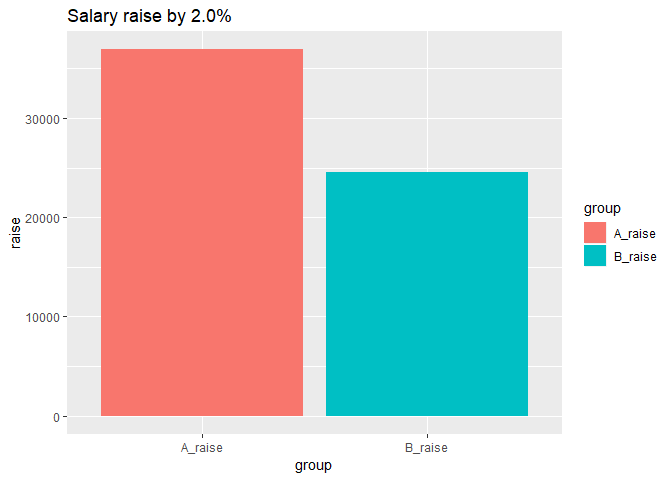

``` r
model <- lm (log(salary) ~ year2 + sex + poly(age4, 3), data = tb)

tb <- bind_cols(tb, as_tibble(exp(predict(model, tb, interval = "confidence"))))

tb %>%
  ggplot () +  
    geom_point (mapping = aes(x = year2,y = log(fit), colour = age, shape=sex))
```


``` r
summary(model)  
```

    ## 
    ## Call:
    ## lm(formula = log(salary) ~ year2 + sex + poly(age4, 3), data = tb)
    ## 
    ## Residuals:
    ##       Min        1Q    Median        3Q       Max 
    ## -0.219144 -0.017261  0.004548  0.024708  0.137118 
    ## 
    ## Coefficients:
    ##                  Estimate Std. Error t value Pr(>|t|)    
    ## (Intercept)    -3.936e+01  1.404e+00 -28.034  < 2e-16 ***
    ## year2           2.484e-02  6.997e-04  35.492  < 2e-16 ***
    ## sexwomen       -7.453e-02  5.659e-03 -13.172  < 2e-16 ***
    ## poly(age4, 3)1  2.148e+00  4.372e-02  49.126  < 2e-16 ***
    ## poly(age4, 3)2 -1.314e+00  4.391e-02 -29.926  < 2e-16 ***
    ## poly(age4, 3)3  1.729e-01  4.372e-02   3.954 0.000102 ***
    ## ---
    ## Signif. codes:  0 '***' 0.001 '**' 0.01 '*' 0.05 '.' 0.1 ' ' 1
    ## 
    ## Residual standard error: 0.0437 on 235 degrees of freedom
    ## Multiple R-squared:  0.952,  Adjusted R-squared:  0.951 
    ## F-statistic: 932.3 on 5 and 235 DF,  p-value: < 2.2e-16

``` r
Anova(model, type=2)
```

    ## Anova Table (Type II tests)
    ## 
    ## Response: log(salary)
    ##               Sum Sq  Df F value    Pr(>F)    
    ## year2         2.4060   1  1259.7 < 2.2e-16 ***
    ## sex           0.3314   1   173.5 < 2.2e-16 ***
    ## poly(age4, 3) 6.3536   3  1108.8 < 2.2e-16 ***
    ## Residuals     0.4488 235                      
    ## ---
    ## Signif. codes:  0 '***' 0.001 '**' 0.01 '*' 0.05 '.' 0.1 ' ' 1

``` r
tb <- readfile("AM0103A9_2.csv") %>% 
  rowwise() %>% 
  mutate(age2 = unlist(lapply(strsplit(substr(age, 1, 5), "-"), strtoi))[1]) %>%  
  rowwise() %>% 
  mutate(age3 = unlist(lapply(strsplit(substr(age, 1, 5), "-"), strtoi))[2]) %>% 
  mutate(age4 = (age3 + age2) / 2) %>% 
  group_by (`occupational group (SSYK)`, age, sex) %>%   
  mutate (grouprelsal = relative_dev (salary))
```

    ## Warning: Grouping rowwise data frame strips rowwise nature

Could my R installation need update?

``` r
tb <- drop_na(tb)  
    
model <- lm (log(salary) ~ `occupational group (SSYK)` + year2 + sex + poly(age4, 3), data = tb)
    
summary(model)  
```

    ## 
    ## Call:
    ## lm(formula = log(salary) ~ `occupational group (SSYK)` + year2 + 
    ##     sex + poly(age4, 3), data = tb)
    ## 
    ## Residuals:
    ##      Min       1Q   Median       3Q      Max 
    ## -0.42795 -0.04676  0.00143  0.04718  0.84375 
    ## 
    ## Coefficients:
    ##                                                                                                                  Estimate
    ## (Intercept)                                                                                                    -4.892e+01
    ## `occupational group (SSYK)`121 Directors and chief executives                                                   6.843e-01
    ## `occupational group (SSYK)`122 Production and operations managers                                               1.498e-01
    ## `occupational group (SSYK)`123 Other specialist managers                                                        3.561e-01
    ## `occupational group (SSYK)`124 Foreman                                                                         -7.816e-02
    ## `occupational group (SSYK)`131 Managers of small enterprises                                                   -2.514e-02
    ## `occupational group (SSYK)`211 Physicists, chemists and related professionals                                   2.084e-01
    ## `occupational group (SSYK)`212 Mathematicians and statisticians                                                 2.004e-01
    ## `occupational group (SSYK)`213 Computing professionals                                                          1.512e-01
    ## `occupational group (SSYK)`214 Architects, engineers and related professionals                                  1.217e-01
    ## `occupational group (SSYK)`221 Life science professionals                                                       1.249e-01
    ## `occupational group (SSYK)`222 Health professionals (except nursing)                                            3.540e-01
    ## `occupational group (SSYK)`223 Nursing and midwifery professionals                                             -5.372e-02
    ## `occupational group (SSYK)`231 College, university and higher education teaching professionals                  5.207e-02
    ## `occupational group (SSYK)`232 Secondary education teaching professionals                                      -2.093e-01
    ## `occupational group (SSYK)`233 Primary education teaching professionals                                        -2.352e-01
    ## `occupational group (SSYK)`235 Other teaching professionals                                                    -1.513e-01
    ## `occupational group (SSYK)`241 Business professionals                                                           1.536e-01
    ## `occupational group (SSYK)`242 Legal professionals                                                              3.757e-01
    ## `occupational group (SSYK)`244 Social science and linguistics professionals (except social work professionals) -3.750e-03
    ## `occupational group (SSYK)`245 Writers and creative or performing artists                                      -2.426e-02
    ## `occupational group (SSYK)`246 Religious professionals                                                         -3.300e-02
    ## `occupational group (SSYK)`247 Public service administrative professionals                                     -4.295e-03
    ## `occupational group (SSYK)`248 Administrative professionals of special-interest organisations                  -1.071e-02
    ## `occupational group (SSYK)`249 Psychologists, social work and related professionals                            -1.351e-01
    ## `occupational group (SSYK)`311 Physical and engineering science technicians                                    -7.049e-02
    ## `occupational group (SSYK)`312 Computer associate professionals                                                -7.091e-02
    ## `occupational group (SSYK)`313 Optical and electronic equipment operators                                      -2.000e-01
    ## `occupational group (SSYK)`314 Ship and aircraft controllers and technicians                                    3.907e-01
    ## `occupational group (SSYK)`315 Safety and quality inspectors                                                   -1.200e-01
    ## `occupational group (SSYK)`321 Agronomy and forestry technicians                                               -1.452e-01
    ## `occupational group (SSYK)`322 Health associate professionals (except nursing)                                 -1.388e-01
    ## `occupational group (SSYK)`323 Nursing associate professionals                                                 -7.971e-02
    ## `occupational group (SSYK)`324 Life science technicians                                                        -2.070e-01
    ## `occupational group (SSYK)`331 Pre-primary education teaching associate professionals                          -3.034e-01
    ## `occupational group (SSYK)`332 Other teaching associate professionals                                          -2.775e-01
    ## `occupational group (SSYK)`341 Finance and sales associate professionals                                       -2.391e-02
    ## `occupational group (SSYK)`342 Business services agents and trade brokers                                      -1.491e-01
    ## `occupational group (SSYK)`343 Administrative associate professionals                                          -1.075e-01
    ## `occupational group (SSYK)`346 Social work associate professionals                                             -3.102e-01
    ## `occupational group (SSYK)`347 Artistic, entertainment and sports associate professionals                      -1.287e-01
    ## `occupational group (SSYK)`411 Office secretaries and data entry operators                                     -2.447e-01
    ## `occupational group (SSYK)`412 Numerical clerks                                                                -2.420e-01
    ## `occupational group (SSYK)`413 Stores and transport clerks                                                     -2.639e-01
    ## `occupational group (SSYK)`415 Mail carriers and sorting clerks                                                -4.046e-01
    ## `occupational group (SSYK)`419 Other office clerks                                                             -2.813e-01
    ## `occupational group (SSYK)`421 Cashiers, tellers and related clerks                                            -2.912e-01
    ## `occupational group (SSYK)`422 Client information clerks                                                       -3.467e-01
    ## `occupational group (SSYK)`511 Travel attendants and related workers                                           -1.698e-01
    ## `occupational group (SSYK)`512 Housekeeping and restaurant services workers                                    -3.676e-01
    ## `occupational group (SSYK)`513 Personal care and related workers                                               -3.716e-01
    ## `occupational group (SSYK)`514 Other personal services workers                                                 -3.457e-01
    ## `occupational group (SSYK)`515 Protective services workers                                                     -2.028e-01
    ## `occupational group (SSYK)`522 Shop and stall salespersons and demonstrators                                   -2.672e-01
    ## `occupational group (SSYK)`712 Building frame and related trades workers                                       -2.664e-01
    ## `occupational group (SSYK)`713 Building finishers and related trades workers                                   -2.954e-01
    ## `occupational group (SSYK)`723 Machinery mechanics and fitters                                                 -2.832e-01
    ## `occupational group (SSYK)`724 Electrical and electronic equipment mechanics and fitters                       -2.434e-01
    ## `occupational group (SSYK)`734 Craft printing and related trades workers                                       -2.137e-01
    ## `occupational group (SSYK)`815 Chemical-processing-plant operators                                             -1.040e-01
    ## `occupational group (SSYK)`816 Power-production and related plant operators                                    -2.126e-01
    ## `occupational group (SSYK)`825 Printing-, binding- and paper-products machine operators                        -1.780e-01
    ## `occupational group (SSYK)`828 Assemblers                                                                      -2.745e-01
    ## `occupational group (SSYK)`829 Other machine operators and assemblers                                          -1.862e-01
    ## `occupational group (SSYK)`831 Locomotive-engine drivers and related worker                                    -1.837e-01
    ## `occupational group (SSYK)`832 Motor-vehicle drivers                                                           -4.037e-01
    ## `occupational group (SSYK)`912 Helpers and cleaners                                                            -4.112e-01
    ## `occupational group (SSYK)`913 Helpers in restaurants                                                          -4.004e-01
    ## `occupational group (SSYK)`914 Doorkeepers, newspaper and package deliverers and related workers               -4.234e-01
    ## `occupational group (SSYK)`919 Other sales and services elementary occupations                                 -4.459e-01
    ## `occupational group (SSYK)`933 Transport labourers and freight handlers                                        -2.856e-01
    ## year2                                                                                                           2.955e-02
    ## sexwomen                                                                                                       -9.402e-02
    ## poly(age4, 3)1                                                                                                  8.009e+00
    ## poly(age4, 3)2                                                                                                 -5.401e+00
    ## poly(age4, 3)3                                                                                                  6.344e-01
    ##                                                                                                                Std. Error
    ## (Intercept)                                                                                                     4.450e-01
    ## `occupational group (SSYK)`121 Directors and chief executives                                                   9.769e-03
    ## `occupational group (SSYK)`122 Production and operations managers                                               7.784e-03
    ## `occupational group (SSYK)`123 Other specialist managers                                                        7.804e-03
    ## `occupational group (SSYK)`124 Foreman                                                                          1.188e-02
    ## `occupational group (SSYK)`131 Managers of small enterprises                                                    7.860e-03
    ## `occupational group (SSYK)`211 Physicists, chemists and related professionals                                   8.119e-03
    ## `occupational group (SSYK)`212 Mathematicians and statisticians                                                 3.488e-02
    ## `occupational group (SSYK)`213 Computing professionals                                                          7.626e-03
    ## `occupational group (SSYK)`214 Architects, engineers and related professionals                                  7.642e-03
    ## `occupational group (SSYK)`221 Life science professionals                                                       1.291e-02
    ## `occupational group (SSYK)`222 Health professionals (except nursing)                                            8.106e-03
    ## `occupational group (SSYK)`223 Nursing and midwifery professionals                                              9.626e-03
    ## `occupational group (SSYK)`231 College, university and higher education teaching professionals                  1.037e-02
    ## `occupational group (SSYK)`232 Secondary education teaching professionals                                       8.129e-03
    ## `occupational group (SSYK)`233 Primary education teaching professionals                                         9.191e-03
    ## `occupational group (SSYK)`235 Other teaching professionals                                                     8.812e-03
    ## `occupational group (SSYK)`241 Business professionals                                                           7.579e-03
    ## `occupational group (SSYK)`242 Legal professionals                                                              8.734e-03
    ## `occupational group (SSYK)`244 Social science and linguistics professionals (except social work professionals)  8.451e-02
    ## `occupational group (SSYK)`245 Writers and creative or performing artists                                       7.564e-03
    ## `occupational group (SSYK)`246 Religious professionals                                                          8.197e-03
    ## `occupational group (SSYK)`247 Public service administrative professionals                                      4.900e-02
    ## `occupational group (SSYK)`248 Administrative professionals of special-interest organisations                   8.007e-03
    ## `occupational group (SSYK)`249 Psychologists, social work and related professionals                             1.028e-02
    ## `occupational group (SSYK)`311 Physical and engineering science technicians                                     7.557e-03
    ## `occupational group (SSYK)`312 Computer associate professionals                                                 7.602e-03
    ## `occupational group (SSYK)`313 Optical and electronic equipment operators                                       9.536e-03
    ## `occupational group (SSYK)`314 Ship and aircraft controllers and technicians                                    1.026e-02
    ## `occupational group (SSYK)`315 Safety and quality inspectors                                                    9.176e-03
    ## `occupational group (SSYK)`321 Agronomy and forestry technicians                                                1.360e-02
    ## `occupational group (SSYK)`322 Health associate professionals (except nursing)                                  8.859e-03
    ## `occupational group (SSYK)`323 Nursing associate professionals                                                  9.090e-03
    ## `occupational group (SSYK)`324 Life science technicians                                                         1.101e-02
    ## `occupational group (SSYK)`331 Pre-primary education teaching associate professionals                           9.917e-03
    ## `occupational group (SSYK)`332 Other teaching associate professionals                                           1.282e-02
    ## `occupational group (SSYK)`341 Finance and sales associate professionals                                        7.557e-03
    ## `occupational group (SSYK)`342 Business services agents and trade brokers                                       7.828e-03
    ## `occupational group (SSYK)`343 Administrative associate professionals                                           7.564e-03
    ## `occupational group (SSYK)`346 Social work associate professionals                                              8.093e-03
    ## `occupational group (SSYK)`347 Artistic, entertainment and sports associate professionals                       8.376e-03
    ## `occupational group (SSYK)`411 Office secretaries and data entry operators                                      8.568e-03
    ## `occupational group (SSYK)`412 Numerical clerks                                                                 7.579e-03
    ## `occupational group (SSYK)`413 Stores and transport clerks                                                      7.579e-03
    ## `occupational group (SSYK)`415 Mail carriers and sorting clerks                                                 9.771e-03
    ## `occupational group (SSYK)`419 Other office clerks                                                              7.564e-03
    ## `occupational group (SSYK)`421 Cashiers, tellers and related clerks                                             8.515e-03
    ## `occupational group (SSYK)`422 Client information clerks                                                        7.602e-03
    ## `occupational group (SSYK)`511 Travel attendants and related workers                                            8.011e-03
    ## `occupational group (SSYK)`512 Housekeeping and restaurant services workers                                     1.128e-02
    ## `occupational group (SSYK)`513 Personal care and related workers                                                7.587e-03
    ## `occupational group (SSYK)`514 Other personal services workers                                                  1.567e-02
    ## `occupational group (SSYK)`515 Protective services workers                                                      1.200e-02
    ## `occupational group (SSYK)`522 Shop and stall salespersons and demonstrators                                    7.579e-03
    ## `occupational group (SSYK)`712 Building frame and related trades workers                                        1.661e-02
    ## `occupational group (SSYK)`713 Building finishers and related trades workers                                    1.130e-02
    ## `occupational group (SSYK)`723 Machinery mechanics and fitters                                                  1.053e-02
    ## `occupational group (SSYK)`724 Electrical and electronic equipment mechanics and fitters                        9.384e-03
    ## `occupational group (SSYK)`734 Craft printing and related trades workers                                        1.809e-02
    ## `occupational group (SSYK)`815 Chemical-processing-plant operators                                              4.252e-02
    ## `occupational group (SSYK)`816 Power-production and related plant operators                                     1.135e-02
    ## `occupational group (SSYK)`825 Printing-, binding- and paper-products machine operators                         2.404e-02
    ## `occupational group (SSYK)`828 Assemblers                                                                       2.118e-02
    ## `occupational group (SSYK)`829 Other machine operators and assemblers                                           2.247e-02
    ## `occupational group (SSYK)`831 Locomotive-engine drivers and related worker                                     1.024e-02
    ## `occupational group (SSYK)`832 Motor-vehicle drivers                                                            9.255e-03
    ## `occupational group (SSYK)`912 Helpers and cleaners                                                             9.597e-03
    ## `occupational group (SSYK)`913 Helpers in restaurants                                                           2.724e-02
    ## `occupational group (SSYK)`914 Doorkeepers, newspaper and package deliverers and related workers                1.123e-02
    ## `occupational group (SSYK)`919 Other sales and services elementary occupations                                  1.473e-02
    ## `occupational group (SSYK)`933 Transport labourers and freight handlers                                         8.454e-02
    ## year2                                                                                                           2.218e-04
    ## sexwomen                                                                                                        1.931e-03
    ## poly(age4, 3)1                                                                                                  8.610e-02
    ## poly(age4, 3)2                                                                                                  8.609e-02
    ## poly(age4, 3)3                                                                                                  8.495e-02
    ##                                                                                                                 t value
    ## (Intercept)                                                                                                    -109.923
    ## `occupational group (SSYK)`121 Directors and chief executives                                                    70.046
    ## `occupational group (SSYK)`122 Production and operations managers                                                19.241
    ## `occupational group (SSYK)`123 Other specialist managers                                                         45.630
    ## `occupational group (SSYK)`124 Foreman                                                                           -6.578
    ## `occupational group (SSYK)`131 Managers of small enterprises                                                     -3.198
    ## `occupational group (SSYK)`211 Physicists, chemists and related professionals                                    25.671
    ## `occupational group (SSYK)`212 Mathematicians and statisticians                                                   5.745
    ## `occupational group (SSYK)`213 Computing professionals                                                           19.829
    ## `occupational group (SSYK)`214 Architects, engineers and related professionals                                   15.922
    ## `occupational group (SSYK)`221 Life science professionals                                                         9.680
    ## `occupational group (SSYK)`222 Health professionals (except nursing)                                             43.677
    ## `occupational group (SSYK)`223 Nursing and midwifery professionals                                               -5.580
    ## `occupational group (SSYK)`231 College, university and higher education teaching professionals                    5.020
    ## `occupational group (SSYK)`232 Secondary education teaching professionals                                       -25.742
    ## `occupational group (SSYK)`233 Primary education teaching professionals                                         -25.586
    ## `occupational group (SSYK)`235 Other teaching professionals                                                     -17.166
    ## `occupational group (SSYK)`241 Business professionals                                                            20.269
    ## `occupational group (SSYK)`242 Legal professionals                                                               43.012
    ## `occupational group (SSYK)`244 Social science and linguistics professionals (except social work professionals)   -0.044
    ## `occupational group (SSYK)`245 Writers and creative or performing artists                                        -3.208
    ## `occupational group (SSYK)`246 Religious professionals                                                           -4.026
    ## `occupational group (SSYK)`247 Public service administrative professionals                                       -0.088
    ## `occupational group (SSYK)`248 Administrative professionals of special-interest organisations                    -1.338
    ## `occupational group (SSYK)`249 Psychologists, social work and related professionals                             -13.135
    ## `occupational group (SSYK)`311 Physical and engineering science technicians                                      -9.329
    ## `occupational group (SSYK)`312 Computer associate professionals                                                  -9.328
    ## `occupational group (SSYK)`313 Optical and electronic equipment operators                                       -20.975
    ## `occupational group (SSYK)`314 Ship and aircraft controllers and technicians                                     38.060
    ## `occupational group (SSYK)`315 Safety and quality inspectors                                                    -13.080
    ## `occupational group (SSYK)`321 Agronomy and forestry technicians                                                -10.673
    ## `occupational group (SSYK)`322 Health associate professionals (except nursing)                                  -15.673
    ## `occupational group (SSYK)`323 Nursing associate professionals                                                   -8.769
    ## `occupational group (SSYK)`324 Life science technicians                                                         -18.796
    ## `occupational group (SSYK)`331 Pre-primary education teaching associate professionals                           -30.590
    ## `occupational group (SSYK)`332 Other teaching associate professionals                                           -21.640
    ## `occupational group (SSYK)`341 Finance and sales associate professionals                                         -3.165
    ## `occupational group (SSYK)`342 Business services agents and trade brokers                                       -19.049
    ## `occupational group (SSYK)`343 Administrative associate professionals                                           -14.206
    ## `occupational group (SSYK)`346 Social work associate professionals                                              -38.335
    ## `occupational group (SSYK)`347 Artistic, entertainment and sports associate professionals                       -15.362
    ## `occupational group (SSYK)`411 Office secretaries and data entry operators                                      -28.553
    ## `occupational group (SSYK)`412 Numerical clerks                                                                 -31.925
    ## `occupational group (SSYK)`413 Stores and transport clerks                                                      -34.815
    ## `occupational group (SSYK)`415 Mail carriers and sorting clerks                                                 -41.403
    ## `occupational group (SSYK)`419 Other office clerks                                                              -37.187
    ## `occupational group (SSYK)`421 Cashiers, tellers and related clerks                                             -34.197
    ## `occupational group (SSYK)`422 Client information clerks                                                        -45.600
    ## `occupational group (SSYK)`511 Travel attendants and related workers                                            -21.199
    ## `occupational group (SSYK)`512 Housekeeping and restaurant services workers                                     -32.589
    ## `occupational group (SSYK)`513 Personal care and related workers                                                -48.987
    ## `occupational group (SSYK)`514 Other personal services workers                                                  -22.064
    ## `occupational group (SSYK)`515 Protective services workers                                                      -16.893
    ## `occupational group (SSYK)`522 Shop and stall salespersons and demonstrators                                    -35.253
    ## `occupational group (SSYK)`712 Building frame and related trades workers                                        -16.039
    ## `occupational group (SSYK)`713 Building finishers and related trades workers                                    -26.149
    ## `occupational group (SSYK)`723 Machinery mechanics and fitters                                                  -26.910
    ## `occupational group (SSYK)`724 Electrical and electronic equipment mechanics and fitters                        -25.937
    ## `occupational group (SSYK)`734 Craft printing and related trades workers                                        -11.816
    ## `occupational group (SSYK)`815 Chemical-processing-plant operators                                               -2.447
    ## `occupational group (SSYK)`816 Power-production and related plant operators                                     -18.732
    ## `occupational group (SSYK)`825 Printing-, binding- and paper-products machine operators                          -7.402
    ## `occupational group (SSYK)`828 Assemblers                                                                       -12.959
    ## `occupational group (SSYK)`829 Other machine operators and assemblers                                            -8.283
    ## `occupational group (SSYK)`831 Locomotive-engine drivers and related worker                                     -17.947
    ## `occupational group (SSYK)`832 Motor-vehicle drivers                                                            -43.616
    ## `occupational group (SSYK)`912 Helpers and cleaners                                                             -42.853
    ## `occupational group (SSYK)`913 Helpers in restaurants                                                           -14.700
    ## `occupational group (SSYK)`914 Doorkeepers, newspaper and package deliverers and related workers                -37.716
    ## `occupational group (SSYK)`919 Other sales and services elementary occupations                                  -30.266
    ## `occupational group (SSYK)`933 Transport labourers and freight handlers                                          -3.378
    ## year2                                                                                                           133.229
    ## sexwomen                                                                                                        -48.680
    ## poly(age4, 3)1                                                                                                   93.018
    ## poly(age4, 3)2                                                                                                  -62.741
    ## poly(age4, 3)3                                                                                                    7.468
    ##                                                                                                                Pr(>|t|)
    ## (Intercept)                                                                                                     < 2e-16
    ## `occupational group (SSYK)`121 Directors and chief executives                                                   < 2e-16
    ## `occupational group (SSYK)`122 Production and operations managers                                               < 2e-16
    ## `occupational group (SSYK)`123 Other specialist managers                                                        < 2e-16
    ## `occupational group (SSYK)`124 Foreman                                                                         5.03e-11
    ## `occupational group (SSYK)`131 Managers of small enterprises                                                   0.001387
    ## `occupational group (SSYK)`211 Physicists, chemists and related professionals                                   < 2e-16
    ## `occupational group (SSYK)`212 Mathematicians and statisticians                                                9.48e-09
    ## `occupational group (SSYK)`213 Computing professionals                                                          < 2e-16
    ## `occupational group (SSYK)`214 Architects, engineers and related professionals                                  < 2e-16
    ## `occupational group (SSYK)`221 Life science professionals                                                       < 2e-16
    ## `occupational group (SSYK)`222 Health professionals (except nursing)                                            < 2e-16
    ## `occupational group (SSYK)`223 Nursing and midwifery professionals                                             2.46e-08
    ## `occupational group (SSYK)`231 College, university and higher education teaching professionals                 5.25e-07
    ## `occupational group (SSYK)`232 Secondary education teaching professionals                                       < 2e-16
    ## `occupational group (SSYK)`233 Primary education teaching professionals                                         < 2e-16
    ## `occupational group (SSYK)`235 Other teaching professionals                                                     < 2e-16
    ## `occupational group (SSYK)`241 Business professionals                                                           < 2e-16
    ## `occupational group (SSYK)`242 Legal professionals                                                              < 2e-16
    ## `occupational group (SSYK)`244 Social science and linguistics professionals (except social work professionals) 0.964610
    ## `occupational group (SSYK)`245 Writers and creative or performing artists                                      0.001343
    ## `occupational group (SSYK)`246 Religious professionals                                                         5.72e-05
    ## `occupational group (SSYK)`247 Public service administrative professionals                                     0.930163
    ## `occupational group (SSYK)`248 Administrative professionals of special-interest organisations                  0.181015
    ## `occupational group (SSYK)`249 Psychologists, social work and related professionals                             < 2e-16
    ## `occupational group (SSYK)`311 Physical and engineering science technicians                                     < 2e-16
    ## `occupational group (SSYK)`312 Computer associate professionals                                                 < 2e-16
    ## `occupational group (SSYK)`313 Optical and electronic equipment operators                                       < 2e-16
    ## `occupational group (SSYK)`314 Ship and aircraft controllers and technicians                                    < 2e-16
    ## `occupational group (SSYK)`315 Safety and quality inspectors                                                    < 2e-16
    ## `occupational group (SSYK)`321 Agronomy and forestry technicians                                                < 2e-16
    ## `occupational group (SSYK)`322 Health associate professionals (except nursing)                                  < 2e-16
    ## `occupational group (SSYK)`323 Nursing associate professionals                                                  < 2e-16
    ## `occupational group (SSYK)`324 Life science technicians                                                         < 2e-16
    ## `occupational group (SSYK)`331 Pre-primary education teaching associate professionals                           < 2e-16
    ## `occupational group (SSYK)`332 Other teaching associate professionals                                           < 2e-16
    ## `occupational group (SSYK)`341 Finance and sales associate professionals                                       0.001557
    ## `occupational group (SSYK)`342 Business services agents and trade brokers                                       < 2e-16
    ## `occupational group (SSYK)`343 Administrative associate professionals                                           < 2e-16
    ## `occupational group (SSYK)`346 Social work associate professionals                                              < 2e-16
    ## `occupational group (SSYK)`347 Artistic, entertainment and sports associate professionals                       < 2e-16
    ## `occupational group (SSYK)`411 Office secretaries and data entry operators                                      < 2e-16
    ## `occupational group (SSYK)`412 Numerical clerks                                                                 < 2e-16
    ## `occupational group (SSYK)`413 Stores and transport clerks                                                      < 2e-16
    ## `occupational group (SSYK)`415 Mail carriers and sorting clerks                                                 < 2e-16
    ## `occupational group (SSYK)`419 Other office clerks                                                              < 2e-16
    ## `occupational group (SSYK)`421 Cashiers, tellers and related clerks                                             < 2e-16
    ## `occupational group (SSYK)`422 Client information clerks                                                        < 2e-16
    ## `occupational group (SSYK)`511 Travel attendants and related workers                                            < 2e-16
    ## `occupational group (SSYK)`512 Housekeeping and restaurant services workers                                     < 2e-16
    ## `occupational group (SSYK)`513 Personal care and related workers                                                < 2e-16
    ## `occupational group (SSYK)`514 Other personal services workers                                                  < 2e-16
    ## `occupational group (SSYK)`515 Protective services workers                                                      < 2e-16
    ## `occupational group (SSYK)`522 Shop and stall salespersons and demonstrators                                    < 2e-16
    ## `occupational group (SSYK)`712 Building frame and related trades workers                                        < 2e-16
    ## `occupational group (SSYK)`713 Building finishers and related trades workers                                    < 2e-16
    ## `occupational group (SSYK)`723 Machinery mechanics and fitters                                                  < 2e-16
    ## `occupational group (SSYK)`724 Electrical and electronic equipment mechanics and fitters                        < 2e-16
    ## `occupational group (SSYK)`734 Craft printing and related trades workers                                        < 2e-16
    ## `occupational group (SSYK)`815 Chemical-processing-plant operators                                             0.014431
    ## `occupational group (SSYK)`816 Power-production and related plant operators                                     < 2e-16
    ## `occupational group (SSYK)`825 Printing-, binding- and paper-products machine operators                        1.45e-13
    ## `occupational group (SSYK)`828 Assemblers                                                                       < 2e-16
    ## `occupational group (SSYK)`829 Other machine operators and assemblers                                           < 2e-16
    ## `occupational group (SSYK)`831 Locomotive-engine drivers and related worker                                     < 2e-16
    ## `occupational group (SSYK)`832 Motor-vehicle drivers                                                            < 2e-16
    ## `occupational group (SSYK)`912 Helpers and cleaners                                                             < 2e-16
    ## `occupational group (SSYK)`913 Helpers in restaurants                                                           < 2e-16
    ## `occupational group (SSYK)`914 Doorkeepers, newspaper and package deliverers and related workers                < 2e-16
    ## `occupational group (SSYK)`919 Other sales and services elementary occupations                                  < 2e-16
    ## `occupational group (SSYK)`933 Transport labourers and freight handlers                                        0.000733
    ## year2                                                                                                           < 2e-16
    ## sexwomen                                                                                                        < 2e-16
    ## poly(age4, 3)1                                                                                                  < 2e-16
    ## poly(age4, 3)2                                                                                                  < 2e-16
    ## poly(age4, 3)3                                                                                                 8.85e-14
    ##                                                                                                                   
    ## (Intercept)                                                                                                    ***
    ## `occupational group (SSYK)`121 Directors and chief executives                                                  ***
    ## `occupational group (SSYK)`122 Production and operations managers                                              ***
    ## `occupational group (SSYK)`123 Other specialist managers                                                       ***
    ## `occupational group (SSYK)`124 Foreman                                                                         ***
    ## `occupational group (SSYK)`131 Managers of small enterprises                                                   ** 
    ## `occupational group (SSYK)`211 Physicists, chemists and related professionals                                  ***
    ## `occupational group (SSYK)`212 Mathematicians and statisticians                                                ***
    ## `occupational group (SSYK)`213 Computing professionals                                                         ***
    ## `occupational group (SSYK)`214 Architects, engineers and related professionals                                 ***
    ## `occupational group (SSYK)`221 Life science professionals                                                      ***
    ## `occupational group (SSYK)`222 Health professionals (except nursing)                                           ***
    ## `occupational group (SSYK)`223 Nursing and midwifery professionals                                             ***
    ## `occupational group (SSYK)`231 College, university and higher education teaching professionals                 ***
    ## `occupational group (SSYK)`232 Secondary education teaching professionals                                      ***
    ## `occupational group (SSYK)`233 Primary education teaching professionals                                        ***
    ## `occupational group (SSYK)`235 Other teaching professionals                                                    ***
    ## `occupational group (SSYK)`241 Business professionals                                                          ***
    ## `occupational group (SSYK)`242 Legal professionals                                                             ***
    ## `occupational group (SSYK)`244 Social science and linguistics professionals (except social work professionals)    
    ## `occupational group (SSYK)`245 Writers and creative or performing artists                                      ** 
    ## `occupational group (SSYK)`246 Religious professionals                                                         ***
    ## `occupational group (SSYK)`247 Public service administrative professionals                                        
    ## `occupational group (SSYK)`248 Administrative professionals of special-interest organisations                     
    ## `occupational group (SSYK)`249 Psychologists, social work and related professionals                            ***
    ## `occupational group (SSYK)`311 Physical and engineering science technicians                                    ***
    ## `occupational group (SSYK)`312 Computer associate professionals                                                ***
    ## `occupational group (SSYK)`313 Optical and electronic equipment operators                                      ***
    ## `occupational group (SSYK)`314 Ship and aircraft controllers and technicians                                   ***
    ## `occupational group (SSYK)`315 Safety and quality inspectors                                                   ***
    ## `occupational group (SSYK)`321 Agronomy and forestry technicians                                               ***
    ## `occupational group (SSYK)`322 Health associate professionals (except nursing)                                 ***
    ## `occupational group (SSYK)`323 Nursing associate professionals                                                 ***
    ## `occupational group (SSYK)`324 Life science technicians                                                        ***
    ## `occupational group (SSYK)`331 Pre-primary education teaching associate professionals                          ***
    ## `occupational group (SSYK)`332 Other teaching associate professionals                                          ***
    ## `occupational group (SSYK)`341 Finance and sales associate professionals                                       ** 
    ## `occupational group (SSYK)`342 Business services agents and trade brokers                                      ***
    ## `occupational group (SSYK)`343 Administrative associate professionals                                          ***
    ## `occupational group (SSYK)`346 Social work associate professionals                                             ***
    ## `occupational group (SSYK)`347 Artistic, entertainment and sports associate professionals                      ***
    ## `occupational group (SSYK)`411 Office secretaries and data entry operators                                     ***
    ## `occupational group (SSYK)`412 Numerical clerks                                                                ***
    ## `occupational group (SSYK)`413 Stores and transport clerks                                                     ***
    ## `occupational group (SSYK)`415 Mail carriers and sorting clerks                                                ***
    ## `occupational group (SSYK)`419 Other office clerks                                                             ***
    ## `occupational group (SSYK)`421 Cashiers, tellers and related clerks                                            ***
    ## `occupational group (SSYK)`422 Client information clerks                                                       ***
    ## `occupational group (SSYK)`511 Travel attendants and related workers                                           ***
    ## `occupational group (SSYK)`512 Housekeeping and restaurant services workers                                    ***
    ## `occupational group (SSYK)`513 Personal care and related workers                                               ***
    ## `occupational group (SSYK)`514 Other personal services workers                                                 ***
    ## `occupational group (SSYK)`515 Protective services workers                                                     ***
    ## `occupational group (SSYK)`522 Shop and stall salespersons and demonstrators                                   ***
    ## `occupational group (SSYK)`712 Building frame and related trades workers                                       ***
    ## `occupational group (SSYK)`713 Building finishers and related trades workers                                   ***
    ## `occupational group (SSYK)`723 Machinery mechanics and fitters                                                 ***
    ## `occupational group (SSYK)`724 Electrical and electronic equipment mechanics and fitters                       ***
    ## `occupational group (SSYK)`734 Craft printing and related trades workers                                       ***
    ## `occupational group (SSYK)`815 Chemical-processing-plant operators                                             *  
    ## `occupational group (SSYK)`816 Power-production and related plant operators                                    ***
    ## `occupational group (SSYK)`825 Printing-, binding- and paper-products machine operators                        ***
    ## `occupational group (SSYK)`828 Assemblers                                                                      ***
    ## `occupational group (SSYK)`829 Other machine operators and assemblers                                          ***
    ## `occupational group (SSYK)`831 Locomotive-engine drivers and related worker                                    ***
    ## `occupational group (SSYK)`832 Motor-vehicle drivers                                                           ***
    ## `occupational group (SSYK)`912 Helpers and cleaners                                                            ***
    ## `occupational group (SSYK)`913 Helpers in restaurants                                                          ***
    ## `occupational group (SSYK)`914 Doorkeepers, newspaper and package deliverers and related workers               ***
    ## `occupational group (SSYK)`919 Other sales and services elementary occupations                                 ***
    ## `occupational group (SSYK)`933 Transport labourers and freight handlers                                        ***
    ## year2                                                                                                          ***
    ## sexwomen                                                                                                       ***
    ## poly(age4, 3)1                                                                                                 ***
    ## poly(age4, 3)2                                                                                                 ***
    ## poly(age4, 3)3                                                                                                 ***
    ## ---
    ## Signif. codes:  0 '***' 0.001 '**' 0.01 '*' 0.05 '.' 0.1 ' ' 1
    ## 
    ## Residual standard error: 0.08431 on 9447 degrees of freedom
    ## Multiple R-squared:  0.9175, Adjusted R-squared:  0.9169 
    ## F-statistic:  1402 on 75 and 9447 DF,  p-value: < 2.2e-16

``` r
Anova(model, type=2)
```

    ## Anova Table (Type II tests)
    ## 
    ## Response: log(salary)
    ##                             Sum Sq   Df  F value    Pr(>F)    
    ## `occupational group (SSYK)` 453.91   70   912.27 < 2.2e-16 ***
    ## year2                       126.17    1 17749.89 < 2.2e-16 ***
    ## sex                          16.84    1  2369.75 < 2.2e-16 ***
    ## poly(age4, 3)                88.64    3  4156.82 < 2.2e-16 ***
    ## Residuals                    67.15 9447                       
    ## ---
    ## Signif. codes:  0 '***' 0.001 '**' 0.01 '*' 0.05 '.' 0.1 ' ' 1

Average monthly pay, non-manual workers private sector (SLP) by occupational group (SSYK 2012) age and sex. Year 2014 - 2018 Average monthly pay (total pay), non-manual workers private sector (SLP), SEK by occupational group (SSYK), age, sex and year

``` r
tb <- readfile("00000031_1.csv") %>% 
  rowwise() %>% 
  mutate(age2 = unlist(lapply(strsplit(substr(age, 1, 5), "-"), strtoi))[1]) %>%  
  rowwise() %>% 
  mutate(age3 = unlist(lapply(strsplit(substr(age, 1, 5), "-"), strtoi))[2]) %>% 
  mutate(age4 = (age3 + age2) / 2) %>% 
  group_by (`occuptional  (SSYK 2012)`, age, sex) %>%   
  mutate (grouprelsal = relative_dev (salary))  
```

    ## Warning: Grouping rowwise data frame strips rowwise nature

``` r
tb %>%
  ggplot () +  
    geom_point (mapping = aes(x = year2,y = log(salary), colour = age, shape=sex))  
```

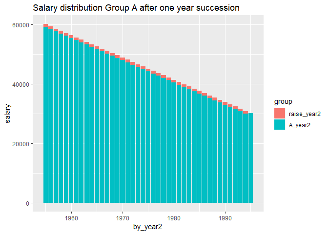

``` r
model <- lm (log(salary) ~ year2 + sex + poly(age4, 3), data = tb)

tb <- bind_cols(tb, as_tibble(exp(predict(model, tb, interval = "confidence"))))

tb %>%
  ggplot () +  
    geom_point (mapping = aes(x = year2,y = log(fit), colour = age, shape=sex))
```


``` r
summary(model)  
```

    ## 
    ## Call:
    ## lm(formula = log(salary) ~ year2 + sex + poly(age4, 3), data = tb)
    ## 
    ## Residuals:
    ##       Min        1Q    Median        3Q       Max 
    ## -0.083528 -0.017062  0.004134  0.013698  0.078086 
    ## 
    ## Coefficients:
    ##                  Estimate Std. Error t value Pr(>|t|)    
    ## (Intercept)    -27.998755   4.194742  -6.675 2.13e-09 ***
    ## year2            0.019178   0.002081   9.217 1.47e-14 ***
    ## sexwomen        -0.035347   0.005966  -5.925 5.96e-08 ***
    ## poly(age4, 3)1   1.501878   0.028669  52.386  < 2e-16 ***
    ## poly(age4, 3)2  -0.732149   0.028703 -25.508  < 2e-16 ***
    ## poly(age4, 3)3   0.008299   0.028723   0.289    0.773    
    ## ---
    ## Signif. codes:  0 '***' 0.001 '**' 0.01 '*' 0.05 '.' 0.1 ' ' 1
    ## 
    ## Residual standard error: 0.02859 on 88 degrees of freedom
    ## Multiple R-squared:  0.9759, Adjusted R-squared:  0.9745 
    ## F-statistic: 711.9 on 5 and 88 DF,  p-value: < 2.2e-16

``` r
Anova(model, type=2)
```

    ## Anova Table (Type II tests)
    ## 
    ## Response: log(salary)
    ##                Sum Sq Df  F value    Pr(>F)    
    ## year2         0.06946  1   84.951 1.468e-14 ***
    ## sex           0.02870  1   35.102 5.959e-08 ***
    ## poly(age4, 3) 2.78971  3 1137.265 < 2.2e-16 ***
    ## Residuals     0.07195 88                       
    ## ---
    ## Signif. codes:  0 '***' 0.001 '**' 0.01 '*' 0.05 '.' 0.1 ' ' 1

``` r
tb <- readfile("00000031_3.csv") %>% 
  rowwise() %>% 
  mutate(age2 = unlist(lapply(strsplit(substr(age, 1, 5), "-"), strtoi))[1]) %>%  
  rowwise() %>% 
  mutate(age3 = unlist(lapply(strsplit(substr(age, 1, 5), "-"), strtoi))[2]) %>% 
  mutate(age4 = (age3 + age2) / 2) %>% 
  group_by (`occuptional  (SSYK 2012)`, age, sex) %>%   
  mutate (grouprelsal = relative_dev (salary))
```

    ## Warning: Grouping rowwise data frame strips rowwise nature

``` r
model <- lm (log(salary) ~ `occuptional  (SSYK 2012)` + year2 + sex + poly(age4, 3), data = tb)
    
summary(model)  
```

    ## 
    ## Call:
    ## lm(formula = log(salary) ~ `occuptional  (SSYK 2012)` + year2 + 
    ##     sex + poly(age4, 3), data = tb)
    ## 
    ## Residuals:
    ##      Min       1Q   Median       3Q      Max 
    ## -0.41565 -0.04967 -0.00225  0.05041  0.35673 
    ## 
    ## Coefficients:
    ##                                                                                                             Estimate
    ## (Intercept)                                                                                               -3.755e+01
    ## `occuptional  (SSYK 2012)`112 Managing directors and chief executives                                      6.171e-01
    ## `occuptional  (SSYK 2012)`121 Finance managers                                                             4.770e-01
    ## `occuptional  (SSYK 2012)`122 Human resource managers                                                      4.543e-01
    ## `occuptional  (SSYK 2012)`123 Administration and planning managers                                         4.956e-01
    ## `occuptional  (SSYK 2012)`124 Information, communication and public relations managers                     5.279e-01
    ## `occuptional  (SSYK 2012)`125 Sales and marketing managers                                                 3.862e-01
    ## `occuptional  (SSYK 2012)`129 Administration and service managers not elsewhere classified                 2.823e-01
    ## `occuptional  (SSYK 2012)`131 Information and communications technology service managers                   4.023e-01
    ## `occuptional  (SSYK 2012)`132 Supply, logistics and transport managers                                     2.974e-01
    ## `occuptional  (SSYK 2012)`133 Research and development managers                                            5.277e-01
    ## `occuptional  (SSYK 2012)`134 Architectural and engineering managers                                       3.935e-01
    ## `occuptional  (SSYK 2012)`135 Real estate and head of administration manager                               2.313e-01
    ## `occuptional  (SSYK 2012)`136 Production managers in construction and mining                               2.888e-01
    ## `occuptional  (SSYK 2012)`137 Production managers in manufacturing                                         1.975e-01
    ## `occuptional  (SSYK 2012)`141 Primary and secondary schools and adult education managers                   1.834e-01
    ## `occuptional  (SSYK 2012)`151 Health care managers                                                         1.681e-01
    ## `occuptional  (SSYK 2012)`154 Managers and leaders within religious bodies                                 2.967e-01
    ## `occuptional  (SSYK 2012)`159 Other social services managers                                               2.082e-01
    ## `occuptional  (SSYK 2012)`161 Financial and insurance managers                                             7.252e-01
    ## `occuptional  (SSYK 2012)`172 Restaurant managers                                                         -5.185e-02
    ## `occuptional  (SSYK 2012)`173 Retail and wholesale trade managers                                          1.104e-01
    ## `occuptional  (SSYK 2012)`179 Other services managers not elsewhere classified                             8.969e-02
    ## `occuptional  (SSYK 2012)`211 Physicists and chemists                                                      1.498e-01
    ## `occuptional  (SSYK 2012)`212 Mathematicians, actuaries and statisticians                                  1.950e-01
    ## `occuptional  (SSYK 2012)`213 Biologists, pharmacologists and specialists in agriculture and forestry      4.217e-02
    ## `occuptional  (SSYK 2012)`214 Engineering professionals                                                    1.572e-01
    ## `occuptional  (SSYK 2012)`216 Architects and surveyors                                                     5.156e-02
    ## `occuptional  (SSYK 2012)`217 Designers                                                                   -8.167e-03
    ## `occuptional  (SSYK 2012)`218 Specialists within environmental and health protection                       7.405e-02
    ## `occuptional  (SSYK 2012)`221 Medical doctors                                                              5.404e-01
    ## `occuptional  (SSYK 2012)`222 Nursing professionals                                                        6.094e-02
    ## `occuptional  (SSYK 2012)`223 Nursing professionals (cont.)                                               -3.751e-02
    ## `occuptional  (SSYK 2012)`224 Psychologists and psychotherapists                                           1.311e-01
    ## `occuptional  (SSYK 2012)`225 Veterinarians                                                                1.451e-01
    ## `occuptional  (SSYK 2012)`226 Dentists                                                                     2.062e-01
    ## `occuptional  (SSYK 2012)`227 Naprapaths, physiotherapists, occupational therapists                       -1.370e-01
    ## `occuptional  (SSYK 2012)`228 Specialists in health care not elsewhere classified                          7.114e-03
    ## `occuptional  (SSYK 2012)`231 University and higher education teachers                                     1.367e-01
    ## `occuptional  (SSYK 2012)`232 Vocational education teachers                                               -2.934e-01
    ## `occuptional  (SSYK 2012)`233 Secondary education teachers                                                -1.041e-01
    ## `occuptional  (SSYK 2012)`234 Primary- and pre-school teachers                                            -1.872e-01
    ## `occuptional  (SSYK 2012)`235 Teaching professionals not elsewhere classified                             -1.426e-01
    ## `occuptional  (SSYK 2012)`241 Accountants, financial analysts and fund managers                            2.279e-01
    ## `occuptional  (SSYK 2012)`242 Organisation analysts, policy administrators and human resource specialists  1.696e-01
    ## `occuptional  (SSYK 2012)`243 Marketing and public relations professionals                                 1.408e-01
    ## `occuptional  (SSYK 2012)`251 ICT architects, systems analysts and test managers                           1.673e-01
    ## `occuptional  (SSYK 2012)`261 Legal professionals                                                          3.911e-01
    ## `occuptional  (SSYK 2012)`264 Authors, journalists and linguists                                          -1.820e-03
    ## `occuptional  (SSYK 2012)`265 Creative and performing artists                                             -8.801e-02
    ## `occuptional  (SSYK 2012)`266 Social work and counselling professionals                                   -2.953e-02
    ## `occuptional  (SSYK 2012)`267 Religious professionals and deacons                                         -4.052e-02
    ## `occuptional  (SSYK 2012)`311 Physical and engineering science technicians                                 1.681e-02
    ## `occuptional  (SSYK 2012)`312 Construction and manufacturing supervisors                                  -1.063e-02
    ## `occuptional  (SSYK 2012)`315 Ship and aircraft controllers and technicians                                2.332e-01
    ## `occuptional  (SSYK 2012)`321 Medical and pharmaceutical technicians                                      -7.302e-02
    ## `occuptional  (SSYK 2012)`324 Veterinary assistants                                                       -1.810e-01
    ## `occuptional  (SSYK 2012)`325 Dental hygienists                                                           -1.573e-01
    ## `occuptional  (SSYK 2012)`331 Financial and accounting associate professionals                             4.499e-02
    ## `occuptional  (SSYK 2012)`332 Insurance advisers, sales and purchasing agents                              5.093e-02
    ## `occuptional  (SSYK 2012)`333 Business services agents                                                    -3.205e-02
    ## `occuptional  (SSYK 2012)`334 Administrative and specialized secretaries                                  -7.863e-04
    ## `occuptional  (SSYK 2012)`335 Tax and related government associate professionals                          -1.270e-02
    ## `occuptional  (SSYK 2012)`341 Social work and religious associate professionals                           -2.183e-01
    ## `occuptional  (SSYK 2012)`342 Athletes, fitness instructors and recreational workers                      -1.492e-01
    ## `occuptional  (SSYK 2012)`343 Photographers, interior decorators and entertainers                         -1.203e-01
    ## `occuptional  (SSYK 2012)`344 Driving instructors and other instructors                                   -2.170e-01
    ## `occuptional  (SSYK 2012)`345 Culinary associate professionals                                            -3.831e-01
    ## `occuptional  (SSYK 2012)`351 ICT operations and user support technicians                                 -3.359e-02
    ## `occuptional  (SSYK 2012)`352 Broadcasting and audio-visual technicians                                   -2.179e-01
    ## `occuptional  (SSYK 2012)`411 Office assistants and other secretaries                                     -1.912e-01
    ## `occuptional  (SSYK 2012)`422 Client information clerks                                                   -2.841e-01
    ## `occuptional  (SSYK 2012)`511 Cabin crew, guides and related workers                                      -1.823e-01
    ## `occuptional  (SSYK 2012)`524 Event seller and telemarketers                                              -2.089e-01
    ## year2                                                                                                      2.386e-02
    ## sexwomen                                                                                                  -7.673e-02
    ## poly(age4, 3)1                                                                                             6.694e+00
    ## poly(age4, 3)2                                                                                            -4.156e+00
    ## poly(age4, 3)3                                                                                             2.201e-01
    ##                                                                                                           Std. Error
    ## (Intercept)                                                                                                2.047e+00
    ## `occuptional  (SSYK 2012)`112 Managing directors and chief executives                                      1.924e-02
    ## `occuptional  (SSYK 2012)`121 Finance managers                                                             1.560e-02
    ## `occuptional  (SSYK 2012)`122 Human resource managers                                                      1.646e-02
    ## `occuptional  (SSYK 2012)`123 Administration and planning managers                                         1.675e-02
    ## `occuptional  (SSYK 2012)`124 Information, communication and public relations managers                     2.467e-02
    ## `occuptional  (SSYK 2012)`125 Sales and marketing managers                                                 1.486e-02
    ## `occuptional  (SSYK 2012)`129 Administration and service managers not elsewhere classified                 1.482e-02
    ## `occuptional  (SSYK 2012)`131 Information and communications technology service managers                   1.580e-02
    ## `occuptional  (SSYK 2012)`132 Supply, logistics and transport managers                                     1.664e-02
    ## `occuptional  (SSYK 2012)`133 Research and development managers                                            1.620e-02
    ## `occuptional  (SSYK 2012)`134 Architectural and engineering managers                                       1.620e-02
    ## `occuptional  (SSYK 2012)`135 Real estate and head of administration manager                               2.777e-02
    ## `occuptional  (SSYK 2012)`136 Production managers in construction and mining                               1.619e-02
    ## `occuptional  (SSYK 2012)`137 Production managers in manufacturing                                         1.611e-02
    ## `occuptional  (SSYK 2012)`141 Primary and secondary schools and adult education managers                   8.905e-02
    ## `occuptional  (SSYK 2012)`151 Health care managers                                                         1.888e-02
    ## `occuptional  (SSYK 2012)`154 Managers and leaders within religious bodies                                 4.561e-02
    ## `occuptional  (SSYK 2012)`159 Other social services managers                                               1.758e-02
    ## `occuptional  (SSYK 2012)`161 Financial and insurance managers                                             1.655e-02
    ## `occuptional  (SSYK 2012)`172 Restaurant managers                                                          2.302e-02
    ## `occuptional  (SSYK 2012)`173 Retail and wholesale trade managers                                          1.756e-02
    ## `occuptional  (SSYK 2012)`179 Other services managers not elsewhere classified                             1.512e-02
    ## `occuptional  (SSYK 2012)`211 Physicists and chemists                                                      1.573e-02
    ## `occuptional  (SSYK 2012)`212 Mathematicians, actuaries and statisticians                                  8.905e-02
    ## `occuptional  (SSYK 2012)`213 Biologists, pharmacologists and specialists in agriculture and forestry      1.595e-02
    ## `occuptional  (SSYK 2012)`214 Engineering professionals                                                    1.413e-02
    ## `occuptional  (SSYK 2012)`216 Architects and surveyors                                                     1.731e-02
    ## `occuptional  (SSYK 2012)`217 Designers                                                                    1.547e-02
    ## `occuptional  (SSYK 2012)`218 Specialists within environmental and health protection                       1.730e-02
    ## `occuptional  (SSYK 2012)`221 Medical doctors                                                              1.663e-02
    ## `occuptional  (SSYK 2012)`222 Nursing professionals                                                        1.469e-02
    ## `occuptional  (SSYK 2012)`223 Nursing professionals (cont.)                                                1.852e-02
    ## `occuptional  (SSYK 2012)`224 Psychologists and psychotherapists                                           6.346e-02
    ## `occuptional  (SSYK 2012)`225 Veterinarians                                                                2.469e-02
    ## `occuptional  (SSYK 2012)`226 Dentists                                                                     2.179e-02
    ## `occuptional  (SSYK 2012)`227 Naprapaths, physiotherapists, occupational therapists                        1.774e-02
    ## `occuptional  (SSYK 2012)`228 Specialists in health care not elsewhere classified                          1.686e-02
    ## `occuptional  (SSYK 2012)`231 University and higher education teachers                                     1.610e-02
    ## `occuptional  (SSYK 2012)`232 Vocational education teachers                                                6.346e-02
    ## `occuptional  (SSYK 2012)`233 Secondary education teachers                                                 3.519e-02
    ## `occuptional  (SSYK 2012)`234 Primary- and pre-school teachers                                             1.432e-02
    ## `occuptional  (SSYK 2012)`235 Teaching professionals not elsewhere classified                              1.685e-02
    ## `occuptional  (SSYK 2012)`241 Accountants, financial analysts and fund managers                            1.443e-02
    ## `occuptional  (SSYK 2012)`242 Organisation analysts, policy administrators and human resource specialists  1.429e-02
    ## `occuptional  (SSYK 2012)`243 Marketing and public relations professionals                                 1.443e-02
    ## `occuptional  (SSYK 2012)`251 ICT architects, systems analysts and test managers                           1.410e-02
    ## `occuptional  (SSYK 2012)`261 Legal professionals                                                          1.559e-02
    ## `occuptional  (SSYK 2012)`264 Authors, journalists and linguists                                           1.429e-02
    ## `occuptional  (SSYK 2012)`265 Creative and performing artists                                              1.491e-02
    ## `occuptional  (SSYK 2012)`266 Social work and counselling professionals                                    2.051e-02
    ## `occuptional  (SSYK 2012)`267 Religious professionals and deacons                                          1.732e-02
    ## `occuptional  (SSYK 2012)`311 Physical and engineering science technicians                                 1.416e-02
    ## `occuptional  (SSYK 2012)`312 Construction and manufacturing supervisors                                   1.490e-02
    ## `occuptional  (SSYK 2012)`315 Ship and aircraft controllers and technicians                                1.926e-02
    ## `occuptional  (SSYK 2012)`321 Medical and pharmaceutical technicians                                       1.436e-02
    ## `occuptional  (SSYK 2012)`324 Veterinary assistants                                                        2.050e-02
    ## `occuptional  (SSYK 2012)`325 Dental hygienists                                                            1.774e-02
    ## `occuptional  (SSYK 2012)`331 Financial and accounting associate professionals                             1.422e-02
    ## `occuptional  (SSYK 2012)`332 Insurance advisers, sales and purchasing agents                              1.413e-02
    ## `occuptional  (SSYK 2012)`333 Business services agents                                                     1.455e-02
    ## `occuptional  (SSYK 2012)`334 Administrative and specialized secretaries                                   1.476e-02
    ## `occuptional  (SSYK 2012)`335 Tax and related government associate professionals                           1.455e-02
    ## `occuptional  (SSYK 2012)`341 Social work and religious associate professionals                            1.664e-02
    ## `occuptional  (SSYK 2012)`342 Athletes, fitness instructors and recreational workers                       1.472e-02
    ## `occuptional  (SSYK 2012)`343 Photographers, interior decorators and entertainers                          1.627e-02
    ## `occuptional  (SSYK 2012)`344 Driving instructors and other instructors                                    2.774e-02
    ## `occuptional  (SSYK 2012)`345 Culinary associate professionals                                             2.781e-02
    ## `occuptional  (SSYK 2012)`351 ICT operations and user support technicians                                  1.429e-02
    ## `occuptional  (SSYK 2012)`352 Broadcasting and audio-visual technicians                                    1.906e-02
    ## `occuptional  (SSYK 2012)`411 Office assistants and other secretaries                                      1.413e-02
    ## `occuptional  (SSYK 2012)`422 Client information clerks                                                    1.416e-02
    ## `occuptional  (SSYK 2012)`511 Cabin crew, guides and related workers                                       1.833e-02
    ## `occuptional  (SSYK 2012)`524 Event seller and telemarketers                                               1.952e-02
    ## year2                                                                                                      1.015e-03
    ## sexwomen                                                                                                   3.056e-03
    ## poly(age4, 3)1                                                                                             9.182e-02
    ## poly(age4, 3)2                                                                                             9.200e-02
    ## poly(age4, 3)3                                                                                             8.962e-02
    ##                                                                                                           t value
    ## (Intercept)                                                                                               -18.342
    ## `occuptional  (SSYK 2012)`112 Managing directors and chief executives                                      32.068
    ## `occuptional  (SSYK 2012)`121 Finance managers                                                             30.572
    ## `occuptional  (SSYK 2012)`122 Human resource managers                                                      27.594
    ## `occuptional  (SSYK 2012)`123 Administration and planning managers                                         29.587
    ## `occuptional  (SSYK 2012)`124 Information, communication and public relations managers                     21.400
    ## `occuptional  (SSYK 2012)`125 Sales and marketing managers                                                 25.995
    ## `occuptional  (SSYK 2012)`129 Administration and service managers not elsewhere classified                 19.049
    ## `occuptional  (SSYK 2012)`131 Information and communications technology service managers                   25.457
    ## `occuptional  (SSYK 2012)`132 Supply, logistics and transport managers                                     17.867
    ## `occuptional  (SSYK 2012)`133 Research and development managers                                            32.577
    ## `occuptional  (SSYK 2012)`134 Architectural and engineering managers                                       24.296
    ## `occuptional  (SSYK 2012)`135 Real estate and head of administration manager                                8.331
    ## `occuptional  (SSYK 2012)`136 Production managers in construction and mining                               17.842
    ## `occuptional  (SSYK 2012)`137 Production managers in manufacturing                                         12.260
    ## `occuptional  (SSYK 2012)`141 Primary and secondary schools and adult education managers                    2.060
    ## `occuptional  (SSYK 2012)`151 Health care managers                                                          8.904
    ## `occuptional  (SSYK 2012)`154 Managers and leaders within religious bodies                                  6.504
    ## `occuptional  (SSYK 2012)`159 Other social services managers                                               11.843
    ## `occuptional  (SSYK 2012)`161 Financial and insurance managers                                             43.812
    ## `occuptional  (SSYK 2012)`172 Restaurant managers                                                          -2.252
    ## `occuptional  (SSYK 2012)`173 Retail and wholesale trade managers                                           6.287
    ## `occuptional  (SSYK 2012)`179 Other services managers not elsewhere classified                              5.930
    ## `occuptional  (SSYK 2012)`211 Physicists and chemists                                                       9.522
    ## `occuptional  (SSYK 2012)`212 Mathematicians, actuaries and statisticians                                   2.189
    ## `occuptional  (SSYK 2012)`213 Biologists, pharmacologists and specialists in agriculture and forestry       2.645
    ## `occuptional  (SSYK 2012)`214 Engineering professionals                                                    11.131
    ## `occuptional  (SSYK 2012)`216 Architects and surveyors                                                      2.978
    ## `occuptional  (SSYK 2012)`217 Designers                                                                    -0.528
    ## `occuptional  (SSYK 2012)`218 Specialists within environmental and health protection                        4.280
    ## `occuptional  (SSYK 2012)`221 Medical doctors                                                              32.493
    ## `occuptional  (SSYK 2012)`222 Nursing professionals                                                         4.148
    ## `occuptional  (SSYK 2012)`223 Nursing professionals (cont.)                                                -2.025
    ## `occuptional  (SSYK 2012)`224 Psychologists and psychotherapists                                            2.065
    ## `occuptional  (SSYK 2012)`225 Veterinarians                                                                 5.878
    ## `occuptional  (SSYK 2012)`226 Dentists                                                                      9.461
    ## `occuptional  (SSYK 2012)`227 Naprapaths, physiotherapists, occupational therapists                        -7.726
    ## `occuptional  (SSYK 2012)`228 Specialists in health care not elsewhere classified                           0.422
    ## `occuptional  (SSYK 2012)`231 University and higher education teachers                                      8.492
    ## `occuptional  (SSYK 2012)`232 Vocational education teachers                                                -4.624
    ## `occuptional  (SSYK 2012)`233 Secondary education teachers                                                 -2.959
    ## `occuptional  (SSYK 2012)`234 Primary- and pre-school teachers                                            -13.072
    ## `occuptional  (SSYK 2012)`235 Teaching professionals not elsewhere classified                              -8.462
    ## `occuptional  (SSYK 2012)`241 Accountants, financial analysts and fund managers                            15.789
    ## `occuptional  (SSYK 2012)`242 Organisation analysts, policy administrators and human resource specialists  11.870
    ## `occuptional  (SSYK 2012)`243 Marketing and public relations professionals                                  9.752
    ## `occuptional  (SSYK 2012)`251 ICT architects, systems analysts and test managers                           11.866
    ## `occuptional  (SSYK 2012)`261 Legal professionals                                                          25.081
    ## `occuptional  (SSYK 2012)`264 Authors, journalists and linguists                                           -0.127
    ## `occuptional  (SSYK 2012)`265 Creative and performing artists                                              -5.903
    ## `occuptional  (SSYK 2012)`266 Social work and counselling professionals                                    -1.440
    ## `occuptional  (SSYK 2012)`267 Religious professionals and deacons                                          -2.340
    ## `occuptional  (SSYK 2012)`311 Physical and engineering science technicians                                  1.187
    ## `occuptional  (SSYK 2012)`312 Construction and manufacturing supervisors                                   -0.713
    ## `occuptional  (SSYK 2012)`315 Ship and aircraft controllers and technicians                                12.104
    ## `occuptional  (SSYK 2012)`321 Medical and pharmaceutical technicians                                       -5.085
    ## `occuptional  (SSYK 2012)`324 Veterinary assistants                                                        -8.831
    ## `occuptional  (SSYK 2012)`325 Dental hygienists                                                            -8.870
    ## `occuptional  (SSYK 2012)`331 Financial and accounting associate professionals                              3.164
    ## `occuptional  (SSYK 2012)`332 Insurance advisers, sales and purchasing agents                               3.605
    ## `occuptional  (SSYK 2012)`333 Business services agents                                                     -2.202
    ## `occuptional  (SSYK 2012)`334 Administrative and specialized secretaries                                   -0.053
    ## `occuptional  (SSYK 2012)`335 Tax and related government associate professionals                           -0.872
    ## `occuptional  (SSYK 2012)`341 Social work and religious associate professionals                           -13.119
    ## `occuptional  (SSYK 2012)`342 Athletes, fitness instructors and recreational workers                      -10.136
    ## `occuptional  (SSYK 2012)`343 Photographers, interior decorators and entertainers                          -7.397
    ## `occuptional  (SSYK 2012)`344 Driving instructors and other instructors                                    -7.824
    ## `occuptional  (SSYK 2012)`345 Culinary associate professionals                                            -13.776
    ## `occuptional  (SSYK 2012)`351 ICT operations and user support technicians                                  -2.351
    ## `occuptional  (SSYK 2012)`352 Broadcasting and audio-visual technicians                                   -11.434
    ## `occuptional  (SSYK 2012)`411 Office assistants and other secretaries                                     -13.532
    ## `occuptional  (SSYK 2012)`422 Client information clerks                                                   -20.067
    ## `occuptional  (SSYK 2012)`511 Cabin crew, guides and related workers                                       -9.947
    ## `occuptional  (SSYK 2012)`524 Event seller and telemarketers                                              -10.702
    ## year2                                                                                                      23.496
    ## sexwomen                                                                                                  -25.110
    ## poly(age4, 3)1                                                                                             72.907
    ## poly(age4, 3)2                                                                                            -45.176
    ## poly(age4, 3)3                                                                                              2.456
    ##                                                                                                           Pr(>|t|)
    ## (Intercept)                                                                                                < 2e-16
    ## `occuptional  (SSYK 2012)`112 Managing directors and chief executives                                      < 2e-16
    ## `occuptional  (SSYK 2012)`121 Finance managers                                                             < 2e-16
    ## `occuptional  (SSYK 2012)`122 Human resource managers                                                      < 2e-16
    ## `occuptional  (SSYK 2012)`123 Administration and planning managers                                         < 2e-16
    ## `occuptional  (SSYK 2012)`124 Information, communication and public relations managers                     < 2e-16
    ## `occuptional  (SSYK 2012)`125 Sales and marketing managers                                                 < 2e-16
    ## `occuptional  (SSYK 2012)`129 Administration and service managers not elsewhere classified                 < 2e-16
    ## `occuptional  (SSYK 2012)`131 Information and communications technology service managers                   < 2e-16
    ## `occuptional  (SSYK 2012)`132 Supply, logistics and transport managers                                     < 2e-16
    ## `occuptional  (SSYK 2012)`133 Research and development managers                                            < 2e-16
    ## `occuptional  (SSYK 2012)`134 Architectural and engineering managers                                       < 2e-16
    ## `occuptional  (SSYK 2012)`135 Real estate and head of administration manager                               < 2e-16
    ## `occuptional  (SSYK 2012)`136 Production managers in construction and mining                               < 2e-16
    ## `occuptional  (SSYK 2012)`137 Production managers in manufacturing                                         < 2e-16
    ## `occuptional  (SSYK 2012)`141 Primary and secondary schools and adult education managers                  0.039465
    ## `occuptional  (SSYK 2012)`151 Health care managers                                                         < 2e-16
    ## `occuptional  (SSYK 2012)`154 Managers and leaders within religious bodies                                8.82e-11
    ## `occuptional  (SSYK 2012)`159 Other social services managers                                               < 2e-16
    ## `occuptional  (SSYK 2012)`161 Financial and insurance managers                                             < 2e-16
    ## `occuptional  (SSYK 2012)`172 Restaurant managers                                                         0.024349
    ## `occuptional  (SSYK 2012)`173 Retail and wholesale trade managers                                         3.61e-10
    ## `occuptional  (SSYK 2012)`179 Other services managers not elsewhere classified                            3.30e-09
    ## `occuptional  (SSYK 2012)`211 Physicists and chemists                                                      < 2e-16
    ## `occuptional  (SSYK 2012)`212 Mathematicians, actuaries and statisticians                                 0.028633
    ## `occuptional  (SSYK 2012)`213 Biologists, pharmacologists and specialists in agriculture and forestry     0.008205
    ## `occuptional  (SSYK 2012)`214 Engineering professionals                                                    < 2e-16
    ## `occuptional  (SSYK 2012)`216 Architects and surveyors                                                    0.002919
    ## `occuptional  (SSYK 2012)`217 Designers                                                                   0.597462
    ## `occuptional  (SSYK 2012)`218 Specialists within environmental and health protection                      1.92e-05
    ## `occuptional  (SSYK 2012)`221 Medical doctors                                                              < 2e-16
    ## `occuptional  (SSYK 2012)`222 Nursing professionals                                                       3.42e-05
    ## `occuptional  (SSYK 2012)`223 Nursing professionals (cont.)                                               0.042901
    ## `occuptional  (SSYK 2012)`224 Psychologists and psychotherapists                                          0.038958
    ## `occuptional  (SSYK 2012)`225 Veterinarians                                                               4.52e-09
    ## `occuptional  (SSYK 2012)`226 Dentists                                                                     < 2e-16
    ## `occuptional  (SSYK 2012)`227 Naprapaths, physiotherapists, occupational therapists                       1.41e-14
    ## `occuptional  (SSYK 2012)`228 Specialists in health care not elsewhere classified                         0.673131
    ## `occuptional  (SSYK 2012)`231 University and higher education teachers                                     < 2e-16
    ## `occuptional  (SSYK 2012)`232 Vocational education teachers                                               3.90e-06
    ## `occuptional  (SSYK 2012)`233 Secondary education teachers                                                0.003109
    ## `occuptional  (SSYK 2012)`234 Primary- and pre-school teachers                                             < 2e-16
    ## `occuptional  (SSYK 2012)`235 Teaching professionals not elsewhere classified                              < 2e-16
    ## `occuptional  (SSYK 2012)`241 Accountants, financial analysts and fund managers                            < 2e-16
    ## `occuptional  (SSYK 2012)`242 Organisation analysts, policy administrators and human resource specialists  < 2e-16
    ## `occuptional  (SSYK 2012)`243 Marketing and public relations professionals                                 < 2e-16
    ## `occuptional  (SSYK 2012)`251 ICT architects, systems analysts and test managers                           < 2e-16
    ## `occuptional  (SSYK 2012)`261 Legal professionals                                                          < 2e-16
    ## `occuptional  (SSYK 2012)`264 Authors, journalists and linguists                                          0.898671
    ## `occuptional  (SSYK 2012)`265 Creative and performing artists                                             3.88e-09
    ## `occuptional  (SSYK 2012)`266 Social work and counselling professionals                                   0.149876
    ## `occuptional  (SSYK 2012)`267 Religious professionals and deacons                                         0.019356
    ## `occuptional  (SSYK 2012)`311 Physical and engineering science technicians                                0.235267
    ## `occuptional  (SSYK 2012)`312 Construction and manufacturing supervisors                                  0.475788
    ## `occuptional  (SSYK 2012)`315 Ship and aircraft controllers and technicians                                < 2e-16
    ## `occuptional  (SSYK 2012)`321 Medical and pharmaceutical technicians                                      3.85e-07
    ## `occuptional  (SSYK 2012)`324 Veterinary assistants                                                        < 2e-16
    ## `occuptional  (SSYK 2012)`325 Dental hygienists                                                            < 2e-16
    ## `occuptional  (SSYK 2012)`331 Financial and accounting associate professionals                            0.001569
    ## `occuptional  (SSYK 2012)`332 Insurance advisers, sales and purchasing agents                             0.000317
    ## `occuptional  (SSYK 2012)`333 Business services agents                                                    0.027702
    ## `occuptional  (SSYK 2012)`334 Administrative and specialized secretaries                                  0.957532
    ## `occuptional  (SSYK 2012)`335 Tax and related government associate professionals                          0.383048
    ## `occuptional  (SSYK 2012)`341 Social work and religious associate professionals                            < 2e-16
    ## `occuptional  (SSYK 2012)`342 Athletes, fitness instructors and recreational workers                       < 2e-16
    ## `occuptional  (SSYK 2012)`343 Photographers, interior decorators and entertainers                         1.71e-13
    ## `occuptional  (SSYK 2012)`344 Driving instructors and other instructors                                   6.56e-15
    ## `occuptional  (SSYK 2012)`345 Culinary associate professionals                                             < 2e-16
    ## `occuptional  (SSYK 2012)`351 ICT operations and user support technicians                                 0.018776
    ## `occuptional  (SSYK 2012)`352 Broadcasting and audio-visual technicians                                    < 2e-16
    ## `occuptional  (SSYK 2012)`411 Office assistants and other secretaries                                      < 2e-16
    ## `occuptional  (SSYK 2012)`422 Client information clerks                                                    < 2e-16
    ## `occuptional  (SSYK 2012)`511 Cabin crew, guides and related workers                                       < 2e-16
    ## `occuptional  (SSYK 2012)`524 Event seller and telemarketers                                               < 2e-16
    ## year2                                                                                                      < 2e-16
    ## sexwomen                                                                                                   < 2e-16
    ## poly(age4, 3)1                                                                                             < 2e-16
    ## poly(age4, 3)2                                                                                             < 2e-16
    ## poly(age4, 3)3                                                                                            0.014087
    ##                                                                                                              
    ## (Intercept)                                                                                               ***
    ## `occuptional  (SSYK 2012)`112 Managing directors and chief executives                                     ***
    ## `occuptional  (SSYK 2012)`121 Finance managers                                                            ***
    ## `occuptional  (SSYK 2012)`122 Human resource managers                                                     ***
    ## `occuptional  (SSYK 2012)`123 Administration and planning managers                                        ***
    ## `occuptional  (SSYK 2012)`124 Information, communication and public relations managers                    ***
    ## `occuptional  (SSYK 2012)`125 Sales and marketing managers                                                ***
    ## `occuptional  (SSYK 2012)`129 Administration and service managers not elsewhere classified                ***
    ## `occuptional  (SSYK 2012)`131 Information and communications technology service managers                  ***
    ## `occuptional  (SSYK 2012)`132 Supply, logistics and transport managers                                    ***
    ## `occuptional  (SSYK 2012)`133 Research and development managers                                           ***
    ## `occuptional  (SSYK 2012)`134 Architectural and engineering managers                                      ***
    ## `occuptional  (SSYK 2012)`135 Real estate and head of administration manager                              ***
    ## `occuptional  (SSYK 2012)`136 Production managers in construction and mining                              ***
    ## `occuptional  (SSYK 2012)`137 Production managers in manufacturing                                        ***
    ## `occuptional  (SSYK 2012)`141 Primary and secondary schools and adult education managers                  *  
    ## `occuptional  (SSYK 2012)`151 Health care managers                                                        ***
    ## `occuptional  (SSYK 2012)`154 Managers and leaders within religious bodies                                ***
    ## `occuptional  (SSYK 2012)`159 Other social services managers                                              ***
    ## `occuptional  (SSYK 2012)`161 Financial and insurance managers                                            ***
    ## `occuptional  (SSYK 2012)`172 Restaurant managers                                                         *  
    ## `occuptional  (SSYK 2012)`173 Retail and wholesale trade managers                                         ***
    ## `occuptional  (SSYK 2012)`179 Other services managers not elsewhere classified                            ***
    ## `occuptional  (SSYK 2012)`211 Physicists and chemists                                                     ***
    ## `occuptional  (SSYK 2012)`212 Mathematicians, actuaries and statisticians                                 *  
    ## `occuptional  (SSYK 2012)`213 Biologists, pharmacologists and specialists in agriculture and forestry     ** 
    ## `occuptional  (SSYK 2012)`214 Engineering professionals                                                   ***
    ## `occuptional  (SSYK 2012)`216 Architects and surveyors                                                    ** 
    ## `occuptional  (SSYK 2012)`217 Designers                                                                      
    ## `occuptional  (SSYK 2012)`218 Specialists within environmental and health protection                      ***
    ## `occuptional  (SSYK 2012)`221 Medical doctors                                                             ***
    ## `occuptional  (SSYK 2012)`222 Nursing professionals                                                       ***
    ## `occuptional  (SSYK 2012)`223 Nursing professionals (cont.)                                               *  
    ## `occuptional  (SSYK 2012)`224 Psychologists and psychotherapists                                          *  
    ## `occuptional  (SSYK 2012)`225 Veterinarians                                                               ***
    ## `occuptional  (SSYK 2012)`226 Dentists                                                                    ***
    ## `occuptional  (SSYK 2012)`227 Naprapaths, physiotherapists, occupational therapists                       ***
    ## `occuptional  (SSYK 2012)`228 Specialists in health care not elsewhere classified                            
    ## `occuptional  (SSYK 2012)`231 University and higher education teachers                                    ***
    ## `occuptional  (SSYK 2012)`232 Vocational education teachers                                               ***
    ## `occuptional  (SSYK 2012)`233 Secondary education teachers                                                ** 
    ## `occuptional  (SSYK 2012)`234 Primary- and pre-school teachers                                            ***
    ## `occuptional  (SSYK 2012)`235 Teaching professionals not elsewhere classified                             ***
    ## `occuptional  (SSYK 2012)`241 Accountants, financial analysts and fund managers                           ***
    ## `occuptional  (SSYK 2012)`242 Organisation analysts, policy administrators and human resource specialists ***
    ## `occuptional  (SSYK 2012)`243 Marketing and public relations professionals                                ***
    ## `occuptional  (SSYK 2012)`251 ICT architects, systems analysts and test managers                          ***
    ## `occuptional  (SSYK 2012)`261 Legal professionals                                                         ***
    ## `occuptional  (SSYK 2012)`264 Authors, journalists and linguists                                             
    ## `occuptional  (SSYK 2012)`265 Creative and performing artists                                             ***
    ## `occuptional  (SSYK 2012)`266 Social work and counselling professionals                                      
    ## `occuptional  (SSYK 2012)`267 Religious professionals and deacons                                         *  
    ## `occuptional  (SSYK 2012)`311 Physical and engineering science technicians                                   
    ## `occuptional  (SSYK 2012)`312 Construction and manufacturing supervisors                                     
    ## `occuptional  (SSYK 2012)`315 Ship and aircraft controllers and technicians                               ***
    ## `occuptional  (SSYK 2012)`321 Medical and pharmaceutical technicians                                      ***
    ## `occuptional  (SSYK 2012)`324 Veterinary assistants                                                       ***
    ## `occuptional  (SSYK 2012)`325 Dental hygienists                                                           ***
    ## `occuptional  (SSYK 2012)`331 Financial and accounting associate professionals                            ** 
    ## `occuptional  (SSYK 2012)`332 Insurance advisers, sales and purchasing agents                             ***
    ## `occuptional  (SSYK 2012)`333 Business services agents                                                    *  
    ## `occuptional  (SSYK 2012)`334 Administrative and specialized secretaries                                     
    ## `occuptional  (SSYK 2012)`335 Tax and related government associate professionals                             
    ## `occuptional  (SSYK 2012)`341 Social work and religious associate professionals                           ***
    ## `occuptional  (SSYK 2012)`342 Athletes, fitness instructors and recreational workers                      ***
    ## `occuptional  (SSYK 2012)`343 Photographers, interior decorators and entertainers                         ***
    ## `occuptional  (SSYK 2012)`344 Driving instructors and other instructors                                   ***
    ## `occuptional  (SSYK 2012)`345 Culinary associate professionals                                            ***
    ## `occuptional  (SSYK 2012)`351 ICT operations and user support technicians                                 *  
    ## `occuptional  (SSYK 2012)`352 Broadcasting and audio-visual technicians                                   ***
    ## `occuptional  (SSYK 2012)`411 Office assistants and other secretaries                                     ***
    ## `occuptional  (SSYK 2012)`422 Client information clerks                                                   ***
    ## `occuptional  (SSYK 2012)`511 Cabin crew, guides and related workers                                      ***
    ## `occuptional  (SSYK 2012)`524 Event seller and telemarketers                                              ***
    ## year2                                                                                                     ***
    ## sexwomen                                                                                                  ***
    ## poly(age4, 3)1                                                                                            ***
    ## poly(age4, 3)2                                                                                            ***
    ## poly(age4, 3)3                                                                                            *  
    ## ---
    ## Signif. codes:  0 '***' 0.001 '**' 0.01 '*' 0.05 '.' 0.1 ' ' 1
    ## 
    ## Residual standard error: 0.08834 on 3797 degrees of freedom
    ## Multiple R-squared:  0.9103, Adjusted R-squared:  0.9085 
    ## F-statistic: 494.2 on 78 and 3797 DF,  p-value: < 2.2e-16

``` r
Anova(model, type=2)
```

    ## Anova Table (Type II tests)
    ## 
    ## Response: log(salary)
    ##                             Sum Sq   Df F value    Pr(>F)    
    ## `occuptional  (SSYK 2012)` 180.652   73  317.13 < 2.2e-16 ***
    ## year2                        4.308    1  552.04 < 2.2e-16 ***
    ## sex                          4.920    1  630.49 < 2.2e-16 ***
    ## poly(age4, 3)               56.140    3 2398.10 < 2.2e-16 ***
    ## Residuals                   29.629 3797                      
    ## ---
    ## Signif. codes:  0 '***' 0.001 '**' 0.01 '*' 0.05 '.' 0.1 ' ' 1

Average monthly pay, non-manual workers private sector (SLP) by region, occupational group (SSYK) and sex. Year 2000 - 2013 Average monthly pay (total pay), non-manual workers private sector (SLP) 214 Engineering professionals

``` r
tb <- readfile("AM0103H2_4.csv") %>%
    filter(year2 > 1994) %>%
    group_by (`occupational group (SSYK)`, region, sex) %>%   
    mutate (grouprelsal = relative_dev (salary))

model <- lm (log(salary) ~ year2 + region + sex, data = tb)
    
summary(model)
```

    ## 
    ## Call:
    ## lm(formula = log(salary) ~ year2 + region + sex, data = tb)
    ## 
    ## Residuals:
    ##       Min        1Q    Median        3Q       Max 
    ## -0.116928 -0.016884  0.000856  0.019384  0.112117 
    ## 
    ## Coefficients:
    ##                                   Estimate Std. Error t value Pr(>|t|)    
    ## (Intercept)                     -4.609e+01  1.043e+00 -44.193  < 2e-16 ***
    ## year2                            2.821e-02  5.198e-04  54.262  < 2e-16 ***
    ## regionSE11 Stockholm             7.033e-02  8.675e-03   8.108 2.92e-14 ***
    ## regionSE12 East-Central Sweden  -1.578e-02  8.675e-03  -1.819 0.070172 .  
    ## regionSE21 Småland and islands  -1.108e-01  8.755e-03 -12.659  < 2e-16 ***
    ## regionSE22 South Sweden         -2.674e-02  8.675e-03  -3.082 0.002301 ** 
    ## regionSE23 West Sweden          -3.149e-02  8.675e-03  -3.630 0.000349 ***
    ## regionSE31 North-Central Sweden -7.091e-02  8.675e-03  -8.174 1.91e-14 ***
    ## regionSE32 Central Norrland     -5.268e-02  9.043e-03  -5.826 1.88e-08 ***
    ## regionSE33 Upper Norrland       -9.497e-02  8.942e-03 -10.621  < 2e-16 ***
    ## sexwomen                        -9.978e-02  4.168e-03 -23.938  < 2e-16 ***
    ## ---
    ## Signif. codes:  0 '***' 0.001 '**' 0.01 '*' 0.05 '.' 0.1 ' ' 1
    ## 
    ## Residual standard error: 0.03246 on 233 degrees of freedom
    ## Multiple R-squared:  0.9443, Adjusted R-squared:  0.9419 
    ## F-statistic: 394.7 on 10 and 233 DF,  p-value: < 2.2e-16

``` r
Anova(model, type=2)
```

    ## Anova Table (Type II tests)
    ## 
    ## Response: log(salary)
    ##            Sum Sq  Df F value    Pr(>F)    
    ## year2     3.10200   1 2944.35 < 2.2e-16 ***
    ## region    0.64528   8   76.56 < 2.2e-16 ***
    ## sex       0.60372   1  573.04 < 2.2e-16 ***
    ## Residuals 0.24548 233                      
    ## ---
    ## Signif. codes:  0 '***' 0.001 '**' 0.01 '*' 0.05 '.' 0.1 ' ' 1

Average monthly pay, non-manual workers private sector (SLP) by region, occupational group (SSYK 2012) and sex. Year 2014 - 2018 Average monthly pay (total pay), non-manual workers private sector (SLP) 214 Engineering professionals

``` r
tb <- readfile("0000002T_1.csv") %>%
    filter(year2 > 1994) %>%
    group_by (`occuptional  (SSYK 2012)`, region, sex) %>%   
    mutate (grouprelsal = relative_dev (salary))

model <- lm (log(salary) ~ year2 + region + sex, data = tb)
    
summary(model)
```

    ## 
    ## Call:
    ## lm(formula = log(salary) ~ year2 + region + sex, data = tb)
    ## 
    ## Residuals:
    ##       Min        1Q    Median        3Q       Max 
    ## -0.110486 -0.008020 -0.000168  0.011394  0.050841 
    ## 
    ## Coefficients:
    ##                                   Estimate Std. Error t value Pr(>|t|)    
    ## (Intercept)                     -28.135769   3.820613  -7.364 2.70e-10 ***
    ## year2                             0.019289   0.001895  10.178 1.91e-15 ***
    ## regionSE12 East-Central Sweden   -0.056478   0.010721  -5.268 1.45e-06 ***
    ## regionSE21 Småland and islands   -0.129648   0.010721 -12.093  < 2e-16 ***
    ## regionSE22 South Sweden          -0.045303   0.010721  -4.226 7.06e-05 ***
    ## regionSE23 West Sweden           -0.051116   0.010721  -4.768 9.80e-06 ***
    ## regionSE31 North-Central Sweden  -0.097948   0.010721  -9.136 1.49e-13 ***
    ## regionSE32 Central Norrland      -0.113659   0.010721 -10.602 3.32e-16 ***
    ## regionSE33 Upper Norrland        -0.141165   0.010721 -13.168  < 2e-16 ***
    ## sexwomen                         -0.059090   0.005360 -11.024  < 2e-16 ***
    ## ---
    ## Signif. codes:  0 '***' 0.001 '**' 0.01 '*' 0.05 '.' 0.1 ' ' 1
    ## 
    ## Residual standard error: 0.02397 on 70 degrees of freedom
    ## Multiple R-squared:  0.8803, Adjusted R-squared:  0.8649 
    ## F-statistic: 57.21 on 9 and 70 DF,  p-value: < 2.2e-16

``` r
Anova(model, type=2)
```

    ## Anova Table (Type II tests)
    ## 
    ## Response: log(salary)
    ##             Sum Sq Df F value    Pr(>F)    
    ## year2     0.059530  1 103.594 1.908e-15 ***
    ## region    0.166498  7  41.391 < 2.2e-16 ***
    ## sex       0.069833  1 121.524 < 2.2e-16 ***
    ## Residuals 0.040225 70                      
    ## ---
    ## Signif. codes:  0 '***' 0.001 '**' 0.01 '*' 0.05 '.' 0.1 ' ' 1

Average monthly pay (total pay), non-manual workers private sector (SLP), SEK by occuptional (SSYK 2012), age, sex and year, Year 2014 - 2018
age=total
sex=total
Approximaton with B-spline

``` r
readfile ("00000031.csv") %>%   
  group_by (`occuptional  (SSYK 2012)`) %>%   
  summarise (tot = parse_number (tot_dev (salary))) %>%  
  arrange (desc (tot))  
```

    ## # A tibble: 87 x 2
    ##    `occuptional  (SSYK 2012)`                                           tot
    ##    <chr>                                                              <dbl>
    ##  1 222 Nursing professionals                                         27.6  
    ##  2 149 Education managers not elsewhere classified                   26.4  
    ##  3 343 Photographers, interior decorators and entertainers           24.8  
    ##  4 443 Elected representatives                                       19.5  
    ##  5 334 Administrative and specialized secretaries                    19.2  
    ##  6 266 Social work and counselling professionals                     18.4  
    ##  7 171 Hotel and conference managers                                 18.3  
    ##  8 161 Financial and insurance managers                              18.1  
    ##  9 173 Retail and wholesale trade managers                           17.8  
    ## 10 121 Finance managers                                              17.7  
    ## 11 223 Nursing professionals (cont.)                                 17.7  
    ## 12 122 Human resource managers                                       17.6  
    ## 13 138 Forestry and agricultural production managers                 17.3  
    ## 14 132 Supply, logistics and transport managers                      17.2  
    ## 15 141 Primary and secondary schools and adult education managers    16.7  
    ## 16 142 Preschool managers                                            16    
    ## 17 152 Managers in social and curative care                          15.6  
    ## 18 234 Primary- and pre-school teachers                              15.2  
    ## 19 136 Production managers in construction and mining                15    
    ## 20 344 Driving instructors and other instructors                     14.8  
    ## 21 123 Administration and planning managers                          14.4  
    ## 22 153 Elderly care managers                                         14.1  
    ## 23 174 Sports, leisure and wellness managers                         14.1  
    ## 24 267 Religious professionals and deacons                           14.1  
    ## 25 265 Creative and performing artists                               13.6  
    ## 26 179 Other services managers not elsewhere classified              13.4  
    ## 27 228 Specialists in health care not elsewhere classified           13.4  
    ## 28 312 Construction and manufacturing supervisors                    13.4  
    ## 29 131 Information and communications technology service managers    13.2  
    ## 30 321 Medical and pharmaceutical technicians                        12.3  
    ## 31 335 Tax and related government associate professionals            12.3  
    ## 32 134 Architectural and engineering managers                        12.2  
    ## 33 217 Designers                                                     12.2  
    ## 34 151 Health care managers                                          11.8  
    ## 35 311 Physical and engineering science technicians                  11.7  
    ## 36 224 Psychologists and psychotherapists                            10.9  
    ## 37 262 Museum curators and librarians and related professionals      10.6  
    ## 38 125 Sales and marketing managers                                  10.4  
    ## 39 233 Secondary education teachers                                  10.3  
    ## 40 159 Other social services managers                                10.2  
    ## 41 332 Insurance advisers, sales and purchasing agents                9.87 
    ## 42 218 Specialists within environmental and health protection         9.8  
    ## 43 212 Mathematicians, actuaries and statisticians                    9.74 
    ## 44 324 Veterinary assistants                                          9.49 
    ## 45 0000 All                                                           9.44 
    ## 46 524 Event seller and telemarketers                                 9.44 
    ## 47 241 Accountants, financial analysts and fund managers              9.43 
    ## 48 411 Office assistants and other secretaries                        9.19 
    ## 49 341 Social work and religious associate professionals              9.03 
    ## 50 226 Dentists                                                       8.98 
    ## 51 231 University and higher education teachers                       8.92 
    ## 52 345 Culinary associate professionals                               8.7  
    ## 53 331 Financial and accounting associate professionals               8.61 
    ## 54 251 ICT architects, systems analysts and test managers             8.31 
    ## 55 124 Information, communication and public relations managers       8.28 
    ## 56 261 Legal professionals                                            8.19 
    ## 57 325 Dental hygienists                                              8.16 
    ## 58 213 Biologists, pharmacologists and specialists in agriculture ~   8.14 
    ## 59 232 Vocational education teachers                                  7.74 
    ## 60 242 Organisation analysts, policy administrators and human reso~   7.59 
    ## 61 137 Production managers in manufacturing                           7.54 
    ## 62 154 Managers and leaders within religious bodies                   7.39 
    ## 63 214 Engineering professionals                                      7.24 
    ## 64 211 Physicists and chemists                                        6.82 
    ## 65 422 Client information clerks                                      6.43 
    ## 66 421 Croupiers, debt collectors and related workers                 6.01 
    ## 67 112 Managing directors and chief executives                        5.84 
    ## 68 133 Research and development managers                              5.32 
    ## 69 135 Real estate and head of administration manager                 5.17 
    ## 70 333 Business services agents                                       5.1  
    ## 71 352 Broadcasting and audio-visual technicians                      4.79 
    ## 72 129 Administration and service managers not elsewhere classified   4.1  
    ## 73 243 Marketing and public relations professionals                   4.07 
    ## 74 351 ICT operations and user support technicians                    3.63 
    ## 75 227 Naprapaths, physiotherapists, occupational therapists          3.23 
    ## 76 315 Ship and aircraft controllers and technicians                  3.19 
    ## 77 264 Authors, journalists and linguists                             2.25 
    ## 78 342 Athletes, fitness instructors and recreational workers         2.11 
    ## 79 216 Architects and surveyors                                       2.08 
    ## 80 172 Restaurant managers                                            0.917
    ## 81 441 Library and filing clerks                                     -0.402
    ## 82 225 Veterinarians                                                 -0.467
    ## 83 235 Teaching professionals not elsewhere classified               -2.72 
    ## 84 0002 occupations unidentifiable                                   -4.51 
    ## 85 111 Legislators and senior officials                              -7.04 
    ## 86 511 Cabin crew, guides and related workers                        -7.61 
    ## 87 221 Medical doctors                                               -8.99

Average monthly pay (total pay), non-manual workers private sector (SLP),
SEK by occuptional (SSYK), age, sex and year 2000-2013
214 Engineering professionals
sex=total

``` r
##readfile("AM0103A9.csv") %>% rowwise() %>% mutate(age2 = unlist(lapply(strsplit(substr(age, 1, 5), "-"), strtoi))[1]) %>%  
##rowwise() %>% mutate(age3 = unlist(lapply(strsplit(substr(age, 1, 5), "-"), strtoi))[2]) %>%   
## ggplot(mapping = aes(x = year2 - (age2 + age3) / 2, y = salary)) +  
##   geom_point() +   
##   geom_smooth(method = lm, formula = y ~ splines::bs(x, 8), se = FALSE) +  
##   transition_time(year2) +  
##   labs(title = "Year: {frame_time}") +  
##  scale_x_continuous(name = "Year of birth") +  
##   scale_y_continuous(name = "Salary")  
##anim_save("2000-2013.gif", width = 1000, height = 1000)     
```


Average monthly pay (total pay), non-manual workers private sector (SLP),
SEK by occuptional (SSYK 2012), age, sex and year 2014-2018
214 Engineering professionals
sex=total

``` r
##readfile("00000031_2.csv") %>% rowwise() %>% mutate(age2 = unlist(lapply(strsplit(substr(age, 1, 5), "-"), strtoi))[1]) %>%  
##rowwise() %>% mutate(age3 = unlist(lapply(strsplit(substr(age, 1, 5), "-"), strtoi))[2]) %>%   
## ggplot(mapping = aes(x = year2 - (age2 + age3) / 2, y = salary)) +  
##   geom_point() +   
##   geom_smooth(method = lm, formula = y ~ splines::bs(x, 8), se = FALSE) +  
##   transition_time(year2) +  
##   labs(title = "Year: {frame_time}") +  
##  scale_x_continuous(name = "Year of birth") +  
##   scale_y_continuous(name = "Salary")      
##anim_save("2014-2018.gif", width = 1000, height = 1000)    
```


Average monthly pay (total pay), non-manual workers private sector (SLP),
SEK by occuptional (SSYK 2012), age, sex and year 2000-2013
214 Engineering professionals
sex=total
Growth of salaries by age group

``` r
##csvfile <- readfile("AM0103A9.csv") %>%   
##  rowwise() %>%   
##  mutate(age2 = unlist(lapply(strsplit(substr(age, 1, 5), "-"), strtoi))[1]) %>%  
##  rowwise() %>% mutate(age3 = unlist(lapply(strsplit(substr(age, 1, 5), "-"), strtoi))[2])      
##yearwise <- group_split(csvfile %>% group_by(year2))    
##ageGroupGrowth = data.frame()   
##for (i in 1:13){  
##  temp <- cbind(year = 1999 + i, age = (yearwise[[i]]$age2 + yearwise[[i]]$age3) / 2, growth = yearwise[[i+1]]$relsalary / yearwise[[i]]$relsalary) - 1  
##  ageGroupGrowth <- rbind(myvar2, temp)  
##}   
##ageGroupGrowth[, 'age'] <- factor(ageGroupGrowth[, 'age'])          
##ageGroupGrowth %>%      
##  ggplot(mapping = aes(x = age, y = growth)) +  
##  geom_bar(stat = "identity") +  
##  transition_time(as.numeric(year)) +  
##  labs(title = "Year: {frame_time}") +  
##  scale_x_discrete(name = "Age group") +  
##  scale_y_continuous(name = "Salary increase (%)")      
##anim_save("AgeGroupGrowth2000-2013.gif", width = 1000, height = 1000)    
```


Average monthly pay (total pay), non-manual workers private sector (SLP),
SEK by occuptional (SSYK 2012), age, sex and year 2000-2013
214 Engineering professionals
sex=total
Individual salary increase by birthyear, estimated from B-spline approximation

``` r
##csvfile <- readfile("AM0103A9.csv") %>%   
##  rowwise() %>%   
##  mutate(age2 = unlist(lapply(strsplit(substr(age, 1, 5), "-"), strtoi))[1]) %>%  
##  rowwise() %>% mutate(age3 = unlist(lapply(strsplit(substr(age, 1, 5), "-"), strtoi))[2])  
##indGrowth = data.frame()  
##for (i in 2000:2012){  
##  yearfile <- filter(csvfile, year2 == i)  
##  x = yearfile$year2 - (yearfile$age2 + yearfile$age3) / 2  
##  model = lm(yearfile$salary ~ splines::bs(x, 8))  
##  X1 = data.frame(x = unlist(map2( i - 62, i - 22, seq)))  
##  Y1 = predict(model, X1)   
##  yearfile <- filter(csvfile, year2 == i + 1)  
##  x = yearfile$year2 - (yearfile$age2 + yearfile$age3) / 2  
##  model = lm(yearfile$salary ~ splines::bs(x, 8))  
##  X2 = data.frame(x = unlist(map2( i + 1 - 62, i + 1 - 22, seq)))      
##  Y2 = predict(model, X2)  
##  growth = Y2[1:40] / Y1[2:41]    
##  temp <- as_tibble(cbind(year = i+1, by=X2[1:40,1], growth=growth))  
##  indGrowth <- rbind(indGrowth, temp)  
##}   
##indGrowth %>%   
##  ggplot(mapping = aes(x = by, y = growth)) +  
##  geom_line() +  
## transition_time(year) +  
##  labs(title = "Year: {frame_time}") +  
##  scale_x_continuous(name = "Year of birth") +  
##  scale_y_continuous(name = "Salary increase (%)")   
##anim_save("indGrowth2000-2013.gif", width = 1000, height = 1000)  
```


Average monthly pay (total pay), non-manual workers private sector (SLP),
SEK by occuptional (SSYK 2012), age, sex and year 2000-2013
214 Engineering professionals
sex=total
Changes in the salary structure part by birthyear, salary structure part is
defined as the derivative of the age / salary function, salary structure
part defines how much the salaries needs to increase each year so that the
structure remains unchanged.

``` r
##csvfile <- readfile("AM0103A9.csv") %>%   
##  rowwise() %>%   
##  mutate(age2 = unlist(lapply(strsplit(substr(age, 1, 5), "-"), strtoi))[1]) %>%  
##  rowwise() %>% mutate(age3 = unlist(lapply(strsplit(substr(age, 1, 5), "-"), strtoi))[2])    
##salaryStructure = data.frame()  
##for (i in min(csvfile$year2):max(csvfile$year2)){  
##  yearfile <- filter(csvfile, year2 == i)  
##  x = yearfile$year2 - (yearfile$age2 + yearfile$age3) / 2  
##  model = lm(yearfile$salary ~ splines::bs(x, 8))  
##  X = data.frame(x = unlist(map2( i - 62, i - 22, seq, length = 100)))  
##  Y = predict(model, X)   
##  dX = rowMeans(embed(X$x, 2))  
##  dY = -diff(Y) / diff(X$x) / Y  
##  temp <- as_tibble(cbind(year = i, dX = dX, dY = dY))  
##  salaryStructure <- rbind(salaryStructure, temp)  
##}   
##salaryStructure %>%     
##  ggplot(mapping = aes(x = dX, y = dY)) +  
##  geom_line() +  
##  transition_time(year) +  
##  labs(title = "Year: {frame_time}") +  
##  scale_x_continuous(name = "Year of birth") +  
##  scale_y_continuous(name = "Structural increase (%)")   
##anim_save("salaryStructure2000-2013.gif", width = 1000, height = 1000)  
```


Theoretical study of salaries in groups with different age/salary structures. Suppose there are two groups A and B that both have flat age distributions. Group B has a flat salary distribution in general, in group A the oldest employees earn twice as much as the youngest in general. Swedish SCB site

``` r
A <- seq(30000, 60000, by=750)  
B <- seq(30000, 30000, length=41)  
year <- 2019  
by <- (year - 25):(year - 65)    
tibble(by, A, B) %>%   
  gather(A, B, key = "group", value = "salary") %>%  
  ggplot() +  
  geom_bar(mapping = aes(x = by, y = salary, fill = group), stat = "identity", position = "dodge") +  
  labs(  
    title = "Salary structure of Group A and Group B"  
  )  
```

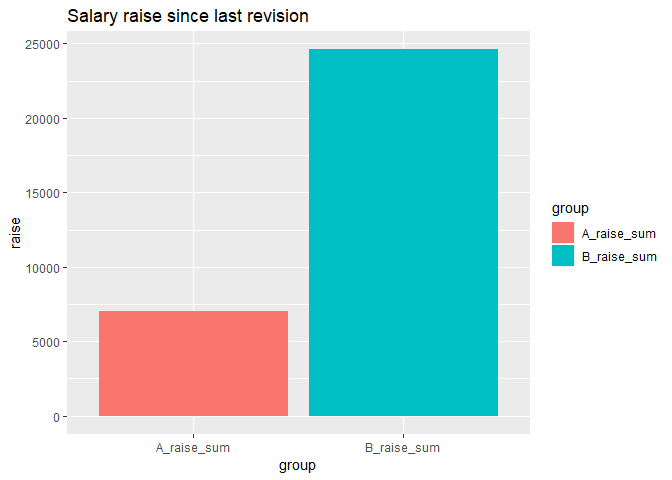

During the year both group A and B increase the sum of all salaries for respective group by two per cent.

``` r
tibble(A_raise = sum(A) * 0.02, B_raise = sum(B) * 0.02) %>%   
  gather(A_raise, B_raise, key="group", value="raise") %>%  
  ggplot() +  
    geom_bar(mapping = aes(x=group, y=raise, fill = group), stat = "identity") +  
    labs(  
      title = "Salary raise by 2.0%"  
    )    
```


Suppose that each group increase is divided equally to the employees within respective group.

``` r
raise <- (A + sum(A) * 0.02 / length (A)) - A     
g <- tibble(by, A, raise) %>%   
  gather(A, raise, key = "group", value = "salary")  
g$group <-  factor(g$group, levels = c("raise", "A"))  
g %>%  
  ggplot() +  
  geom_bar(mapping = aes(x = by, y = salary, fill = group), stat = "identity") +  
  labs(  
    title = "Salary increase distribution over age Group A"  
  )       
```


Suppose that each group increase is divided equally to the employees within respective group.

``` r
raise <- (B + sum(B) * 0.02 / length (B)) - B     
g <- as_tibble(cbind(by, B, raise)) %>%   
  gather(B, raise, key = "group", value = "salary")  
g$group <-  factor(g$group, levels = c("raise", "B"))  
g %>%  
  ggplot() +  
  geom_bar(mapping = aes(x = by, y = salary, fill = group), stat = "identity") +  
  labs(  
    title = "Salary increase distribution over age Group B"  
  )  
```


The oldest employees retire and new adolescents enter the job market. Suppose that the starting salary for the respective group is determined by the age / salary structure.

``` r
by_year2 <- by + 1  
B_year2 <- lag(B)  
B_year2[1] <- B[1] * 1.02  
raise_year2 <- lag(B + sum(B) * 0.02 / length (B) - B)  
raise_year2[1] <- 0  
t <- tibble(by_year2, B_year2, raise_year2) %>%  
  gather(B_year2, raise_year2, key = "group", value = "salary")  
t$group <- factor(t$group, levels=c("raise_year2", "B_year2"))  
t %>%  
  ggplot() +  
  geom_bar(mapping = aes(x = by_year2, y = salary, fill = group), stat = "identity") +  
  labs(  
    title = "Salary distribution Group B after one year succession"  
  )     
```


The oldest employees retire and new adolescents enter the job market. Suppose that the starting salary for the respective group is determined by the age / salary structure.

``` r
by_year2 <- by + 1  
raise_year2 <- lag(A + sum(A) * 0.02 / length (A) - A)  
raise_year2[1] <- 0  
A_year2 <- lag(A)  
A_year2[1] <- A[1] + raise_year2[2] - (A[2] - A[1])  
t <- tibble(by_year2, A_year2, raise_year2) %>%  
  gather(A_year2, raise_year2, key = "group", value = "salary")  
t$group <- factor(t$group, levels = c("raise_year2", "A_year2"))  
t %>%  
  ggplot() +  
  geom_bar(mapping = aes(x = by_year2, y = salary, fill = group), stat = "identity") +  
  labs(  
    title = "Salary distribution Group A after one year succession"  
  )    
```


Before next years’ salary revision the sum of the salaries have increased by
2.0 % for group B and only 0.31% for group A

``` r
tibble(A_raise_sum = sum(A) * 0.02 - A[length(A)] + A_year2[1], B_raise_sum = sum(B) * 0.02) %>%   
  gather(A_raise_sum, B_raise_sum, key = "group", value = "raise") %>%  
  ggplot() +  
    geom_bar(mapping = aes(x=group, y=raise, fill = group), stat = "identity") +  
    labs(  
      title = "Salary raise since last revision"  
    )     
```


This animation shows how salary development progresses for a longer period of time according to the prerequisites stated above.

``` r
##A <- seq(30000, 60000, by = 750)  
##B <- seq(30000, 30000, length = 41)  
##for (year in 2019:2059){  
## by <- (year - 25):(year - 65)    
## tibble(by, A, B) %>%   
##   gather(A, B, key = "group", value = "salary") %>%  
##   ggplot() +  
##     geom_point(mapping = aes(x = by, y = salary, colour = group)) +  
##     labs(  
##       title = "Salary development different groups.",  
##      subtitle = paste ("Year of revision", year)  
##     ) +  
##    scale_x_continuous(name = "Year of birth", limits = c(1954, 2034)) +  
##     scale_y_continuous(name = "Salary", limits = c(30000, 80000))            
## ggsave(paste (year, sep="", ".png"))  
## A <- A + sum (A) * 0.020 / length (A)  
## A <- c(A[1] - 750, A[1:40])  
## B <- B * 1.02  
##}   
```

The animation was made with ImageMagick.

``` r
##"c:\Program Files\ImageMagick-7.0.8-Q16\magick.exe" -delay 50 -loop 0 *.png animation.gif   
```


TBC
Appendix
All tables avaliable at Statistics Sweden, Labour market
Labour market
Aggregate gross pay, payroll taxes and prel. tax statistics from employers monthly tax returns
Aggregate gross pay, payroll taxes and prel. tax statistics
Gross pay, payroll taxes and preliminary tax from employers monthly tax returns, by sector. Quarter 2001K1 - 2019K1 \[2019-05-23\]
Gross pay, payroll taxes and preliminary tax withheld by employers, by industry NACE Rev. 2 (aggr. level), for the business sector. Quarter 2008K1 - 2019K1 \[2019-05-23\]
Gross pay, payroll taxes and preliminary tax withheld by employers, by industry NACE Rev. 2, for the business sector. Quarter 2008K1 - 2019K1 \[2019-05-23\]
Old tables – not updated
Gross pay, payroll taxes and preliminary tax from employers monthly tax returns, by industry for the private sector. Quarter 2000K1 - 2008K4 \[2009-03-02\]
Gross pay, payroll taxes and preliminary tax from employers monthly tax returns, by sector (not updated). Quarter 2005K1 - 2015K1 \[2015-05-22\]
Gross pay, payroll taxes and preliminary tax withheld by employers, by industry Nace Rev. 2 (aggr. level), for the private sector (not updated). Quarter 2009K1 - 2015K1 \[2015-05-22\]
Gross pay, payroll taxes and preliminary tax withheld by employers, by industry NACE Rev. 2, for the private sector (not updated). Quarter 2013K1 - 2015K1 \[2015-05-21\]
Gross pay based on income of statements
Aggregate wages, prel. tax reported by employers and the amount of social benefit payments
Gross pay (SEK) and number of statements of income distributed by region of residence. Year 2010 - 2017 \[2018-09-20\]
Gross pay (SEK) and number of statements of income distrubuted by region of work and residence. Year 2005 - 2017 \[2018-11-29\]
Gross pay (SEK), preliminary tax and number of statements of income distributed by region. Year 1998 - 2017 \[2018-11-29\]
Aggregate wages, prel. tax reported by employers and the amount of social benefit payments by sex
Gross pay (SEK) and number of statements of income distributed by region of work and residence and sex. Year 2005 - 2017 \[2018-11-29\]
Job openings and unmet labour demand
Job openings and vacancies
Job openings and vacancies, Business by industry Nace Rev 2, Quarter 2015K2 - 2019K1 \[2019-05-23\]
Job openings and vacancies, Business by number of employees, Quarter 2015K2 - 2019K1 \[2019-05-23\]
Job openings and vacancies, Business by region and industry Nace Rev 2, Quarter 2015K2 - 2019K1 \[2019-05-23\]
Job openings and vacancies, Business by region NUTS2, Quarter 2015K2 - 2019K1 \[2019-05-23\]
Recruitment and vacancy rate
Recruitment and vacancy rate, Business by industry Nace rev 2, Quarter 2015K2 - 2019K1 \[2019-05-23\]
Recruitment and vacancy rate, Business by number of employees, Quarter 2015K2 - 2019K1 \[2019-05-23\]
Recruitment and vacancy rate, Business by region and industry Nace rev 2, Quarter 2015K2 - 2019K1 \[2019-05-23\]
Recruitment and vacancy rate, Business by region NUTS2, Quarter 2015K2 - 2019K1 \[2019-05-23\]
Recruitment time
Average recruitment time, in months, Business by Nace rev 2, Quarter 2015K2 - 2019K1 \[2019-05-23\]
Average recruitment time, in months, Business by region NUTS 2, Quarter 2015K2 - 2019K1 \[2019-05-23\]
Old tables, not updated
Average recruitment time, in months, private sector by Nace rev 1.1, Quarter 2003K3 - 2008K4 \[2009-02-17\]
Average recruitment time, in months, private sector by Nace rev 2, Quarter 2009K1 - 2015K1 \[2015-05-21\]
Average recruitment time, in months, private sector by region NUTS 2. Quarter 2003K3 - 2015K1 \[2015-05-21\]
Job openings and vacancies, private sector by industry Nace Rev 1.1, Quarter 2001K2 - 2008K4 \[2009-02-17\]
Job openings and vacancies, private sector by industry Nace Rev 2, Quarter 2009K1 - 2015K1 \[2015-05-21\]
Job openings and vacancies, private sector by number of employees, Quarter 2001K1 - 2015K1 \[2015-05-21\]
Job openings and vacancies, private sector by region and industry Nace Rev 2, Quarter 2009K1 - 2015K1 \[2015-05-21\]
Job openings and vacancies, private sector by region NUTS2 and industry Nace Rev 1.1, Quarter 2001K1 - 2008K4 \[2009-02-17\]
Job openings and vacancies, private sector by region NUTS2, Quarter 2001K1 - 2015K1 \[2015-05-21\]
Recruitment and vacancy rate, private sector by industry Nace rev 1.1, Quarter 2001K2 - 2008K4 \[2009-02-17\]
Recruitment and vacancy rate, private sector by industry Nace rev 2, Quarter 2009K1 - 2015K1 \[2015-05-21\]
Recruitment and vacancy rate, private sector by number of employees, Quarter 2002K2 - 2015K1 \[2015-05-21\]
Recruitment and vacancy rate, private sector by region and industry Nace rev 1.1, Quarter 2003K1 - 2008K4 \[2009-02-17\]
Recruitment and vacancy rate, private sector by region and industry Nace rev 2, Quarter 2009K1 - 2015K1 \[2015-05-21\]
Recruitment and vacancy rate, private sector by region NUTS2, Quarter 2002K2 - 2015K1 \[2015-05-21\]
Labour cost index
Labour Cost Index, manual workers, private sector (LCI man), NACE Rev. 2. Quarterly 2008K1 - 2018K4 \[2019-03-13\]
Labour Cost Index , non-manual workers, private sector (LCI non-man), NACE Rev. 2. Quarterly 2008K1 - 2018K4 \[2019-03-13\]
Labour Cost Index, manual workers, private sector (WAG man), NACE Rev. 2. Quarterly 2008k1 - 2018K4 \[2019-03-13\]
Labour Cost Index , non-manual workers, private sector (WAG non-man), NACE Rev. 2. Quarterly 2008K1 - 2018K4 \[2019-03-13\]
Labour cost index for wage-earners and salaried employees in the private sector (AKI)
Labour cost index for wage-earners and salaried employees in the private sector (AKI)
Labour cost index for salaried employees in private sector (AKI), NACE rev. 2. Month 2008M01 - 2019M03 \[2019-05-29\]
Labour cost index for wage-earners in private sector (AKI), NACE rev. 2. Month 2008M01 - 2019M03 \[2019-05-29\]
Index for direct wages and salaries
Index for direct salaries for salaried employees in private sector (LÖI), NACE rev. 2. Month 2008M01 - 2019M03 \[2019-05-29\]
Index for direct wages for wage-earners in private sector (LÖI), NACE rev. 2. Month 2008M01 - 2019M03 \[2019-05-29\]
Old tables, not updated
Index for direct salaries for salaried employees in private sector, NACE rev. 1.1 \[2009-03-02\]
Index for direct wages for wage-earners in mining, quarrying and manufacturing, NACE rev. 1.1 \[2009-03-02\]
Index for direct wages for wage-earners in private sector, NACE rev. 1.1 \[2009-03-02\]
Labour cost index for salaried employees in private sector, NACE rev. 1.1 \[2009-03-02\]
Labour cost index for wage-earners in mining, quarrying and manufacturing, NACE rev. 1.1 \[2009-03-02\]
Labour cost index for wage-earners in private sector, NACE rev. 1.1 \[2009-03-02\]
Economic indicators
Labour cost index (AKI), percentage change from corresponding month last year. Month 2009M01 - 2019M03 \[2019-05-29\]
Labour Force Surveys (LFS)
Population by labour status from 1970
Population aged 15-74 (LFS) by sex, age and labour status. Month 1970M01 - 2019M04 \[2019-05-23\]
Population aged 15-74 (LFS) by sex, age and labour status. Quarter 1970K1 - 2019K1 \[2019-04-18\]
Population aged 15-74 (LFS) by sex, age and labour status. Year 1970 - 2018 \[2019-01-24\]
Employed persons from 1970
Employed aged 15-74 (LFS), of which at work and of which absent from work the whole week by sex and age. Month 1970M01 - 2019M04 \[2019-05-23\]
Employed aged 15-74 (LFS), of which at work and of which absent from work the whole week by sex and age. Quarter 1970K1 - 2019K1 \[2019-04-18\]
Employed aged 15-74 (LFS), of which at work and of which absent from work the whole week by sex and age. Year 1970 - 2018 \[2019-01-24\]
Employed persons aged 15-74 (LFS) by degree of attachment to the labour market, sex and age. Month 1970M01 - 2019M04 \[2019-05-23\]
Employed persons aged 15-74 (LFS) by degree of attachment to the labour market, sex and age. Quarter 1970K1 - 2019K1 \[2019-04-18\]
Employed persons aged 15-74 (LFS) by degree of attachment to the labour market, sex and age. Year 1970 - 2018 \[2019-01-24\]
Employed persons aged 15-74 (LFS) by degree of attachment to the labour market, industrial classification NACE Rev. 2.0 and sex. Month 2009M01 - 2019M04 \[2019-05-23\]
Employed persons aged 15-74 (LFS) by degree of attachment to the labour market, industrial classification NACE Rev. 2.0 and sex. Quarter 2009K1 - 2019K1 \[2019-04-18\]
Employed persons aged 15-74 (LFS) by degree of attachment to the labour market, industrial classification NACE Rev. 2.0 and sex. Year 2009 - 2018 \[2019-01-24\]
Employed persons aged 15-74 (LFS) by attachment to the labour market, occupation SSYK 2012 and sex. Month 2015M01 - 2019M04 \[2019-05-23\]
Employed persons aged 15-74 (LFS) by attachment to the labour market, occupation SSYK 2012 and sex. Quarter 2015K1 - 2019K1 \[2019-04-18\]
Employed persons aged 15-74 (LFS) by attachment to the labour market, occupation SSYK 2012 and sex. Year 2015 - 2018 \[2019-01-24\]
Employed who study aged 15-74 (LFS) by full-time/part-time studies, sex and age. Month 2005M04 - 2019M04 \[2019-05-23\]
Employed who study aged 15-74 (LFS) by full-time/part-time studies, sex and age. Quarter 2005K2 - 2019K1 \[2019-04-18\]
Employed who study aged 15-74 (LFS) by full-time/part-time studies, sex and age. Year 2005 - 2018 \[2019-01-24\]
Employed who study aged 15-74 (LFS) - average number of hours worked/study hours per week and number of employed by sex and age. Month 2005M04 - 2019M04 \[2019-05-23\]
Employed who study aged 15-74 (LFS) - average number of hours worked/study hours per week and number of employed by sex and age. Quarter 2005K2 - 2019K1 \[2019-04-18\]
Employed who study aged 15-74 (LFS) - average number of hours worked/study hours per week and number of employed by sex and age. Year 2005 - 2018 \[2019-01-24\]
Employed aged 15-74 (LFS) by degree of attachment to the labour market, occupation SSYK 96 and sex. Month 2005M04 - 2015M12 \[2016-01-28\]
Employed aged 15-74 (LFS) by degree of attachment to the labour market, occupation SSYK 96 and sex. Quarter 2005K2 - 2015K4 \[2016-01-28\]
Employed aged 15-74 (LFS) by degree of attachment to the labour market, occupation SSYK 96 and sex. Year 2005 - 2015 \[2016-01-28\]
Employed persons aged 15-74 (LFS) by degree of attachment to the labour market, industrial classification NACE Rev. 1.1 and sex. Month 2005M04 - 2008M12 \[2009-01-22\]
Employed persons aged 15-74 (LFS) by degree of attachment to the labour market, industrial classification NACE Rev. 1.1 and sex. Quarter 2005K2 - 2008K4 \[2009-01-22\]
Employed persons aged 15-74 (LFS) by degree of attachment to the labour market, industrial classification NACE Rev. 1.1 and sex. Year 2005 - 2008 \[2009-01-29\]
Employees from 2005
Employees, total/permanent employees aged 15-74 (LFS) by sector, sex and age. Month 2005M04 - 2019M04 \[2019-05-23\]
Employees, total/permanent employees aged 15-74 (LFS) by sector, sex and age. Quarter 2005K2 - 2019K1 \[2019-04-18\]
Employees, total/permanent employees aged 15-74 (LFS) by sector, sex and age. Year 2005 - 2018 \[2019-01-24\]
Employees aged 15-74 (LFS) by type of employment, trade union membership and sex. Month 2005M04 - 2019M04 \[2019-05-23\]
Employees aged 15-74 (LFS) by type of employment, trade union membership and sex. Quarter 2005K2 - 2019K1 \[2019-04-18\]
Employees aged 15-74 (LFS) by type of employment, trade union membership and sex. Year 2005 - 2018 \[2019-01-24\]
Overtime in main occupation for employees aged 15-74 (persons and hours) during the reference week (LFS) by type of overtime, sex and age. Month 2005M04 - 2019M04 \[2019-05-23\]
Overtime in main occupation for employees aged 15-74 (persons and hours) during the reference week (LFS) by type of overtime, sex and age. Quarter 2005K2 - 2019K1 \[2019-04-18\]
Overtime in main occupation for employees aged 15-74 (persons and hours) during the reference week (LFS) by type of overtime, sex and age. Year 2005 - 2018 \[2019-01-24\]
Hours worked from 2005
Number of hours actually worked per week for persons aged 15-74 (LFS) by degree of attachment to the labour market, sector and sex. Month 2005M04 - 2019M04 \[2019-05-23\]
Number of hours actually worked per week for persons aged 15-74 (LFS) by degree of attachment to the labour market, by sector and sex. Quarter 2005K2 - 2019K1 \[2019-04-18\]
Number of hours actually worked per week for persons aged 15-74 (LFS) by degree of attachment to the labour market, by sector and sex. Year 2005 - 2018 \[2019-01-24\]
Average number of hours (actually) worked per week for employed persons aged 15-74 (LFS) by degree of attachment to the labour market, sex and age. Month 2005M04 - 2019M04 \[2019-05-23\]
Average number of hours (actually) worked per week for employed persons aged 15-74 (LFS) by degree of attachment to the labour market, sex and age. Quarter 2005K2 - 2019K1 \[2019-04-18\]
Average number of hours (actually) worked per week for employed persons aged 15-74 (LFS) by degree of attachment to the labour market, sex and age. Year 2005 - 2018 \[2019-01-24\]
Employed persons aged 15-74 (LFS) by working hours (by agreement) per week, sex and age. Month 2005M04 - 2019M04 \[2019-05-23\]
Employed persons aged 15-74 (LFS) by working hours (by agreement) per week, sex and age. Quarter 2005K2 - 2019K1 \[2019-04-18\]
Employed persons aged 15-74 (LFS) by working hours (by agreement) per week, sex and age. Year 2005 - 2018 \[2019-01-24\]
Average working hours (by agreement) per week for employed persons aged 15-74 (LFS) by sex and age. Month 2005M04 - 2019M04 \[2019-05-23\]
Average working hours (by agreement) per week for employed persons aged 15-74 (LFS) by sex and age. Quarter 2005K2 - 2019K1 \[2019-04-18\]
Average working hours (by agreement) per week for employed persons aged 15-74 (LFS) by sex and age. Year 2005 - 2018 \[2019-01-24\]
Hours worked by industrial classification (NACE Rev. 2) from 2009
Number of hours actually worked per week for persons aged 15-74 (LFS) by degree of attachment to the labour market, industrial classification NACE Rev. 2.0 and sex. Month 2009M01 - 2019M04 \[2019-05-23\]
Number of hours actually worked per week for persons aged 15-74 (LFS) by degree of attachment to the labour market, industrial classification NACE Rev. 2.0 and sex. Quarter 2009K1 - 2019K1 \[2019-04-18\]
Number of hours actually worked per week for persons aged 15-74 (LFS) by degree of attachment to the labour market, industrial classification NACE Rev. 2.0 and sex. Year 2009 - 2018 \[2019-01-24\]
Employed persons aged 15-74 (LFS) by number of working hours (by agreement) per week, industrial classification NACE Rev. 2.0 and sex. Month 2009M01 - 2019M04 \[2019-05-23\]
Employed persons aged 15-74 (LFS) by number of working hours (by agreement) per week, industrial classification NACE Rev. 2.0 and sex. Quarter 2009K1 - 2019K1 \[2019-04-18\]
Employed persons aged 15-74 (LFS) by number of working hours (by agreement) per week, industrial classification NACE Rev. 2.0 and sex. Year 2009 - 2018 \[2019-01-24\]
Average number of working hours (by agreement) per week for employed persons aged 15-74 (LFS) by industrial classification NACE Rev. 2.0 and sex. Month 2009M01 - 2019M04 \[2019-05-23\]
Average number of working hours (by agreement) per week for employed persons aged 15-74 (LFS) by industrial classification NACE Rev. 2.0 and sex. Quarter 2009K1 - 2019K1 \[2019-04-18\]
Average number of working hours (by agreement) per week for employed persons aged 15-74 (LFS) by industrial classification NACE Rev. 2.0 and sex. Year 2009 - 2018 \[2019-01-24\]
Hours worked by industrial classification (NACE Rev. 1.1) 2005-2008
Number of work hours (hours actually worked) per week for persons aged 15-74 (LFS) by degree of attachment to the labour market, industrial classification NACE Rev. 1.1 and sex. Month 2005M04 - 2008M12 \[2009-01-22\]
Number of work hours (hours actually worked) per week for persons aged 15-74 (LFS) by degree of attachment to the labour market, industrial classification NACE Rev. 1.1 and sex. Quarter 2005K2 - 2008K4 \[2009-01-22\]
Number of work hours (hours actually worked) per week for persons aged 15-74 (LFS) by degree of attachment to the labour market, industrial classification NACE Rev. 1.1 and sex. Year 2005 - 2008 \[2009-01-29\]
Employed persons aged 15-74 (LFS) by number of working hours (by agreement) per week, industrial classification NACE Rev. 1.1 and sex. Month 2005M04 - 2008M12 \[2009-01-22\]
Employed persons aged 15-74 (LFS) by number of working hours (by agreement) per week, industrial classification NACE Rev. 1.1 and sex.Quarter 2005K2 - 2008K4 \[2010-06-08\]
Employed persons aged 15-74 (LFS) by number of working hours (by agreement) per week, industrial classification NACE Rev. 1.1 and sex. Year 2005 - 2008 \[2009-01-29\]
Average number of working hours (by agreement) per week for employed persons aged 15-74 (LFS) by industrial classification NACE Rev. 1.1 and sex. Month 2005M04 - 2008M12 \[2009-01-22\]
Average number of working hours (by agreement) per week for employed persons aged 15-74 (LFS) by industrial classification NACE Rev. 1.1 and sex. Quarter 2005K2 - 2008K4 \[2009-01-22\]
Average number of working hours (by agreement) per week for employed persons aged 15-74 (LFS) by industrial classification NACE Rev. 1.1 and sex. Year 2005 - 2008 \[2009-01-29\]
Persons absent from work from 2005
Persons absent from work aged 15-74 (LFS)/hours of absence during the reference week by reason for absence, sex and age. Month 2005M04 - 2019M04 \[2019-05-23\]
Persons absent from work aged 15-74 (LFS)/hours of absence during the reference week by reason for absence, sex and age. Quarter 2005K2 - 2019K1 \[2019-04-18\]
Persons absent from work aged 15-74 (LFS)/hours of absence during the reference week by reason for absence, sex and age. Year 2005 - 2018 \[2019-01-24\]
Absent employed persons and employees aged 15-74 (number and portion) during the reference week (the whole week and part of the week) in main job (LFS) by sex and age. Month 2005M04 - 2019M04 \[2019-05-23\]
Absent employed persons and employees aged 15-74 (number and portion) during the reference week (the whole week and part of the week) in main job (LFS) by sex and age. Quarter 2005K2 - 2019K1 \[2019-04-18\]
Absent employed persons and employees aged 15-74 (number and portion) during the reference week (the whole week and part of the week) in main job (LFS) by sex and age. Year 2005 - 2018 \[2019-01-24\]
Absence from main job in the reference week (LFS) among employees aged 15-74 (persons and hours) by sex and age. Month 2005M04 - 2019M04 \[2019-05-23\]
Absence from main job in the reference week (LFS) among employees aged 15-74 (persons and hours) by sex and age. Quarter 2005K2 - 2019K1 \[2019-04-18\]
Absence from main job in the reference week (LFS) among employees aged 15-74 (persons and hours) by sex and age. Year 2005 - 2018 \[2019-01-24\]
Unemployed persons from 2005
Unemployed persons aged 15-74 (LFS) by duration of unemployment, sex and age. Month 2005M04 - 2019M04 \[2019-05-23\]
Unemployed persons aged 15-74 (LFS) by duration of unemployment, sex and age. Quarter 2005K2 - 2019K1 \[2019-04-18\]
Unemployed persons aged 15-74 (LFS) by duration of unemployment, sex and age. Year 2005 - 2018 \[2019-01-24\]
Unemployed persons and of which full-time students aged 15-74 (LFS) by sex and age. Month 2005M04 - 2019M04 \[2019-05-23\]
Unemployed persons and of which full-time students aged 15-74 (LFS) by sex and age. Quarter 2005K2 - 2019K1 \[2019-04-18\]
Unemployed persons and of which full-time students aged 15-74 (LFS) by sex and age. Year 2005 - 2018 \[2019-01-24\]
Average duration of unemployment and number of unemployed persons aged 15-74 (LFS) by sex and age. Month 2005M04 - 2019M04 \[2019-05-23\]
Average duration of unemployment and number of unemployed persons aged 15-74 (LFS) by sex and age. Quarter 2005K2 - 2019K1 \[2019-04-18\]
Average duration of unemployment and number of unemployed persons aged 15-74 (LFS) by sex and age. Year 2005 - 2018 \[2019-01-24\]
Persons not in the labour force from 2005
Not in the labour force, number of persons aged 15-74 (LFS) by reason, sex and age. Month 2005M04 - 2019M04 \[2019-05-23\]
Not in the labour force, number of persons aged 15-74 (LFS) by reason, sex and age. Quarter 2005K2 - 2019K1 \[2019-04-18\]
Not in the labour force, number of persons aged 15-74 (LFS) by reason, sex and age. Year 2005 - 2018 \[2019-01-24\]
Persons not in the labour force aged 15-74 (LFS) by wanting to work/being available for work, sex and age. Month 2005M04 - 2019M04 \[2019-05-23\]
Persons not in the labour force aged 15-74 (LFS) by wanting to work/being available for work, sex and age. Quarter 2005K2 - 2019K1 \[2019-04-18\]
Persons not in the labour force aged 15-74 (LFS) by wanting to work/being available for work, sex and age. Year 2005 - 2018 \[2019-01-24\]
Labour supply not utilized as from 2005
Underutilized labour supply, number of persons aged 15-74 and hours (LFS) for unemployed, not fully employed and persons potentially looking for a job by sex and age. Month 2005M04 - 2019M04 \[2019-05-23\]
Underutilized labour supply, number of persons aged 15-74 and hours (LFS) for unemployed, not fully employed and persons potentially looking for a job by sex and age. Quarter 2005K2 - 2019K1 \[2019-04-18\]
Underutilized labour supply, number of persons aged 15-74 and hours (LFS) for unemployed, not fully employed and persons potentially looking for a job by sex and age. Year 2005 - 2018 \[2019-01-24\]
Regional data from 2005
Population aged 15-74 (LFS) by region, labour status and sex. Quarter 2005K2 - 2019K1 \[2019-04-18\]
Population aged 15-74 (LFS) by region, labour status and sex. year 2005 - 2018 \[2019-01-24\]
Average working hours (by agreement) per week for employed persons aged 15-74 (LFS) by region and sex. Quarter 2005K2 - 2019K1 \[2019-04-18\]
Average working hours (by agreement) per week for employed persons aged 15-74 (LFS) by region and sex. Year 2005 - 2018 \[2019-01-24\]
Employed persons aged 15-74 (LFS) by region, degree of attachment to the labour market and sex. Quarter 2005K2 - 2019K1 \[2019-04-18\]
Employed persons aged 15-74 (LFS) by region, degree of attachment to the labour market and sex. Year 2005 - 2018 \[2019-01-24\]
Level and field of Education as from 2005
Unemployed persons aged 15-74 (LFS) by duration of unemployment, level of education and sex. Year 2005 - 2018 \[2019-01-24\]
Population aged 15-74 (LFS) by labour status, field of education (SUN 2000) and sex. Year 2005 - 2018 \[2019-01-24\]
Population aged 15-74 (LFS) by labour status, level of education and sex. Year 2005 - 2018 \[2019-01-24\]
Average number of working hours (by agreement) per week for employed persons aged 15-74 (LFS) by level of education and sex. Year 2005 - 2018 \[2019-01-24\]
Average duration of unemployment and number of unemployed persons aged 15-74 (LFS) by level of education and sex. Year 2005 - 2018 \[2019-01-24\]
Employed persons aged 15-74 (LFS) by degree of attachment to the labour market, level of education and sex. Year 2005 - 2018 \[2019-01-24\]
Civil status and children as from 2005
Population aged 15-74 (LFS) by labour force status, sex, marital status and whether there are children living at home or not. Month 2005M04 - 2019M04 \[2019-05-23\]
Population aged 15-74 (LFS) by labour force status, sex, marital status and whether there are children living at home or not. Quarter 2005K2 - 2019K1 \[2019-04-18\]
Population aged 15-74 (LFS) by labour force status, sex, marital status and whether there are children living at home or not. Year 2005 - 2018 \[2019-01-24\]
Average of actual hours worked for persons aged 15-74 (LFS) with children living at home by marital status, sex and age of the youngest child. Month 2005M04 - 2019M04 \[2019-05-23\]
Average of actual hours worked for persons aged 15-74 (LFS) with children living at home by marital status, sex and age of the youngest child. Quarter 2005K2 - 2019K1 \[2019-04-18\]
Average of actual hours worked for persons aged 15-74 (LFS) with children living at home by marital status, sex and age of the youngest child. Year 2005 - 2018 \[2019-01-24\]
Employed perons aged 15-74 (LFS) by average of actual hours worked, hours of absence and overtime hours per week and share of full-time workers (main job) and also by sex, marital status and whether there are children living at home or not. Month 2005M04 - 2019M04 \[2019-05-23\]
Employed perons aged 15-74 (LFS) by average of actual hours worked, hours of absence and overtime hours per week and share of full-time workers (main job) and also by sex, marital status and whether there are children living at home or not. Quarter 2005K2 - 2019K1 \[2019-04-18\]
Employed perons aged 15-74 (LFS) by average of actual hours worked, hours of absence and overtime hours per week and share of full-time workers (main job) and also by sex, marital status and whether there are children living at home or not. Year 2005 - 2018 \[2019-01-24\]
Employment rate for persons aged 15-74 (LFS) with children living at home by marital status, sex and age of the youngest child. Month 2005M04 - 2019M04 \[2019-05-23\]
Employment rate for persons aged 15-74 (LFS) with children living at home by marital status, sex and age of the youngest child. Quarter 2005K2 - 2019K1 \[2019-04-18\]
Employment rate for persons aged 15-74 (LFS) with children living at home by marital status, sex and age of the youngest child. Year 2005 - 2018 \[2019-01-24\]
Born in Sweden and Foreign-born persons as from 2005
Unemployed aged 15-74 (LFS) by duration of unemployment (27+ weeks) and by born in Sweden/foreign born, sex and age. Month 2005M04 - 2019M04 \[2019-05-23\]
Unemployed aged 15-74 (LFS) by duration of unemployment (27+ weeks) and by born in Sweden/foreign born, sex and age. Quarter 2005K2 - 2019K1 \[2019-04-18\]
Unemployed aged 15-74 (LFS) by duration of unemployment (27+ weeks) and by born in Sweden/foreign born, sex and age. Year 2005 - 2018 \[2019-01-24\]
Population aged 15-74 (LFS) by labour status, born in Sweden/foreign born, sex and age. Month 2005M04 - 2019M04 \[2019-05-23\]
Population aged 15-74 (LFS) by labour status, born in Sweden/foreign born, sex and age. Quarter 2005K2 - 2019K1 \[2019-04-18\]
Population aged 15-74 (LFS) by labour status, born in Sweden/foreign born, sex and age. Year 2005 - 2018 \[2019-01-24\]
Population aged 15-74 (LFS) by labour status, born in Sweden/foreign born, level of education and sex. Year 2005 - 2018 \[2019-01-24\]
Employed persons aged 15-74 (number and share) absent from main job (LFS) in the reference week (part of and the whole week) by born in Sweden/foreign born, sex and age. Month 2005M04 - 2019M04 \[2019-05-23\]
Employed persons aged 15-74 (number and share) absent from main job (LFS) in the reference week (part of and the whole week) by born in Sweden/foreign born, sex and age. Quarter 2005K2 - 2019K1 \[2019-04-18\]
Employed persons aged 15-74 (number and share) absent from main job (LFS) in the reference week (part of and the whole week) by born in Sweden/foreign born, sex and age. Year 2005 - 2018 \[2019-01-24\]
Average number of working hours (by agreement) per week for employed persons and number of employed persons aged 15-74 (LFS) by born in Sweden/foreign born, sex and age. Month 2005M04 - 2019M04 \[2019-05-23\]
Average number of working hours (by agreement) per week for employed persons and number of employed persons aged 15-74 (LFS) by born in Sweden/foreign born, sex and age. Quarter 2005K2 - 2019K1 \[2019-04-18\]
Average number of working hours (by agreement) per week for employed persons and number of employed persons aged 15-74 (LFS) by born in Sweden/foreign born, sex and age. Year 2005 - 2018 \[2019-01-24\]
Average duration of unemployment and number of unemployed persons aged 15-74 (LFS) and by born in Sweden/foreign born, sex and age. Month 2005M04 - 2019M04 \[2019-05-23\]
Average duration of unemployment and number of unemployed persons aged 15-74 (LFS) and by born in Sweden/foreign born, sex and age. Quarter 2005K2 - 2019K1 \[2019-04-18\]
Average duration of unemployment and number of unemployed persons aged 15-74 (LFS) and by born in Sweden/foreign born, sex and age. Year 2005 - 2018 \[2019-01-24\]
Labour supply not utilised, number of persons aged 15-74 and hours (LFS) for unemployed, underemployed and persons available to work but not seeking by born in Sweden/foreign born, sex and age. Month 2005M04 - 2019M04 \[2019-05-23\]
Labour supply not utilised, number of persons aged 15-74 and hours (LFS) for unemployed, underemployed and persons available to work but not seeking by born in Sweden/foreign born, sex and age. Quarter 2005K2 - 2019K1 \[2019-04-18\]
Labour supply not utilised, number of persons aged 15-74 and hours (LFS) for unemployed, underemployed and persons available to work but not seeking by born in Sweden/foreign born, sex and age. Year 2005 - 2018 \[2019-01-24\]
Employed perons aged 15-74 (LFS) by average of actual hours worked, hours of absence and overtime hours per week and share of full-time workers (main job) and also by born in Sweden/foreign born, sex and age. Month 2005M04 - 2019M04 \[2019-05-23\]
Employed perons aged 15-74 (LFS) by average of actual hours worked, hours of absence and overtime hours per week and share of full-time workers (main job) and also by born in Sweden/foreign born, sex and age. Quarter 2005K2 - 2019K1 \[2019-04-18\]
Employed perons aged 15-74 (LFS) by average of actual hours worked, hours of absence and overtime hours per week and share of full-time workers (main job) and also by born in Sweden/foreign born, sex and age. Year 2005 - 2018 \[2019-01-24\]
Employed persons aged 15-74 (LFS) by status in employment and by born in Sweden/foreign born, sex and age. Month 2005M04 - 2019M04 \[2019-05-23\]
Employed persons aged 15-74 (LFS) by status in employment and by born in Sweden/foreign born, sex and age. Quarter 2005K2 - 2019K1 \[2019-04-18\]
Employed persons aged 15-74 (LFS) by status in employment and by born in Sweden/foreign born, sex and age. Year 2005 - 2018 \[2019-01-24\]
Young people not in employment and not in any education and training (NEET) from 2007
Young people aged 15-34 (LFS) not in employment and not in any education and training (NEET) by sex and age. Quarter 2007K1 - 2019K1 \[2019-04-18\]
Young people aged 15-34 (LFS) not in employment and not in any education and training (NEET) by sex and age. Year 2007 - 2018 \[2019-01-24\]
Young people aged 15-24 (LFS) not in employment and not in any education and training (NEET) by sex and Swedish/foreign born. Quarter 2007K1 - 2019K1 \[2019-04-18\]
Young people aged 15-24 (LFS) not in employment and not in any education and training (NEET) by sex and Swedish/foreign born. Year 2007 - 2018 \[2019-01-24\]
Young people aged 15-24 (LFS) not in employment and not in any education and training (NEET) by sex and previous experience of work, Quarter 2007K1 - 2019K1 \[2019-04-18\]
Young people aged 15-24 (LFS) not in employment and not in any education and training (NEET) by sex and previous experience of work, Year 2007 - 2018 \[2019-01-24\]
Young people aged 15-24 (LFS) not in employment and not in any education and training (NEET) by sex and labour status. Quarter 2007K1 - 2019K1 \[2019-04-18\]
Young people aged 15-24 (LFS) not in employment and not in any education and training (NEET) by sex and labour status. Year 2007 - 2018 \[2019-01-24\]
Economic indicators
Labour Force Surveys (LFS), population aged 15-74, by economic indicator. Non seasonally adjusted estimates. Month 2013M01 - 2019M04 \[2019-05-23\]
Labour Force Surveys (LFS), population aged 15-74, by economic indicator. Smoothed and seasonally adjusted estimates. Month 2013M01 - 2019M04 \[2019-05-23\]
Labour Force Surveys (LFS), population aged 15-74, by economic indicator. Seasonally adjusted estimates. Month 2013M01 - 2019M04 \[2019-05-23\]
Labour statistics based on administrative sources
Population 16+ years, 2004-
Population 16+ years (RAMS) by region, employment, age and sex. Year 2004 - 2017 \[2018-11-29\]
Population 16+ yeras (RAMS) at national level, employment, country of citizenship, age and sex. Year 2004 - 2017 \[2018-11-29\]
Population 16+ years (RAMS) at national level, employment, country of birth, latest year of immigration, age and sex. Year 2004 - 2017 \[2018-11-29\]
Population 16+ years, 1993-2003
Population 16+ years (RAMS) by region, employment, age and sex. 1993-2003 \[2005-03-21\]
Population 16+ years (RAMS) at national level, employment, country of citizenship, age and sex. 1993-2003 \[2005-03-21\]
Population 16+ years (RAMS) at national level, employment, country of birth, latest year of immigration, age and sex. 1993-2003 \[2011-03-30\]
Gainfully employed commuters 16- years of age, 1993-2003 / 2004-
Gainfully employed commuters 16+ years , leaving or coming into the municipality, by municipality and sex 2004 - 2017 \[2018-11-29\]
Gainfully employed commuters, 16+ years , leaving or coming into the municipality, by municipality and sex. Year 1993-2003 \[2007-03-26\]
Gainfully employed commuters 16+ years , leaving or coming into the county, by county and sex 2004 - 2017 \[2018-11-29\]
Gainfully employed commuters, 16+ years , leaving or coming into the county, by county and sex. Year 1993-2003 1993 - 2003 \[2007-03-26\]
Gainfully employed commuters by municipality 16+ years by municipality of residence, municipality of work and sex. Year 2004 - 2017 \[2018-11-29\]
Gainfully employed commuters by municipality 16+ years by municipality of residence, municipality of work and sex. Year 1993-2003 \[2012-02-06\]
Gainfully employed commuters by county 16+ years by county of residence, county of work and sex. Year 2004 - 2017 \[2018-11-29\]
Gainfully employed commuters by county 16+ years by county of residence, county of work and sex. Year 1993-2003 \[2012-02-06\]
Gainfully employed 16+ years by region of residence, 2004-
Gainfully employed 16+ years by region of residence (RAMS), by region, industry SNI2007 and sex. Year 2008 - 2017 \[2018-11-30\]
Gainfully employed 16+ years by region of residence (RAMS), by region, industry SNI2002 and sex. Year 2004 - 2007 \[2008-12-16\]
Gainfully employed 16+ years by region of residence (RAMS), by region, sector, age and sex. Year 2004 - 2017 \[2018-11-29\]
Gainfully employed 16+ years by region of residence (RAMS), at national level, industry SNI2007, country of birth and sex. Year 2008 - 2017 \[2018-11-29\]
Gainfully employed 16+ years by region of residence (RAMS), at national level, industry SNI2002, country of birth and sex. Year 2004 - 2007 \[2013-03-04\]
Gainfully employed 16+ years by region of residence (RAMS), at national level, industry SNI2007, country of citizenship and sex. Year 2008 - 2017 \[2018-11-29\]
Gainfully employed 16+ years by region of residence (RAMS), at national level, industry SNI2002, country of citizenship and sex. Year 2004 - 2007 \[2013-03-04\]
Gainfully employed 16+ years by region of residence (RAMS), at national level, industry SNI2007, status in employment, age and sex. Year 2008 - 2017 \[2018-11-30\]
Gainfully employed 16+ years by region of residence (RAMS), at national level, industry SNI2002, status in employment, age and sex. Year 2004 - 2007 \[2013-03-04\]
Gainful employment rate 20-64 years by region, born in Sweden and foreign born and sex. Year 2004 - 2017 \[2018-11-29\]
Gainfully employed 16+ years by region of residence, 1993-2003
Gainfully employed 16+ years by region of residence (RAMS), by region, industry SNI92 and sex. 1993-2003 \[2005-03-21\]
Gainfully employed 16+ years by region of residence (RAMS), by region, sector, age and sex. 1993-2003 \[2005-03-21\]
Gainfully employed 16+ years by region of residence (RAMS), at national level, industry SNI92, country of birth and sex. 1993-2003 \[2005-03-21\]
Gainfully employed 16+ years by region of residence (RAMS), at national level, industry SNI92, country of citizenship and sex. 1993-2003 \[2005-03-21\]
Gainfully employed 16+ years by region of residence (RAMS), at national level, industry SNI92, status in employment and sex. 1993-2003 \[2006-02-08\]
Gainful employment rate 20-64 years by region, born in Sweden and foreign born and sex. Year 1993 - 2003 \[2016-02-10\]
Gainfully employed 16+ years by region of work, 2004-
Gainfully employed 16+ years by region of work (RAMS), by region, industry SNI 2007 and sex. Year 2008 - 2017 \[2018-11-29\]
Gainfully employed 16+ years by region of work (RAMS), by region, industry SNI 2002 and sex. Year 2004 - 2007 \[2008-12-16\]
Gainfully employed 16+ years by region of work (RAMS), by region, sector, age and sex. Year 2004 - 2017 \[2018-11-29\]
Gainfully employed 16+ years by region of work (RAMS), at national level, industry SNI 2007, level of education, size class of the local unit and sex. Year 2008 - 2017 \[2018-11-29\]
Gainfully employed 16+ years by region of work (RAMS), at national level, industry SNI 2002, level of education, size class of the local unit and sex. Year 2004 - 2007 \[2013-03-04\]
Gainfully employed 16+ years by region of work (RAMS), at national level, industry SNI 2007, status in employment, age and sex. Year 2008 - 2017 \[2018-11-29\]
Gainfully employed 16+ years by region of work (RAMS), at national level, industry SNI 2002, status in employment, age and sex. Year 2004 - 2007 \[2013-03-04\]
Gainfully employed 16+ years by region of work (RAMS), at national level, industry SNI 2007, status in employment, level of education and sex. Year 2008 - 2017 \[2018-11-29\]
Gainfully employed 16+ years by region of work (RAMS), at national level, industry SNI 2002 , status in employment, level of education and sex. Year 2004 - 2007 \[2013-03-04\]
Gainfully employed 16+ years by region of work, 1993-2003
Gainfully employed 16+ years by region of work (RAMS), by region, industry SNI92 and sex. 1993-2003 \[2005-03-21\]
Gainfully employed 16+ years by region of work (RAMS), by region, sector, age and sex. 1993-2003 \[2005-03-21\]
Gainfully employed 16+ years by region of work (RAMS), at national level, industry SNI92, level of education, size class of the local unit and sex. 1993-2003 \[2017-02-10\]
Gainfully employed 16+ years by region of work (RAMS), at national level, industry SNI92 (43 study domains), status in employment, age and sex. Year 1993 - 2003 \[2005-03-21\]
Gainfully employed 16+ years by region of work (RAMS), at national level, industry SNI92 ,status in employment, level of education and sex. 1993-2003 \[2005-03-21\]
Labour Statistics Based on Administrative Sources 1985-1993
Population 16+ years (ÅRSYS) by region, employment, age and sex. Year 1985 - 1993 \[1997-01-01\]
Salary structures, whole economy
Salaries by occupation (SSYK, 4-digit level)
Average basic salary, monthly salary and women´s salary as a percentage of men´s salary by sector, occupation (SSYK 2012), sex and educational level (SUN) . Year 2014 - 2017 \[2018-06-19\]
Average basic salary, monthly salary and women´s salary as a percentage of men´s salary by sector, occupation (SSYK), sex and educational level (SUN). Year 2005 - 2013 \[2014-06-17\]
Average basic salary, monthly salary and women´s salary as a percentage of men´s salary by region, sector, occupation (SSYK 2012) and sex . Year 2014 - 2017 \[2018-06-19\]
Average basic salary, monthly salary and women´s salary as a percentage of men´s salary by region, sector, occupation (SSYK) and sex. Year 2005 - 2013 \[2014-06-17\]
Average basic salary, monthly salary and women´s salary as a percentage of men´s salary by sector, occupation (SSYK 2012) , sex and age . Year 2014 - 2017 \[2018-06-19\]
Average basic salary, monthly salary and women´s salary as a percentage of men´s salary by sector, occupation (SSYK) , sex and age. Year 2005 - 2013 \[2014-06-17\]
Average salary and salary dispersion by sector, occupation (SSYK 2012) and sex . Year 2014 - 2017 \[2018-06-19\]
Average salary and salary dispersion by sector, occupation (SSYK) and sex. Year 2005 - 2013 \[2014-06-17\]
Women´s salary as a percentage of men´s salary, standard weighted and unweighted, by occupation (SSYK 2012) . Year 2014 - 2017 \[2018-06-19\]
Women´s salary as a percentage of men´s salary, standard weighted and unweighted, by occupation (SSYK). Year 2005 - 2013 \[2014-06-17\]
Salaries by occupational group (SSYK, 3-digit level)
Average basic salary, monthly salary and women´s salary as a percentage of men´s salary by sector, occupational group (SSYK 2012), sex and educational level (SUN). Year 2014 - 2017 \[2018-06-19\]
Average basic salary, monthly salary and women´s salary as a percentage of men´s salary by sector, occupational group (SSYK), sex and educational level (SUN). Year 2003 - 2013 \[2014-06-17\]
Average basic salary, monthly salary and women´s salary as a percentage of men´s salary by region, sector, occupational group (SSYK 2012) and sex . Year 2014 - 2017 \[2018-06-19\]
Average basic salary, monthly salary and women´s salary as a percentage of men´s salary by region, sector, occupational group (SSYK) and sex. Year 2003 - 2013 \[2014-06-17\]
Average basic salary, monthly salary and women´s salary as a percentage of men´s salary by sector, occupational group (SSYK 2012) , sex and age. Year 2014 - 2017 \[2018-06-19\]
Average basic salary, monthly salary and women´s salary as a percentage of men´s salary by sector, occupational group (SSYK) , sex and age. Year 2004 - 2013 \[2014-06-17\]
Average salary and salary dispersion by sector, occupational group (SSYK 2012) and sex. Year 2014 - 2017 \[2018-06-19\]
Average salary and salary dispersion by sector, occupational group (SSYK) and sex. Year 2004 - 2013 \[2014-06-17\]
Women´s salary as a percentage of men´s salary, standard weighted and unweighted, by occupational group (SSYK 2012). Year 2014 - 2017 \[2018-06-19\]
Women´s salary as a percentage of men´s salary, standard weighted and unweighted, by occupational group (SSYK). Year 2004 - 2013 \[2014-06-17\]
Salaries by educational group and industry
Average basic salary, monthly salary and women´s salary as a percentage of men´s salary by SNI 2007 and sex . Year 2014 - 2017 \[2018-06-21\]
Short term business statistics on sick pay
Number of sickdays and sickperiods
Number of sick days and sick periods distributed by sex and industrial classification SNI2007 (production-and service industry). Quarter 2009K1 - 2018K4 \[2019-03-08\]
Number of sickperiods and sickdays per employee distributed by sex and sector. Quaterly 2015K2 - 2018K4 \[2019-03-08\]
Older tables, not updated
Number of sickperiods and sickdays per employee distributed by sex and sector (old Institutional Sectors). Quaterly 2006K1 - 2015K1 \[2015-06-02\]
Number of sickdays and sickperiods distributed by sex and industrial classification SNI2002 (production-and service industry). Quaterly 2006K1 - 2009K1 \[2009-06-02\]
Short-term employment
Employed population
Number of employees by region and sector. Quarter 2015K2 - 2019K1 \[2019-05-23\]
Number of employees, business sector, by industry SNI2007. Quarter 2015K2 - 2019K1 \[2019-05-23\]
Sick Leave
Proportion of absent employees due to sick leave by branch of industry in business sector. Quarter 2015K2 - 2019K1 \[2019-05-23\]
Proportion of absent employees due to sick leave by sector and sex. Quarter 2015K2 - 2019K1 \[2019-05-23\]
Old tables, not updated
Number of employees, private sector, index 2000Q1=100, by industry SNI2007. Quarter 2000K1 - 2015K1 \[2015-05-21\]
Number of employees, private sector by industry. Quarter 1993K1 - 2008K4 \[2009-02-17\]
Short-term statistics, salaries in the county councils
Average monthly salary in the county councils (KLL). Month 1999M01 - 2019M03 \[2019-05-29\]
Short-term statistics, salaries in the municipalities
Average monthly salary in the municipalities (KLK). Month 1999M01 - 2019M03 \[2019-05-29\]
Short-term statistics, wages and salaries in the private sector
Manual workers: Hourly earnings by industry
Average hourly earnings of manual workers in the private sector (KLP) by industrial classification SNI2007 and overtime pay. Month 2008M01 - 2019M03 \[2019-05-29\]
Non-manual workers: Monthly salary by industry
Average monthly salary of non-manual workers in the private sector (KLP) by industrial classification SNI2007 and variable supplements. Month 2008M01 - 2019M03 \[2019-05-29\]
Older tables, not updated
Average hourly earnings of manual workers in the private sector (KLP) by industrial classification SNI2002 and overtime pay (no update). Month 1996M01 - 2008M12 \[2010-03-01\]
Average monthly salary of non-manual workers in the private sector (KLP) by industrial classification SNI2002 and variable supplements (no update). Month 1996M01 - 2008M12 \[2010-03-01\]
Short-term statistics; salaries in the governmental sector
Salaries and employees
Average monthly salary for monthly paid and number of employees in the governmental sector (KLS) by authority, sex and full-/ part-time. Month 2010M01 - 2019M03 \[2019-05-29\]
Average monthly salary for monthly paid and number of employees in the governmental sector (KLS) by industry sector (SNI2007), sex and full-/part-time. Month 2010M01 - 2019M03 \[2019-05-29\]
Older tables, not updated
Average monthly salary and number of employees in the governmental sector (KLS) by authority, sex and full-/part-time. Month 2000M01 - 2011M12 \[2013-03-01\]
Average monthly salary and number of employees in the governmental sector (KLS) by industry sector (SNI2007), sex and full-/part-time. Month 2009M01 - 2011M12 \[2013-03-01\]
Average monthly salary and number of employees in the governmental sector (KLS) by industry sector (SNI92), sex and full-/part-time. Month 2000M01 - 2008M12 \[2010-03-01\]
The Swedish Occupational Register
The population 16+ years
The population 16+ years by region, employment status, age and sex. Year 2001 - 2017 \[2019-03-07\]
Employed population 16-64 years at national level (SSYK3)
Employees 16-64 years at national level by occupation (3-digit SSYK 2012), industry SNI2007 (aggr. level), age and sex. Year 2014 - 2017 \[2019-03-07\]
Employees 16-64 years at national level by occupation (3-digit SSYK 2012, sector, age and sex. Year 2014 - 2017 \[2019-03-07\]
Employees 16-64 years at national level by occupation (3-digit SSYK 2012), level of education SUN 2000, age and sex. Year 2014 - 2017 \[2019-03-07\]
Employees 16-64 years at national level by occupation (3-digit SSYK 2012), orientation of education (SUN 2000), age and sex. Year 2014 - 2017 \[2019-03-07\]
Employees 16-64 years at national level by occupation (3-digit SSYK 2012), region of birth and sex. Year 2014 - 2017 \[2019-03-07\]
Employees 16-64 years at national level by occupation (3-digit SSYK 2012), size class of the local unit, industry SNI2007 (aggr. level), and sex. Year 2014 - 2017 \[2019-03-07\]
Employees 16-64 years at national level by occupation (3-digit SSYK 96), industry SNI 2002 (aggr. level), age and sex. Year 2001 - 2010 \[2012-03-07\]
Employees 16-64 years at national level by occupation (3-digit SSYK 96), industry SNI2007 (aggr. level), age and sex. Year 2008 - 2013 \[2015-02-12\]
Employees 16-64 years at national level by occupation (3-digit SSYK 96), sector, age and sex. Year 2001 - 2013 \[2015-02-12\]
Employees 16-64 years at national level by occupation (3-digit SSYK 96), level of education SUN 2000, age and sex. Year 2001 - 2013 \[2015-02-12\]
Employees 16-64 years at national level by occupation (3-digit SSYK 96), orientation of education (SUN 2000), age and sex. Year 2001 - 2013 \[2015-02-12\]
Employees 16-64 years at national level by occupation (3-digit SSYK 96), size class of the local unit, industry SNI 2002 (aggr. level), and sex. Year 2007 - 2010 \[2012-03-07\]
Employees 16-64 years at national level by occupation (3-digit SSYK 96), size class of the local unit, industry SNI2007 (aggr. level), and sex. Year 2008 - 2013 \[2015-02-12\]
Employed population 16-64 years at national level (SSYK4)
Employees 16-64 years at national level by occupation (4-digit SSYK 2012), sector and sex. Year 2014 - 2017 \[2019-03-07\]
Employees 16-64 years at national level by occupation (4-digit SSYK 2012), level of education SUN 2000, age and sex. Year 2014 - 2017 \[2019-03-07\]
Employees 16-64 years at national level by occupation (4-digit SSYK 2012), orientation of education (SUN 2000), age and sex. Year 2014 - 2017 \[2019-03-07\]
Employees 16-64 years at national level by occupation (4-digit SSYK 2012), region of birth and sex. Year 2014 - 2017 \[2019-03-07\]
Employees 16-64 years at national level by occupation (4-digit SSYK 2012), industry SNI2007 (aggr. level), age and sex. Year 2014 - 2017 \[2019-03-07\]
Employees 16-64 years at national level by occupation (4-digit SSYK 96), sector and sex. Year 2005 - 2013 \[2015-02-12\]
Employees 16-64 years at national level by occupation (4-digit SSYK 96), level of education SUN 2000, age and sex. Year 2005 - 2013 \[2015-02-12\]
Employees 16-64 years at national level by occupation (4-digit SSYK 96), orientation of education (SUN 2000), age and sex. Year 2005 - 2013 \[2015-02-12\]
Employees 16-64 years at national level by occupation (4-digit SSYK 96), industry SNI 2002 (aggr. level), age and sex. Year 2005 - 2010 \[2012-03-07\]
Employees 16-64 years at national level by occupation (4-digit SSYK 96), industry SNI2007 (aggr. level), age and sex. Year 2008 - 2013 \[2015-02-12\]
Employed population 16-64 years by region of residence (SSYK3)
Employees 16-64 years by region of residence, occupation (3-digit SSYK 2012), age and sex. Year 2014 - 2017 \[2019-03-07\]
Employees 16-64 years by region of residence, occupation (3-digit SSYK 96), age and sex. Year 2001 - 2013 \[2015-02-12\]
Employed population 16-64 years by region of work (SSYK3)
Employees 16-64 years by region of work, occupation (3-digit SSYK 2012), industry SNI2007 (aggr. level) and sex. Year 2014 - 2017 \[2019-03-07\]
Employees 16-64 years by region of work, occupation (3-digit SSYK 2012), age and sex. Year 2014 - 2017 \[2019-03-07\]
Employees 16-64 years by region of work, occupation (3-digit SSYK 2012) and sex. Year 2014 - 2017 \[2019-03-07\]
Employees 16-64 years by region of work, occupation (3-digit SSYK 2012), sector and sex. Year 2014 - 2017 \[2019-03-07\]
Employees 16-64 years by region of work, occupation (3-digit SSYK 96), industry SNI 2002 (aggr. level) and sex. Year 2001 - 2010 \[2012-03-07\]
Employees 16-64 years by region of work, occupation (3-digit SSYK 96), industry SNI2007 (aggr. level) and sex. Year 2008 - 2013 \[2015-02-12\]
Employees 16-64 years by region of work, occupation (3-digit SSYK 96), age and sex. Year 2001 - 2013 \[2015-02-12\]
Employees 16-64 years by region of work, occupation (3-digit SSYK 96) and sex. Year 2001 - 2013 \[2015-02-12\]
Employees 16-64 years by region of work, occupation (3-digit SSYK 96), sector and sex. Year 2001 - 2013 \[2015-02-12\]
Employed population 16-64 years by region of work (SSYK4)
Employees 16-64 years by region of work, occupation (4-digit SSYK 2012) and sex. Year 2014 - 2017 \[2019-03-07\]
Self employed 16+ years
Self employed by region of work (NUTS2), occupation (3-digit SSYK 2012), age and sex. Year 2014 - 2017 \[2019-03-07\]
Self employed by national level, occupation (4-digit SSYK 2012), region of birth and sex. Year 2014 - 2017 \[2019-03-07\]
Wage and salary structures and employment in county councils
Salaries
Average monthly salary in the county councils by activity, agreed rate of employment and sex. Year 2000 - 2018 \[2019-05-17\]
Average monthly salary in th county councils by activity, extent of employment and sex. Year 2000 - 2018 \[2019-05-17\]
Average monthly salary and salary dispersion in SEK in the county councils by occupation and sex. Year 2014 - 2018 \[2019-05-17\]
Average monthly salary and basic salary in the county councils by occupation, age and sex. Year 2014 - 2018 \[2019-05-17\]
Average monthly salary and basic salary in the county councils by region (NUTS1, 2008), occupation and sex . Year 2014 - 2018 \[2019-05-17\]
Time serie: Number of employees in the public sector
Employees in the governmental-, municipal-, county council sector and the Church of Sweden by sector and sex. Year 1995 - 2018 \[2019-05-17\]
Old tables, not updated
Average monthly salary in the county councils by county council, occupation and sex. Year 2000 - 2008 \[2009-05-26\]
Average monthly salary and salary dispersion in SEK in the county councils by occupation and sex. Year 2000 - 2013 \[2014-05-21\]
Average monthly salary and basic salary in the county councils by region (NUTS1, 2008), occupation and sex. Year 2009 - 2013 \[2014-05-21\]
Average monthly salary and basic salary in the county councils by occupation, age and sex. Year 2000 - 2013 \[2014-05-21\]
Average monthly salary and basic salary in the county councils by region (NUTS2), occupation and sex. Year 2000 - 2008 \[2009-05-26\]
Average monthly salary in the county councils by occupation and sex. Year 1999 \[2000-10-20\]
Employees in the county councils by monthly salary interval in SEK, sex and age. Year 2000 - 2010 \[2011-05-24\]
Employees in the county councils by montly salar interval, occupation and sex. Year 2000 - 2010 \[2011-05-24\]
Average basic salary in the county councils by occupation, sex and age. Year 1999 \[2009-05-26\]
Employees in the county council-, municipal- , governmental, - other public sectors and the Church of Sweden by sector and sex. Year 1992 - 2013 \[2014-05-21\]
Employees, new appointments and resignations/retirements in the county councils by agreed rate of employment, age and sex. Year 2000 - 2013 \[2014-05-21\]
Employees in the county councils by activity, agreed rate of employment and sex. Year 2000 - 2013 \[2014-05-21\]
Employees in the county councils by activity, extent of employment and sex. Year 2000 - 2013 \[2014-05-21\]
Employees in the county councils by county council, activity and sex. Year 2000 - 2013 \[2014-05-21\]
Employees in the county councils by county council, extent of employment and sex. Year 2000 - 2013 \[2014-05-21\]
Wage and salary structures and employment in the central government sector
Salaries
Average monthly salary, salary dispersion etc. in the central government sector by field of education, level of education and sex. Year 2001 - 2018 \[2019-05-17\]
Average monthly salary in the central government sector by county, occupation and sex. Year 2014 - 2018 \[2019-05-17\]
Average monthly salary, salary dispersion etc. in the central government sector by occupation and sex. Year 2014 - 2018 \[2019-05-17\]
Average monthly salary and basic salary in the central government sector by occupation, age and sex. Year 2014 - 2018 \[2019-05-17\]
Average monthly salary and basic salary in the central government sector by region (NUTS2), occupation and sex. Year 2014 - 2018 \[2019-05-17\]
Time serie: Number of employees in the public sector
Employees in the governmental-, municipal-, county council sector and the Church of Sweden by sector and sex. Year 1995 - 2018 \[2019-05-17\]
Old tables, not updated
Number of employees, new appointments and resignations/retirements in the central government sector by extent of employment, age and sex. Year 2000 - 2013 \[2014-05-21\]
Average monthly salary in the central government sector by county, occupation and sex. Old table, not updated. Year 2000 - 2003 \[2004-05-13\]
Average monthly salary, salary dispersion etc. in the central government sector by occupation and sex. Old table, not updated. Year 2000 - 2003 \[2004-05-13\]
Average monthly salary and basic salary in the central government sector by occupation, age and sex. Old table, not updated. Year 2000 - 2003 \[2004-05-13\]
Average monthly salary and basic salary in the central government sector by region (NUTS2), occupation and sex. Old table, not updated. Year 2000 - 2003 \[2004-05-13\]
Employees in the central government sector by region, extent of employment and sex. Year 2000 - 2013 \[2014-05-21\]
Employees in the central government sector by monthly salary interval in SEK, sex and age. Year 2000 - 2011 \[2012-05-22\]
Average monthly salary in the central government sector by county, occupation and sex. Year 2004 - 2013 \[2014-05-21\]
Employees in the public sector (governmental, county council-, municipal-, other public sectors and the Church of Sweden) by sector and sex. Year 1992 - 2013 \[2014-05-21\]
Average monthly salary, salary dispersion etc. in the central government sector by occupation and sex. Year 2004 - 2013 \[2014-05-21\]
Average monthly salary and basic salary in the central government sector by occupation, age and sex. Year 2004 - 2013 \[2014-05-21\]
Average monthly salary and basic salary in the central government sector by region (NUTS2), occupation and sex. Year 2004 - 2013 \[2014-05-21\]
Wage and salary structures and employment in the primary municipalities
Salaries
Average monthly salary in the primary municipalities by municipality and sex. Year 2007 - 2018 \[2019-05-17\]
Average monthly salary, salary dispersion etc. in the primary municipalities by field of education, level of education and sex. Year 2001 - 2018 \[2019-05-17\]
Average monthly salary in the primary municipalities by activity, extent of employment and sex. Year 2000 - 2018 \[2019-05-17\]
Average monthly salary in the primary municipalities by activity, agreed rate of employment and sex. Year 2012 - 2018 \[2019-05-17\]
Average monthly salary in the primary municipalities by county, occupation and sex. Year 2014 - 2018 \[2019-05-17\]
Average monthly salary, salary dispersion etc. in the primary municipalities by occupation and sex. Year 2014 - 2018 \[2019-05-17\]
Average monthly salary and basic salary in the primary municipalities by occupation, age and sex. Year 2014 - 2018 \[2019-05-17\]
Average monthly salary and basic salary in the primary municipalities by region (NUTS2), occupation and sex. Year 2014 - 2018 \[2019-05-17\]
Time serie: Number of employees in the public sector
Employees in the governmental-, municipal-, county council sector and the Church of Sweden by sector and sex. Year 1995 - 2018 \[2019-05-17\]
Old tables, not updated
Average monthly salary in the primary municipalities by county, occupation and sex. Year 2000 - 2013 \[2014-05-21\]
Average monthly salary and basic salary in the primary municipalities by region (NUTS2), occupation and sex. Year 2000 - 2013 \[2014-05-21\]
Average monthly salary and basic salary in the primary municipalities by occupation, age and sex. Year 2000 - 2013 \[2014-05-21\]
Average monthly salary, salary dispersion etc. in the primary municipalities by occupation and sex. Year 2000 - 2013 \[2014-05-21\]
Average monthly salary in the primary municipalities by occupation and sex. Year 1999 \[2000-10-20\]
Average monthly salary in the primary municipalities by activity, type of appointment and sex. Year 2000 - 2011 \[2012-05-22\]
Employees in the governmental-, municipal-, county council-, other public sector and the Church of Sweden by sector and sex. Year 1992 - 2013 \[2014-05-21\]
Employees in the primary municipalities by activity, agreed rate of employment and sex. Year 2012 - 2013 \[2014-05-21\]
Employees in the primary municipalities by activity, extent of employment and sex. Year 2000 - 2013 \[2014-05-21\]
Employees in the primary municipalities by activity, type of appointment and sex. Year 2000 - 2011 \[2012-05-22\]
Employees in the primary municipalities by monthly salary interval, occupation (major group) and sex. Year 2000 - 2010 \[2011-05-24\]
Employees in the primary municipalities by monthly salary interval, sex and age. Year 2000 - 2010 \[2011-05-24\]
Employees in the primary municipalities by region, activity and sex. Year 2000 - 2013 \[2014-05-21\]
Employees in the primary municipalities by region, extent of employment and sex. Year 2000 - 2003 \[2004-05-14\]
Number of employees, new appointments and resignations/retirements in the primary municipalities by extent of employment, age and sex. Year 2000 - 2013 \[2014-05-21\]
Wage and salary structures in the private sector
Manual workers: Hourly wages
Average hourly pay, manual workers private sector (SLP) by region, occupational group (SSYK) and sex. Year 2014 - 2018 \[2019-05-17\]
Average hourly pay, manual workers private sector (SLP) by, occupational group (SSYK) age and sex. Year 2014 - 2018 \[2019-05-17\]
Average hourly pay, manual workers private sector (SLP) by region, occupation (4-digit SSYK) and sex. Year 2014 - 2018 \[2019-05-17\]
Average hourly pay, manual workers private sector (SLP) by occupation (4-digit SSYK) and sex. Year 2014 - 2018 \[2019-05-17\]
Average hourly pay, manual workers private sector (SLP) by pay element by industry SNI 2007, type of working time and sex. Year 2008 - 2018 \[2019-05-17\]
Average hourly pay and confidence interval, manual workers private sector (SLP) by region, occupational group (SSYK) and sex. Year 2008 - 2018 \[2019-05-17\]
Manual workers: Wages dispersion
Average hourly pay, pay dispersion etc., manual workers private sector (SLP) by educational orientation SUN 2000 and sex. Year 2001 - 2018 \[2019-05-17\]
Average hourly pay, pay dispersion etc., manual workers private sector (SLP) by industry SNI 2007, educational level (SUN96) and sex. Year 2008 - 2018 \[2019-05-17\]
Average hourly pay, pay dispersion etc., manual workers private sector (SLP) by region, occupational group (SSYK2012) and sex. Year 2014 - 2018 \[2019-05-17\]
Average hourly pay, pay dispersion etc., Average hourly pay, manual workers private sector (SLP) by, occupational group (SSYK 201 ) and sex. Year 2014 - 2018 \[2019-05-17\]
Manual workers: Other time series
Average hourly pay and real pay development in the mining and manufacturing industries, manual workers private sector (SLP) by sex. Year 1952 - 2013 \[2014-05-21\]
Manual workers: Old tables, not updated
Average hourly pay, manual workers private sector (SLP) by region, occupational group (SSYK) and sex. Year 2000 - 2013 \[2014-05-21\]
Average hourly pay, pay dispersion etc., Average hourly pay, manual workers private sector (SLP) by, occupational group (SSYK) and sex. Year 2000 - 2013 \[2014-05-21\]
Average hourly pay, manual workers private sector (SLP) by, occupational group (SSYK) age and sex. Year 2000 - 2013 \[2014-05-21\]
Average hourly pay, pay dispersion etc., manual workers private sector (SLP) by region, occupational group (SSYK) and sex. Year 2007 - 2013 \[2014-05-21\]
Average hourly pay, manual workers private sector (SLP) by region, occupation (4-digit SSYK) and sex. Year 2007 - 2013 \[2014-05-21\]
Average hourly pay, manual workers private sector (SLP) by occupation (4-digit SSYK) and sex. Year 2007 - 2013 \[2014-05-21\]
Non-manual workers: Monthly salary
Average monthly pay, non-manual workers private sector (SLP) by industry SNI 2007, type of employment form, occupational area (SSYK 2012) and sex. Year 2014 - 2018 \[2019-05-17\]
Average monthly pay, non-manual workers private sector (SLP) by region, occupation (4-digit SSYK 2012 ) and sex. Year 2014 - 2018 \[2019-05-17\]
Average monthly pay, non-manual workers private sector (SLP) by region, occupational group (SSYK 2012) and sex. Year 2014 - 2018 \[2019-05-17\]
Average monthly pay, non-manual workers private sector (SLP) by occupation (4-digit SSYK 2012), age and sex. Year 2014 - 2018 \[2019-05-17\]
Average monthly pay, non-manual workers private sector (SLP) by occupational group (SSYK 2012) age and sex. Year 2014 - 2018 \[2019-05-17\]
Non-manual workers: Salary dispersion
Average monthly pay, pay dispersion etc., non-manual workers private sector (SLP) by educational orientation SUN 2000 and sex. Year 2001 - 2018 \[2019-05-17\]
Average monthly pay, pay dispersion etc., non-manual workers private sector (SLP) by industry SNI 2007, educational level (SUN96) and sex. Year 2008 - 2018 \[2019-05-17\]
Average monthly pay, pay dispersion etc., non-manual workers private sector (SLP) by occupation (4-digit SSYK 2012) and sex. Year 2014 - 2018 \[2019-05-17\]
Average monthly pay, pay dispersion etc., non-manual workers private sector (SLP) by occupational group (SSYK 2012) and sex. Year 2014 - 2018 \[2019-05-17\]
Non-manual workers: Other time series
Average monthly pay, (total pay) and real pay development in the mining and manufacturing industries, full-time employees, non-manual workers private sector (SLP) by sex. Year 1947 - 2013 \[2014-05-21\]
Non-manual workers: Old tables, not updated
Average monthly pay, non-manual workers private sector (SLP) by region, occupational group (SSYK) and sex. Year 2000 - 2013 \[2014-05-21\]
Average monthly pay, pay dispersion etc., non-manual workers private sector (SLP) by occupational group (SSYK) and sex. Year 2000 - 2013 \[2014-05-21\]
Average monthly pay, non-manual workers private sector (SLP) by occupational group (SSYK) age and sex. Year 2000 - 2013 \[2014-05-21\]
Average monthly pay, pay dispersion etc., non-manual workers private sector (SLP) by occupation (4-digit SSYK) and sex. Year 2007 - 2013 \[2014-05-21\]
Average monthly pay, non-manual workers private sector (SLP) by region, occupation (4-digit SSYK) and sex. Year 2007 - 2013 \[2014-05-21\]
Average monthly pay, non-manual workers private sector (SLP) by occupation (4-digit SSYK), age and sex. Year 2007 - 2013 \[2014-05-21\]
Average monthly pay, non-manual workers private sector (SLP) by industry SNI 2007, type of employment form, occupational area (SSYK) and sex. Year 2008 - 2013 \[2014-05-21\]
References
<http://www.statistikdatabasen.scb.se/pxweb/en>
<http://www.statistikdatabasen.scb.se/pxweb/sv>
<https://imagemagick.org/>
