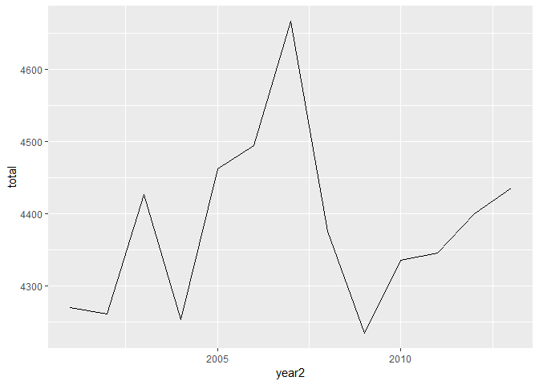

SCB Engineers Jönköping
================
Mikael Lundqvist
9 maj 2019

``` r
##rmarkdown::render("Engineer.r", encoding="UTF-8")
```

Introduction Personal development in R, Statisics, Scientific Report, Markdown, and GitHub with data from Statistics Sweden. I will extract statistics from Statistics Sweden regarding the labour market, salaries and other relevant data from engineers, primarily in Jönköping county. Help functions

``` r
library (tidyverse)
relative_dev <- function (x){
  return (x / x[1])
}
tot_dev <- function (x){
  scales::percent ((tail(x, 1) / x[1]) - 1)
}
## Limited to statistics from 2000 or later
readfile <- function (file1){
  read_csv (file1, col_types = cols(), locale = readr::locale (encoding = "latin1")) %>%
    gather (starts_with("20"), key = "year", value = salary) %>%
    mutate (year2 = parse_number (year)) %>%
    mutate (heading = file1) %>%
    mutate (relsalary = relative_dev (salary))
}   
```

Average monthly pay, pay dispersion etc., non-manual workers private sector (SLP) by educational orientation SUN 2000 and sex. Year 2001 - 2018 Average monthly pay (total pay), SEK SUN2000, 4 natural sciences, mathematics and computing sex, men and women

``` r
readfile ("AM0103I6.csv") %>%
  ggplot () +
    geom_line (mapping = aes(x = year2,y = salary, colour = `field of education SUN 2000`)) +
    theme (legend.position = "bottom") 
```


``` r
readfile ("AM0103I6.csv") %>% 
  group_by (`field of education SUN 2000`) %>% 
  mutate (growth = c (NA, diff(salary)) / salary) %>%
  ggplot () +  
    geom_line (mapping = aes(x = year2, y = growth, colour = `field of education SUN 2000`)) +
    theme (legend.position = "bottom")  
```

    ## Warning: Removed 2 rows containing missing values (geom_path).


``` r
readfile ("AM0103I6_2.csv") %>% 
  group_by (`field of education SUN 2000`) %>% 
  summarise (tot = tot_dev (salary))
```

    ## # A tibble: 11 x 2
    ##    `field of education SUN 2000`                    tot  
    ##    <chr>                                            <chr>
    ##  1 0 general education                              73.0%
    ##  2 000 All educational orientations                 68.2%
    ##  3 1 teaching methods and teacher education         59.5%
    ##  4 2 humanities and arts                            61.6%
    ##  5 3 social sciences, law, commerce, administration 68.5%
    ##  6 4 natural sciences, mathematics and computing    49.7%
    ##  7 5 engineering and manufacturing                  63.5%
    ##  8 6 agriculture and forestry, veterinary medicine  68.1%
    ##  9 7 health care and nursing, social care           72.4%
    ## 10 8 services                                       69.3%
    ## 11 9 unknown                                        67.9%

Employees 16-64 years by region of work, occupation (SSYK 2012) and sex. Year 2001 - 2017 Jönköping county, occupation=311 Physical and engineering science technicians, men and women
In 2014 SCB changed from SSYK96 to SSYK2012

``` r
readfile ("AM0208B6.csv") %>% 
  group_by (year2) %>% 
  summarise (total = sum (salary)) %>%
  ggplot ()+
    geom_line (mapping = aes (x = year2, y = total)) +
    theme (legend.position = "bottom")
```



``` r
readfile ("000000NL.csv") %>% 
  group_by (year2) %>% 
  summarise (total = sum (salary)) %>%
  ggplot ()+
    geom_line (mapping = aes (x = year2, y = total)) +
    theme (legend.position = "bottom")  
```


Average monthly pay, non-manual workers private sector (SLP) by region, occupational group (SSYK) and sex. Year 2000 - 2013 Average monthly pay (total pay), non-manual workers private sector (SLP), SEK 214 Engineering professionls
men and women

``` r
readfile ("AM0103H2.csv") %>% 
  ggplot ()+
    geom_line (mapping = aes (x = year2, y = salary, colour = region)) +
    theme (legend.position = "bottom")
```


Average monthly pay, non-manual workers private sector (SLP) by region, occupational group (SSYK 2012) and sex. Year 2014 - 2018 Average monthly pay (total pay), non-manual workers private sector (SLP), SEK 214 Engineering professionls
men and women

``` r
readfile ("0000002T.csv") %>% 
  ggplot ()+
    geom_line (mapping = aes (x = year2, y = salary, colour = region)) +
    theme (legend.position = "bottom")
```


TBC
References <http://www.statistikdatabasen.scb.se/pxweb/en/>
