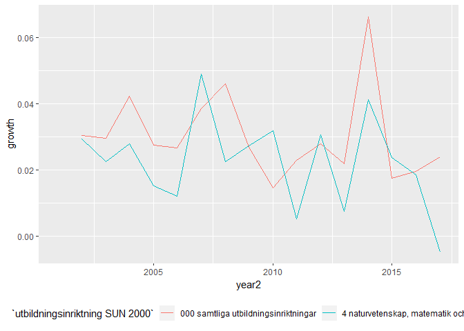
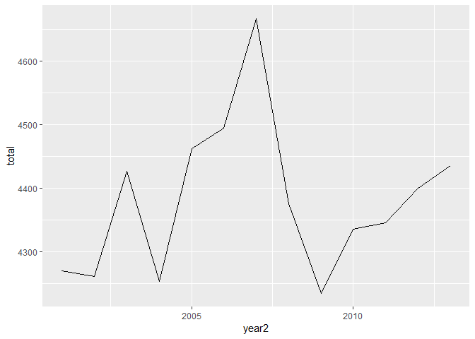
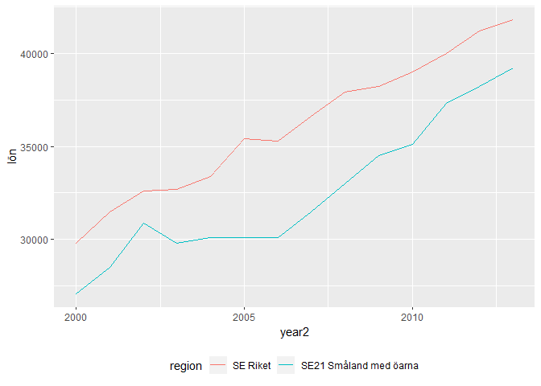
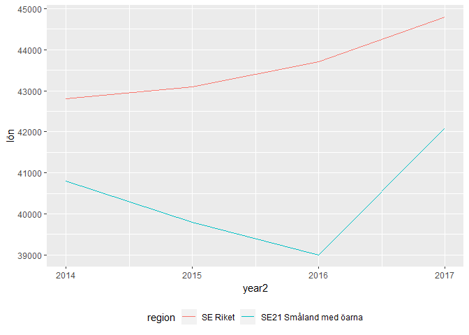

Ingenjör
================
Mikael Lundqvist
9 maj 2019

``` r
##rmarkdown::render("Ingenjör.r", encoding="UTF-8")
```

Hjälpfunktioner

``` r
library (tidyverse)
relative <- function (x){
  return (x / x[1])
}
tot_utv <- function (x){
  scales::percent ((tail(x, 1) / x[1]) - 1)
}
readfile <- function (file1){
  read_csv (file1, locale = readr::locale (encoding = "latin1")) %>%
    gather (starts_with("20"), key = "year", value = lön) %>%
    mutate (year2 = parse_number (year)) %>%
    mutate (heading = file1) %>%
    mutate (rellön = relative (lön)) %>%
    select (year, lön, rellön, year2, heading)
}
readfile2 <- function (file1){
  read_csv (file1, col_types = cols(), locale = readr::locale (encoding = "latin1")) %>%
    gather (starts_with("20"), key = "year", value = lön) %>%
    mutate (year2 = parse_number (year)) %>%
    mutate (heading = file1) %>%
    mutate (rellön = relative (lön))
}   
```

Genomsnittlig månadslön, lönespridning m.m., tjänstemän privat sektor (SLP) efter utbildningsinriktning SUN 2000 och kön. Ãr 2001 - 2017 Genomsnittlig månadslön (totallön), kronor SUN2000, 4 naturvetenskap, teknik, data kön, totalt

``` r
readfile2 ("AM0103I6.csv") %>%
  ggplot () +
    geom_line (mapping = aes(x = year2,y = lön, colour = `utbildningsinriktning SUN 2000`)) +
    theme (legend.position = "bottom") 
```


``` r
readfile2 ("AM0103I6.csv") %>% 
  group_by (`utbildningsinriktning SUN 2000`) %>% 
  mutate (growth = c (NA, diff(lön)) / lön) %>%
  ggplot () +  
    geom_line (mapping = aes(x = year2, y = growth, colour = `utbildningsinriktning SUN 2000`)) +
    theme (legend.position = "bottom")  
```

    ## Warning: Removed 2 rows containing missing values (geom_path).



``` r
readfile2 ("AM0103I6_2.csv") %>% 
  group_by (`utbildningsinriktning SUN 2000`) %>% 
  summarise (tot = tot_utv (lön))
```

    ## # A tibble: 11 x 2
    ##    `utbildningsinriktning SUN 2000`                     tot  
    ##    <chr>                                                <chr>
    ##  1 0 allmän utbildning                                  69.3%
    ##  2 000 samtliga utbildningsinriktningar                 63.5%
    ##  3 1 pedagogik och lärarutbildning                      52.4%
    ##  4 2 humaniora och konst                                58.0%
    ##  5 3 samhällsvetenskap, juridik, handel, administration 63.3%
    ##  6 4 naturvetenskap, matematik och data                 44.3%
    ##  7 5 teknik och tillverkning                            59.6%
    ##  8 6 lant- och skogsbruk samt djursjukvård              65.1%
    ##  9 7 hälso- och sjukvård samt social omsorg             67.8%
    ## 10 8 tjänster                                           62.8%
    ## 11 9 okänd utbildningsinriktning                        59.5%

Anställda 16-64 år med arbetsplats i regionen (dagbef) efter region, Yrke (SSYK 2012), kön och år Jönköpings län, yrke=311 Ingenjörer och tekniker, män och kvinnor 2014 bytte SCB till SSYK2012 från SSYK96

``` r
readfile2 ("AM0208B6.csv") %>% 
  group_by (year2) %>% 
  summarise (total = sum (lön)) %>%
  ggplot ()+
    geom_line (mapping = aes (x = year2, y = total)) +
    theme (legend.position = "bottom")
```



``` r
readfile2 ("000000NL.csv") %>% 
  group_by (year2) %>% 
  summarise (total = sum (lön)) %>%
  ggplot ()+
    geom_line (mapping = aes (x = year2, y = total)) +
    theme (legend.position = "bottom")  
```


Genomsnittlig månadslön (totallön), tjänstemän privat sektor (SLP), kronor efter region, yrkesgrupp (SSYK), kön och år yrkesgrupp (SSYK 2012) och kön. År 2000 - 2013 Genomsnittlig månadslön (totallön), tjänstemän privat sektor (SLP), kronor 214 Civilingenjörsyrken män och kvinnor

``` r
readfile2 ("AM0103H2.csv") %>% 
  ggplot ()+
    geom_line (mapping = aes(x = year2, y = lön, colour = region)) +
    theme (legend.position = "bottom")
```



Genomsnittlig månadslön, tjänstemän privat sektor (SLP) efter region, yrkesgrupp (SSYK 2012) och kön. År 2014 - 2017 Genomsnittlig månadslön (totallön), tjänstemän privat sektor (SLP), kronor 214 Civilingenjörsyrken män och kvinnor

``` r
readfile2 ("0000002T.csv") %>% 
  ggplot ()+
    geom_line (mapping=aes(x = year2, y = lön, colour = region)) +
    theme (legend.position = "bottom")
```



TBC
